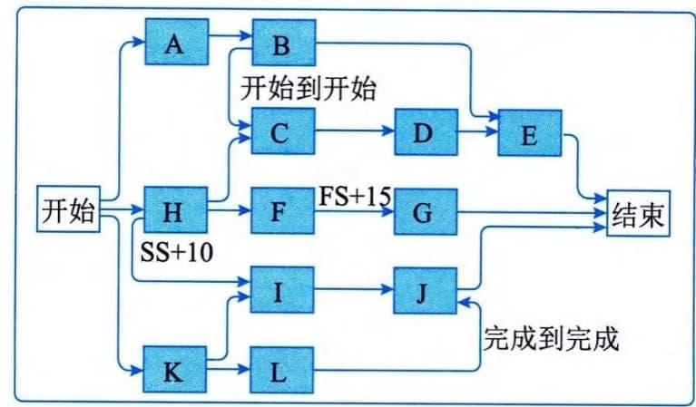

## 11.8.3 主要输出
项目进度网络图是表示项目进度活动之间的逻辑关系（也叫依赖关系）的图形。图11-20所示是项目进度网络图的一个示例。项目进度网络图可手工或借助项目管理软件来绘制，可包括项目的全部细节，也可只列出一项或多项概括性活动。项目进度网络图应附有简要文字描述，说明活动排序所使用的基本方法。在文字描述中，还应该对任何异常的活动序列做详细说明。
带有多个紧前活动的活动代表路径汇聚，而带有多个紧后活动的活动则代表路径分支。带汇聚和分支的活动受到多个活动的影响或能够影响多个活动，因此存在较大风险。

图11-20 项目进度网络图示例
