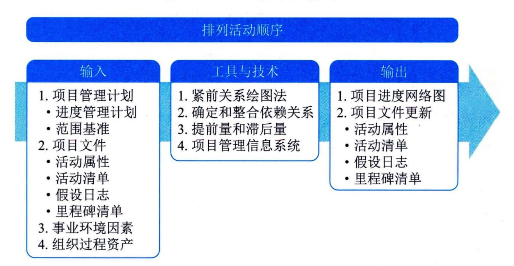

## 11.8 排列活动顺序
排列活动顺序是识别和记录项目活动之间的关系的过程。本过程的主要作用是定义工作之间的逻辑顺序，以便在既定的所有项目制约因素下获得最高的效率。本过程需要在整个项目期间开展。图11-13描述了本过程的输入、工具与技术和输出。

图11-13 排列活动顺序过程的输入、工具与技术和输出
排列活动顺序过程旨在将项目活动列表转化为图表，作为发布进度基准的第一步。
除了首尾两项，每项活动都至少有一项紧前活动和一项紧后活动，并且逻辑关系适当。通过设计逻辑关系可以支持创建一个切实的项目进度计划，可能有必要在活动之间使用提前量或滞后量，使项目进度计划更为切实可行。可以使用项目管理软件、手动技术或自动技术来排列活动顺序。
排列活动顺序过程的主要输入为项目管理计划和项目文件，主要工具与技术包括紧前关系绘图法、箭线图法、提前量和滞后量，主要输出为项目进度网络图。
