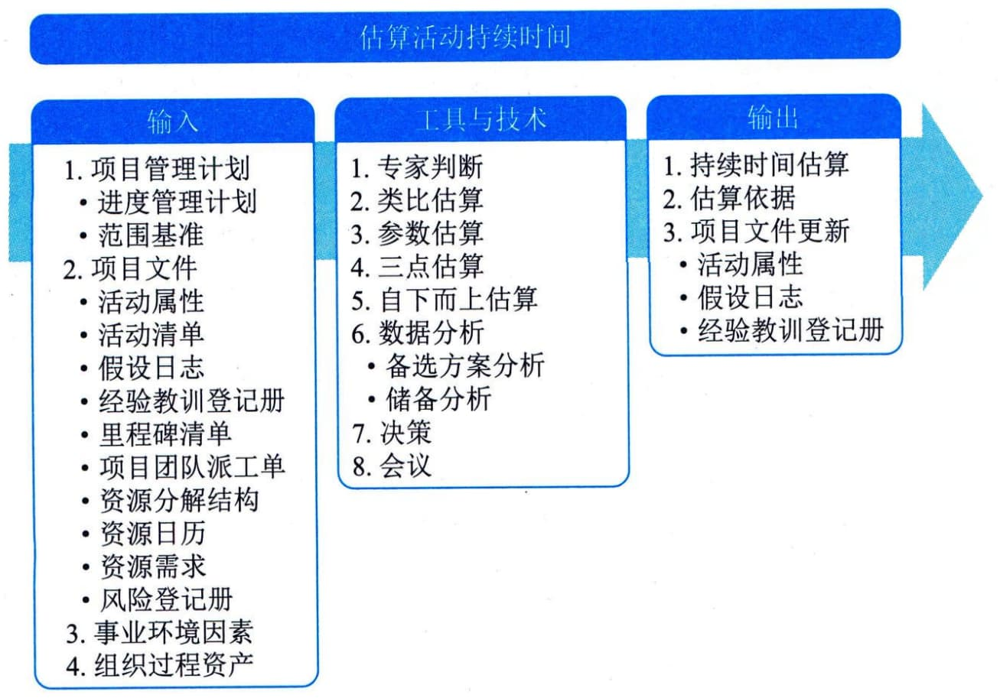

## 11.9 估算活动持续时间
估算活动持续时间
是根据资源估算的结果，估算完成单项活动所需工作时段数的过程。本过程的主要作用是确定完成每个活动所需花费的时间量。本过程需要在整个项目期间开展。图11-21描述了本过程的输入、工具与技术和输出。

图11-21 估算活动持续时间过程的输入、工具与技术和输出
在估算活动持续时间过程中，应该首先估算完成活动所需的工作量和计划投入该活动的资源数量，然后结合项目日历和资源日历，据此估算出完成活动所需的工作时段（即活动持续时间）。应该由项目团队中最熟悉具体活动的个人或小组提供持续时间估算所需的各种输入，对持续时间的估算也应该根据输入数据的数量和质量进行渐进明细。例如，在工程与设计项目中，随着数据越来越详细，越来越准确，持续时间估算的准确性和质量也会越来越高。
在许多情况下，预计可用的资源数量以及这些资源（尤其是人力资源）的技能熟练程度可能会决定活动的持续时间，更改分配到活动的主导性资源通常会影响持续时间，但这不是简单的"直线"或线性关系。有时候，因为工作的特性（即受到持续时间的约束、相关人力投入或资源数量），无论资源分配如何，都需要花预定的时间才能完成工作。估算活动持续时间时需要考虑的其他因素包括收益递减规律、资源数量、技术进步和员工激励等。
 - （1）收益递减规律。在保持其他因素不变的情况下，增加一个用于确定单位产出所需投入的因素（如资源）会最终达到一个临界点，在该点之后的产出或输出会随着增加这个因素而递减。
 - （2）资源数量。增加资源数量，比如资源两倍投入，但完成工作的时间不一定能缩短一半，因为投入资源可能会增加额外的风险，比如，如果增加太多活动资源，可能会因知识传递、学习曲线、额外合作等其他相关因素而造成持续时间增加。
 - （3）技术进步。在确定持续时间估算时，技术进步因素可能发挥重要作用。例如，通过采购最新技术，制造工厂可以提高产量，而这可能会影响持续时间和资源需求。
 - （4）员工激励。项目经理还需要了解拖延症和帕金森定律，前者指出，人们只有在最后一刻，即快到期限时才会全力以赴；后者指出，只要还有时间，工作就会不断扩展，直到用完所有的时间。
应该把活动持续时间估算所依据的全部数据与假设都记录在案。估算活动持续时间过程的主要输入为项目管理计划和项目文件，主要工具与技术包括类比估算、参数估算、三点估算和自下而上估算，主要输出为持续时间估算和估算依据。
