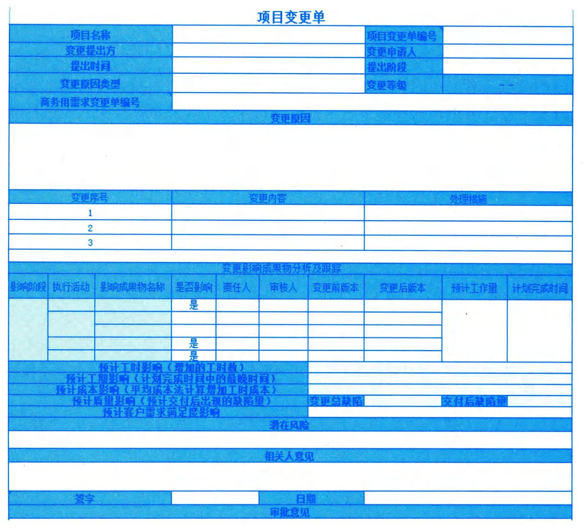

### 12.1.2 主要输出
#### **1．可交付成果**
可交付成果是在某一过程、阶段或项目完成时，必须产出的任何独特并可核实的产品、成果或服务能力。它通常是为实现项目目标而完成的有形的组成部分，并可包括项目管理计划的组成部分。
#### **2．工作绩效数据**
工作绩效数据是在执行项目工作的过程中，从每个正在执行的活动中收集到的原始观察结果和测量值。数据通常是最低层次的细节，将交由其他过程从中提炼并形成信息。在工作执行过程中收集数据，再交由10大知识领域的相应的控制过程做进一步分析。
例如，工作绩效数据包括已完成的工作、关键绩效指标（KPI）、技术绩效测量结果、进度活动的实际开始日期和完成日期、已完成的故事点、可交付成果状态、进度进展情况、变更请求的数量、缺陷的数量、实际发生的成本和实际持续时间等。
#### **3．问题日志**
在整个项目生命周期中，项目经理通常会遇到问题、差距、不一致或意外冲突。项目经理需要采取某些行动加以处理，以免影响项目绩效。问题日志是一种记录和跟进所有问题的项目文件，需要记录和跟进的内容可能包括：
 - · 问题类型；
 - · 问题提出者和提出时间；
 - · 问题描述；
 - · 问题优先级；
 - · 由谁负责解决问题；
 - · 目标解决日期；
 - · 问题状态；
 - · 最终解决情况。
某项目问题日志示例如表12-1所示。
表12-1 某项目日志框架示例
<table>
<colgroup>
<col style="width: 4%" />
<col style="width: 5%" />
<col style="width: 8%" />
<col style="width: 5%" />
<col style="width: 8%" />
<col style="width: 5%" />
<col style="width: 5%" />
<col style="width: 5%" />
<col style="width: 5%" />
<col style="width: 7%" />
<col style="width: 7%" />
<col style="width: 5%" />
<col style="width: 5%" />
<col style="width: 5%" />
<col style="width: 7%" />
<col style="width: 5%" />
</colgroup>
<thead>
<tr class="header">
<th colspan="2">初始信息</th>
<th rowspan="2">
优先级／

严重性
</th>
<th rowspan="2">描述</th>
<th rowspan="2">
问题来

源／分类
</th>
<th rowspan="2">
纠正

措施
</th>
<th rowspan="2">
分析

原因
</th>
<th rowspan="2">
问题

发现

阶段
</th>
<th rowspan="2">
问题

注入

阶段
</th>
<th rowspan="2">
受影响

区域
</th>
<th rowspan="2">
问题跟

踪人
</th>
<th rowspan="2">
目标

日期
</th>
<th colspan="4">跟踪／确认结果</th>
</tr>
<tr class="odd">
<th>#</th>
<th>日期</th>
<th>状态</th>
<th>日期</th>
<th>确认人</th>
<th>
确认

结果
</th>
</tr>
</thead>
<tbody>
<tr class="odd">
<td></td>
<td></td>
<td></td>
<td></td>
<td></td>
<td></td>
<td></td>
<td></td>
<td></td>
<td></td>
<td></td>
<td></td>
<td></td>
<td></td>
<td></td>
<td></td>
</tr>
<tr class="even">
<td></td>
<td></td>
<td></td>
<td></td>
<td></td>
<td></td>
<td></td>
<td></td>
<td></td>
<td></td>
<td></td>
<td></td>
<td></td>
<td></td>
<td></td>
<td></td>
</tr>
</tbody>
</table>
问题日志可以帮助项目经理有效跟进和管理问题，确保它们得到调查和解决。作为本过程
的输出，问题日志被首次创建（尽管在项目期间任何时候都可能发生问题）。在整个项目生命周
期应该随同监控活动更新问题日志。
#### **4.变更请求**
变更请求是关于修改文件、可交付成果或基准的正式提议。如果在开展项目工作时发现问
题，就可提出变更请求，对项目政策或程序、项目或产品范围、项目成本或预算、项目进度计
划、项目或产品结果的质量进行修改。其他变更请求包括必要的预防措施或纠正措施，用来防
止以后的不利后果。任何项目干系人都可以提出变更请求，应该通过实施整体变更控制过程对
变更请求进行审查和处理。变更请求可源自项目内部或外部，可能来自项目需求，也可能是法
律（合同）强制要求。变更请求可能包括：
•纠正措施：为使项目工作绩效重新与项目管理计划一致，进行的有目的的活动。
•预防措施：为确保项目工作的未来绩效符合项目管理计划，进行的有目的的活动。
•缺陷补救：为了修正不一致产品或产品组件进行的有目的的活动。
•更新：对正式受控的项目文件或计划等进行的变更，以反映修改或增加的意见或内容。
某软件研发项目变更单示例如图12-3所示

图12-3项目变更单示例
