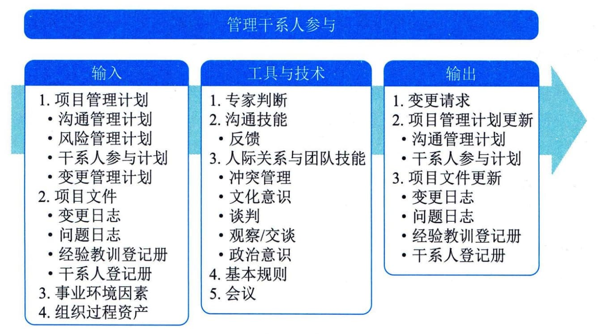

## 12.10 管理干系人参与
管理干系人参与是与干系人进行沟通和协作以满足其需求与期望、处理问题，并促进干系人合理参与的过程。本过程的主要作用是，让项目经理能够提高干系人的支持，并尽可能降低干系人的抵制。图12-17描述本过程的输入、工具与技术和输出。
管理干系人参与过程旨在根据干系人参与计划，通过沟通及其他方法，与干系人沟通并引导干系人合理参与项目，解决实际出现的干系人之间的问题，以便满足干系人的需要和期望。通过这个过程，把干系人实际参与项目的程度提高到项目经理期望的程度。

图12-17 管理干系人参与过程的输入、工具与技术和输出
在这个过程中，需要把项目团队中的问题、项目团队与其他干系人之间的问题以及其他干系人之间的问题记录下来，形成问题日志更新。过程实施中，需要提出变更请求。变更请求可能包括对干系人参与计划的修改建议，以及对项目及其成果的修改建议。
在管理干系人参与过程中，需要开展多项活动，包括：
 - ·在适当的项目阶段引导干系人参与，以便获取、确认或维持他们对项目成功的持续承诺；
 - · 通过谈判和沟通的方式管理干系人期望；
 - · 处理与干系人管理有关的任何风险或潜在关注点，预测干系人可能在未来引发的问题；
 - · 澄清和解决已识别的问题等。
管理干系人参与过程的主要输入为项目管理计划和项目文件。
**主要输入**
#### **1．项目管理计划**
管理干系人参与过程使用的项目管理计划组件主要包括：沟通管理计划、风险管理计划、干系人参与计划和变更管理计划等。
 - · 沟通管理计划：描述与干系人沟通的方法、形式和技术。
 - ·风险管理计划：描述了风险类别、风险偏好和报告格式。这些内容都可用于管理干系人参与。
 - · 干系人参与计划：为管理干系人期望提供指导和信息。
 - · 变更管理计划：描述了提交、评估和执行项目变更的过程。
#### **2．项目文件**
可作为管理干系人过程输入的项目文件主要包括：变更日志、问题日志、经验教训登记册和干系人登记册等。
 - · 变更日志：记录变更请求及其状态，并将其传递给适当的干系人。
 - · 问题日志：记录项目或干系人的关注点，以及关于处理问题的行动方案。
 - · 经验教训登记册：在项目早期获取的与管理干系人参与有关的经验教训，可用于项目后期阶段，以提高本过程的效率和效果。
 - · 干系人登记册：提供项目干系人清单，及执行干系人参与计划所需的任何信息。
