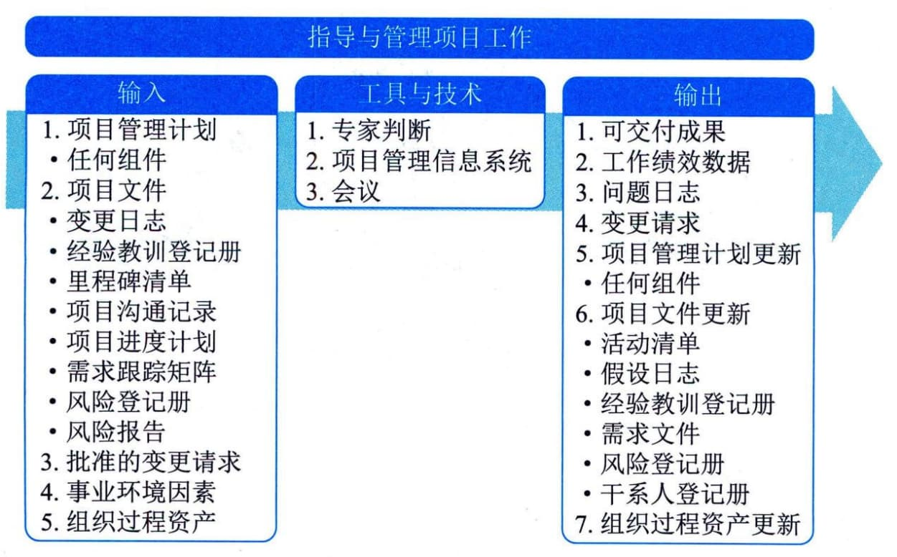

## 12.1 指导与管理项目工作
指导与管理项目工作是为实现项目目标而领导和执行项目管理计划中所确定的工作，并实施已批准变更的过程。本过程的主要作用是对项目工作和可交付成果开展综合管理，以提高项目成功的可能性。本过程需要在整个项目期间开展。图12-2描述本过程的输入、工具与技术和输出。

图12-2 指导与管理项目工作过程的输入、工具与技术和输出
指导与管理项目工作包括执行项目管理计划的各种项目活动，以完成项目可交付成果并达成既定目标，并识别必要的项目变更，提出变更请求。本过程需要分配可用资源并管理其有效使用，也需要执行因分析工作绩效数据和信息而提出的项目计划变更。指导与管理项目工作过程会受项目所在应用领域的直接影响。
项目执行阶段的开始通常由项目经理组织一次会议，项目发起人召集主要项目干系人一起参加，项目经理向主要干系人介绍项目目标与项目计划，获得他们对项目的承诺与支持，并宣布项目正式进入执行阶段。
项目经理与项目管理团队一起指导实施已计划好的项目活动，并管理项目内的各种技术接口和组织接口。指导与管理项目工作还要求回顾所有项目变更的影响，并实施已批准的变更，包括纠正措施、预防措施和（或）缺陷补救。
在指导与管理项目工作时，可以通过会议来讨论和解决项目的相关事项。参会者可包括项目经理、项目团队成员，以及与所讨论事项相关或会受该事项影响的干系人。应该明确每个参会者的角色，确保有效参会。会议类型包括（但不限于）：开工会议、技术会议、敏捷或迭代规划会议、每日站会、指导小组会议、问题解决会议、进展跟进会议以及回顾会议。
在项目执行过程中，收集工作绩效数据并传达给合适的控制过程做进一步分析。通过分析工作绩效数据，得到关于可交付成果的完成情况以及与项目绩效相关的其他细节，工作绩效数据用作监控过程组的输入，并可作为反馈输入到经验教训库，以改善未来工作的绩效。
指导与管理项目工作过程的主要输入为：项目管理计划和项目文件，主要输出为可交付成果、工作绩效数据、问题日志和变更请求。
