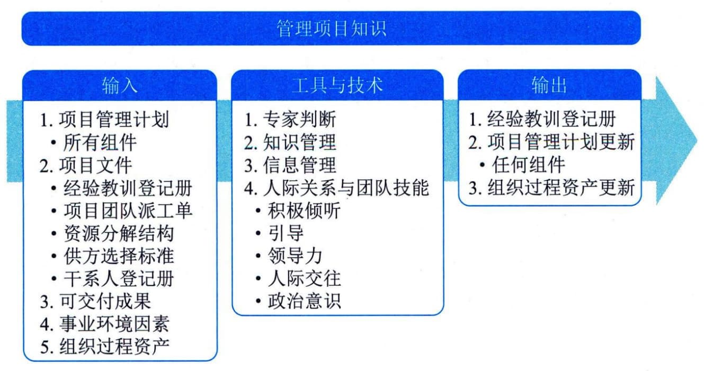

## 12.2 管理项目知识
管理项目知识是使用现有知识并生成新知识，以实现项目目标，并且帮助组织学习的过程。本过程的主要作用是，利用已有的组织知识来创造或改进项目成果，并且使当前项目创造的知识可用于支持组织运营和未来的项目或阶段。图12-4描述本过程的输入、工具与技术和输出。

图12-4 管理项目知识过程的输入、工具与技术和输出
从组织的角度来看，知识管理指的是确保项目团队和其他干系人的技能、经验和专业知识在项目开始之前、开展期间和结束之后都能够得到运用。知识存在于人们的思想中，我们不能强迫别人分享自己的知识或关注他人的知识。因此，知识管理最重要的环节就是营造一种相互信任的氛围，激励人们分享知识或关注他人的知识。如果不激励人们分享知识或关注他人的知识，即便最好的知识管理工具和技术也无法发挥作用。在实践中，可以联合使用知识管理工具和技术（用于人际互动）以及信息管理工具和技术（用于编撰显性知识）来分享知识。
知识管理的重点是把现有的知识条理化和系统化，以便更好地加以利用。同时，还要基于这些条理化和系统化的知识，以及对这些知识的实践来生成新的知识。知识通常分为"显性知识"（易使用文字、图片和数字进行编撰的知识）和"隐性知识"（个体知识以及难以明确表达的知识，如信念、洞察力、经验和"诀窍"）。管理项目知识的过程是要在项目环境中持续整理和利用现有的"显性知识"和"隐性知识"，并不断创造出新的知识，以便实现项目目标，促进项目执行组织持续学习。
管理项目知识的关键活动是知识分享和知识集成。项目管理要创造一个相互信任的氛围，激励大家相互分享知识。不仅要分享以数字、文字或图形方式存在的显性知识，而且要分享存在于个人头脑中的隐性知识。应明确与知识分享有关的权责，采用合适的知识分享途径和方法确保项目连续性。知识集成则是把来自不同领域、产生于不同背景的各种知识系统化。
知识管理过程通常包括：知识获取与集成、知识组织与存储、知识分享、知识转移与应用和知识管理审计。
 - （1）知识获取与集成。知识获取与集成是对组织内部已经存在的知识进行整理、积累或从外部获取知识的过程。显性知识获取与集成就是针对待解决的问题寻找和识别与之相关的关键性信息，并将这些信息进行提取，为形成解决方案或决策提供依据。组织显性知识获取与收集的途径一般有图书资料、内外部数据挖掘、网络搜索、营销与销售信息等。隐性知识获取方式主要有结构式访谈、行动学习标杆学习、分析学习、经验学习、综合学习和交互学习等。
 - （2）知识组织与存储。知识组织是以知识为对象的如整理、加工、表示、控制等一系列组织过程及其方法，其实质是以满足各类客观知识主观化需要为目的，针对客观知识的无序化状态所实施的一系列有序化组织活动。知识存储是指在组织中建立知识库，将知识存储于组织内部，知识库中包括显性知识和隐性知识。知识库是按一定要求存储在计算机中的相互关联的知识的集合，是经过分类、组织和有序化的知识集合。知识库是构造专家系统的核心和基础。构建知识库不仅是为了存储知识，更重要的目的是实现知识分享，促进组织知识流动和创新。
 - （3）知识分享。知识分享就是知识在人与人之间传递的过程，也就是人与人之间进行沟通的过程。知识共享定义为知识从一个个体、群体或组织向另一个个体、群体或组织转移或传播的行为。
 - （4）知识转移与应用。知识转移是由知识传输和知识吸收两个过程所共同组成的统一过程，只有当转移的知识保留下来，才是有效的知识转移。知识的成功转移必须完成知识传递和知识吸收两个过程，并使知识接收者感到满意。知识在组织中只有得到应用才能增加价值，知识应用决定了组织对知识的需求，是知识鉴别，创新、获取、存储和共享的参考点。
 - （5）知识管理审计。知识管理审计是对组织知识资产和关联的知识管理系统的评估。知识管理的审计既是组织知识管理的起点，又是组织知识管理的重点，在组织的知识管理循环中，起到了承上启下的重要作用。
知识管理的审计对象包括知识资源、安全和能力。知识资源审计是对组织知识资源进行系统、科学的考察和评估，分析组织已有的知识（知识存量）与需要的知识（知识需求），分析知识的短缺状况，针对组织的知识管理目标，提出诊断性和预测性的审计报告。知识安全审计是对组织知识资源的合理和安全使用的审计。组织知识管理的安全体系既包括知识管理系统的安全设备、软件和其他安全装置，也包括为使知识管理安全使用的安全政策、措施、策略和规章制度等。知识能力审计是对知识管理人员的素质和知识管理绩效的审计，主要包括：群体的知识管理水平是否达到当前管理的基本要求、群体的专业知识结构的合理性、人员的知识供需安排的适当性、组织主要管理人员的知识贡献与知识管理的规划是否一致、人员的知识运用能力及创新知识能力等。
管理项目知识过程的主要输入为项目管理计划、项目文件和可交付成果，主要输出为经验教训登记册。
