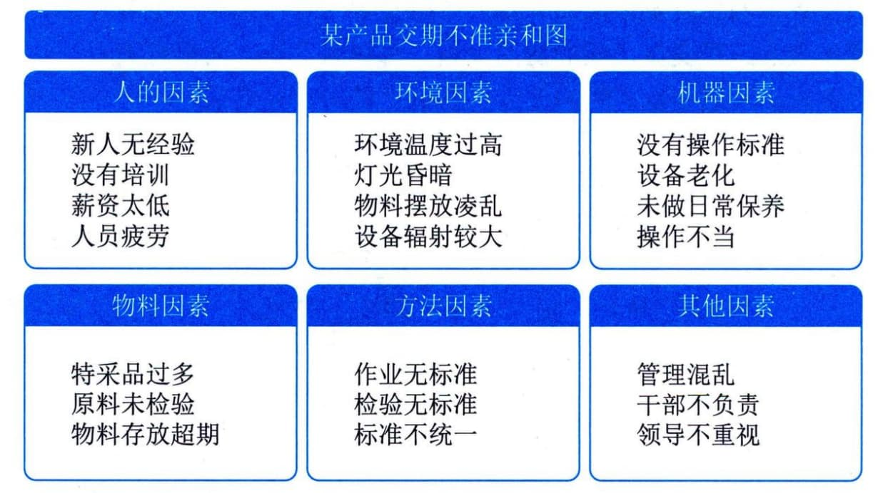
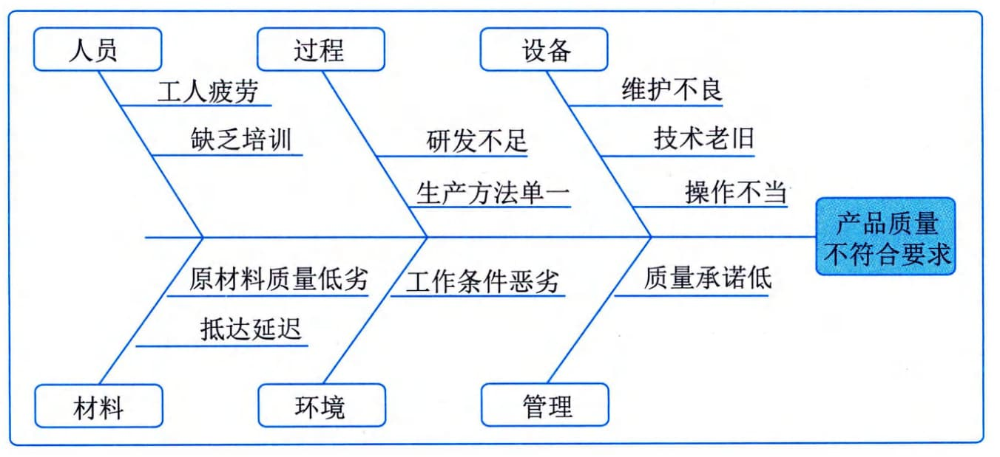
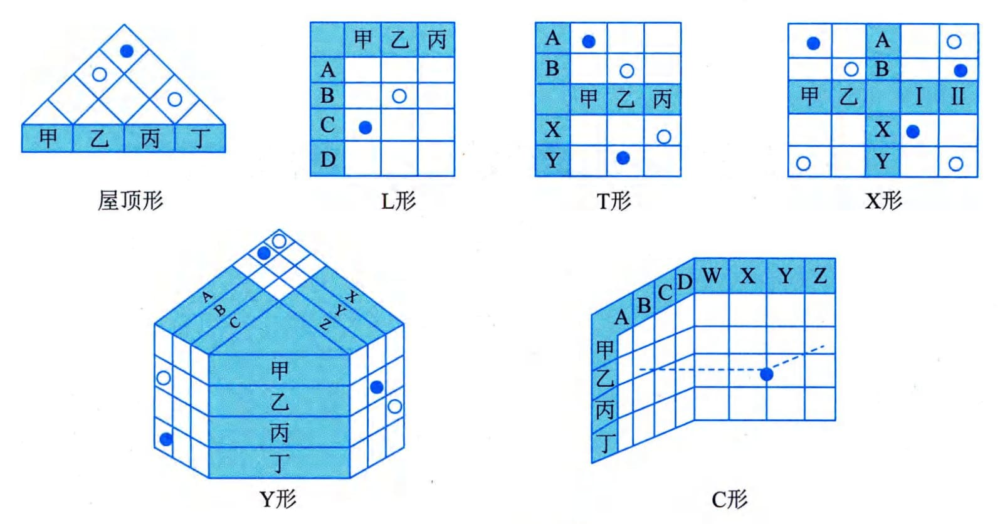
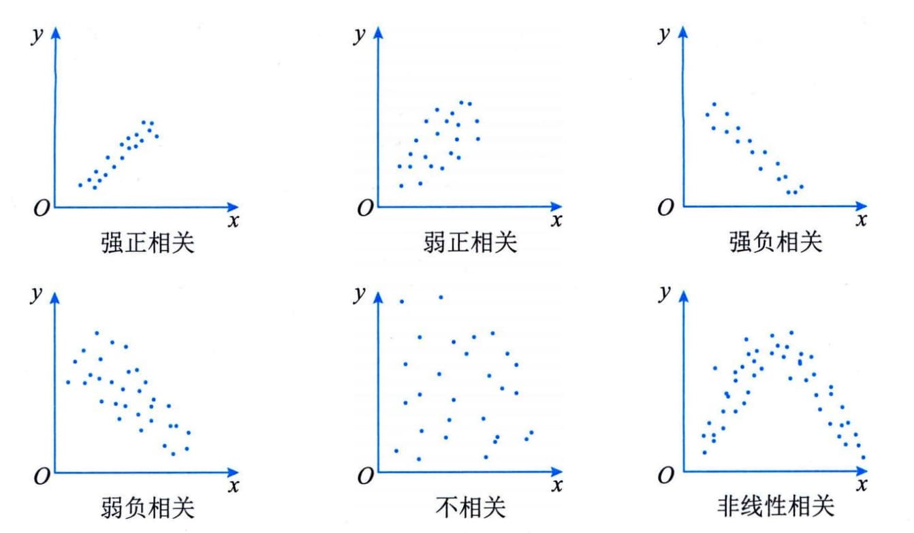

### 12.3.2 主要工具与技术
#### **1．数据收集**
核对单是一种结构化工具，通过具体列出各检查项来核实一系列步骤是否已经执行，确保在质量控制过程中规范地执行经常性任务。在管理质量过程中，可以用核对单收集数据，反映该做的事情是否已做，以及是否已做到符合要求。
#### **2．数据分析**
数据分析包括备选方案分析、文件分析、过程分析和根本原因分析。备选方案分析用于分析多种可选的质量活动实施方案，并做出选择。文件分析用于分析质量控制测量结果、质量测试与评估结果、质量报告等，以便判断质量过程的实施情况好坏。过程分析用于把一个生产过程分解成若干环节，逐一加以分析，发现最值得改进的环节。根本原因分析用于分析导致某个或某类质量问题的根本原因。
#### **3．决策**
多标准决策分析是借助决策矩阵，用系统分析方法建立多种标准，以对众多需要决策内容进行评估和排序。可用多标准决策分析技术来对多种质量活动实施方案进行排序，并作出选择。
#### **4．数据表现**
数据表现中包括亲和图、因果图、流程图、直方图、矩阵图和散点图等。
 - （1）亲和图。亲和图用于根据其亲近关系对导致质量问题的各种原因进行归类，展示最应关注的领域，如图12-6所示。

图12-6 亲和图
 - （2）因果图。因果图也叫鱼刺图或石川图，用来分析导致某一结果的一系列原因，有助于人们进行创造性、系统性思维，找出问题的根源。它是进行根本原因分析的常用方法，如图12-7所示。
 - （3）流程图。流程图展示了引发缺陷的一系列步骤，用于完整地分析某个或某类质量问题产生的全过程。
 - （4）直方图。直方图是一种显示各种问题分布情况的柱状图。每个柱子代表一个问题，柱子的高度代表问题出现的次数。直方图可以展示每个可交付成果的缺陷数量、缺陷成因的排列、各个过程的不合规次数，或项目与产品缺陷的其他表现形式。

图12-7因果图
 - （5）矩阵图。矩阵图在行列交叉的位置展示因素、原因和目标之间的关系强弱。根据可用来比较因素的数量，有图12-8所示的六种常用的矩阵图。
 - · 屋顶形：用于表示同属一组变量的各个变量之间的关系。
 - · L形：通常为倒L形。用于表示两组变量之间的关系。
T形：用于表示一组变量分别与另两组变量的关系。后两组变量之间没有关系。
 - · X形：用于表示四组变量之间的关系。每组变量同时与其他两组有关系。
 - · Y形：用于表示三组变量之间的两两关系。每两组变量之间都有关系。
 - · C形：用于表示三组变量之间的关系。三组变量同时有关系。

图12-8 矩阵图
 - （6）散点图。散点图是一种展示两个变量之间的关系的图形，它能够展示两支轴的关系，一般一支轴表示过程、环境或活动的任何要素，另一支轴表示质量缺陷。散点图一般用x轴表示自变量，y轴表示因变量，定量地显示两个变量之间的关系，是最简单的回归分析工具。所有数据点的分布越靠近某条斜线，两个变量之间的关系就越密切，如图12-9所示。
#### **5．审计**
审计是用于确定项目活动是否遵循了组织和项目的政策、过程与程序的一种结构化且独立的过程。质量审计是在对质量管理活动进行独立的、结构化的审查，以便总结质量管理方面的经验教训。质量审计通常由项目外部的团队开展，如组织内部审计部门、项目管理办公室或组织外部的审计师。质量审计目标一般包括：

图12-9 散点图
 - · 识别全部正在实施的良好及最佳实践；
 - · 识别所有违规做法、差距及不足；
 - · 分享所在组织和（或）行业中类似项目的良好实践；
 - · 积极、主动地提供协助，以改进过程的执行，从而帮助团队提高生产效率；
 - · 强调每次审计都应对组织经验教训知识库的积累做出贡献。
#### **6．面向X的设计**
面向X的设计中的X既可以是卓越（excellence）的意思，也可以是产品的某种特性，如可靠性、可用性、安全性和经济性。前者追求整个产品在整个生命周期中的最优化，后者重点改进产品的某个特性。使用面向X的设计可以降低成本、改进质量、提高绩效和客户满意度。
#### **7．问题解决**
问题解决是指用结构化的方法从根本上解决在控制质量过程或质量审计中发现的质量管理问题。从定义问题、识别根本原因，到形成备选解决方案、选择最好的方案，再到实施选定的方案、核实解决效果。
#### **8．质量改进方法**
在管理质量过程中，要基于过程分析的结果，用质量改进方法去做过程改进。过程改进旨在使生产过程更加顺畅、稳定，减少生产过程中的浪费及降低产品缺陷率。可以用来做过程改进的方法有很多，如戴明环、六西格玛、精益生产和精益六西格玛等。
