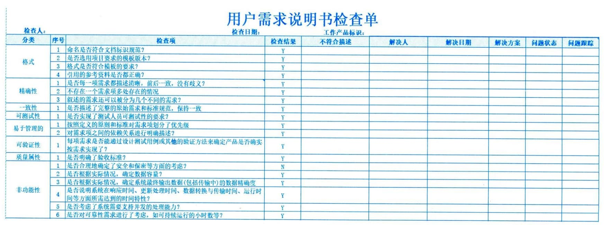

### 12.3.3 主要输出
#### **1．质量报告**
质量报告可能是图形、数据或定性文件，其中包含的信息可帮助其他过程和部门采取纠正措施，以实现项目质量目标。质量报告的信息可以包含团队上报的质量管理问题，针对过程、项目和产品的改善建议、纠正措施建议，以及在控制质量过程中发现的情况的概述。
#### **2．测试与评估文件**
可基于行业需求和组织模板创建测试与评估文件。它们是控制质量过程的输入，用于评估质量目标的实现情况。这些文件可能包括专门的核对单（又称检查单）和详尽的需求跟踪矩阵。某项目需求说明书检查单示例如图12-10所示。

图12-10 需求说明书检查单示例
