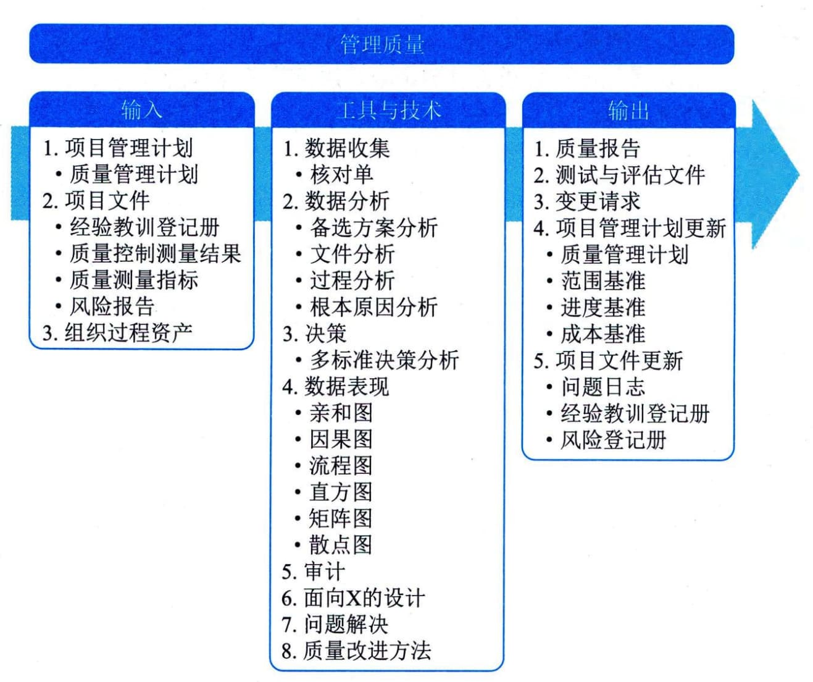

## 12.3 管理质量
管理质量是把组织的质量政策用于项目，并将质量管理计划转化为可执行的质量活动的过程。本过程的主要作用是提高实现质量目标的可能性，以及识别无效过程和导致质量低劣的原因，促进质量过程改进。图12-5描述本过程的输入、工具与技术和输出。

图12-5 管理质量过程的输入、工具与技术和输出
管理质量过程执行在项目质量管理计划中所定义的一系列有计划、有系统的行动和过程，这有助于：
 - （1）通过执行有关产品特定方面的设计准则，设计出最优的、成熟的产品。
 - （2）建立信心，相信通过质量保证工具和技术（如质量审计和故障分析）可以使输出在完工时满足特定的需求和期望。
 - （3）确保使用质量过程并确保其使用能够满足项目的质量目标。
 - （4）提高过程和活动的效率与效果，获得更好的成果和绩效并提高干系人满意度。
项目经理和项目团队可以通过组织的质量保证部门或其他组织职能执行某些管理质量活动，例如故障分析、实验设计和质量改进。质量保证部门在质量工具和技术的使用方面通常拥有跨组织经验，是良好的项目资源。
管理质量是所有人的共同职责，包括项目经理、项目团队、项目发起人、执行组织的管理层，甚至是客户。所有人在管理项目质量方面都扮演一定的角色，尽管这些角色的人数和工作量不同。参与质量管理工作的程度取决于所在行业和项目管理风格。在敏捷型项目中，整个项目期间的质量管理由所有团队成员执行；但在传统项目中，质量管理通常是特定团队成员的职责。
管理质量过程的主要工作包括：
 - （1）执行质量管理计划中规划的质量管理活动，确保项目工作过程和工作成果达到质量测量指标及质量标准。
 - （2）把质量标准和质量测量指标转化成测试与评估文件，供控制质量过程使用。
 - （3）根据风险评估报告识别与处置项目质量目标的机会和威胁，以便提出必要的变更请求，如调整质量管理方法或质量测量指标等。
 - （4）根据质量控制测量结果评价质量管理绩效及质量管理体系的合理性，以便提出必要的变更请求，实现过程改进。
 - （5）质量管理持续优化改进，需参考已记入经验教训登记册的质量管理经验教训。
 - （6）根据质量管理计划、质量测量指标、质量控制测量结果、管理质量过程的实施情况等，编制质量报告，并向项目干系人报告项目质量绩效。
管理质量过程的主要输入为项目管理计划和项目文件，主要工具与技术包括数据收集、数据分析、决策、数据表现、审计、面向X的设计、问题解决和质量改进方法，主要输出为质量报告、测试与评估文件。
