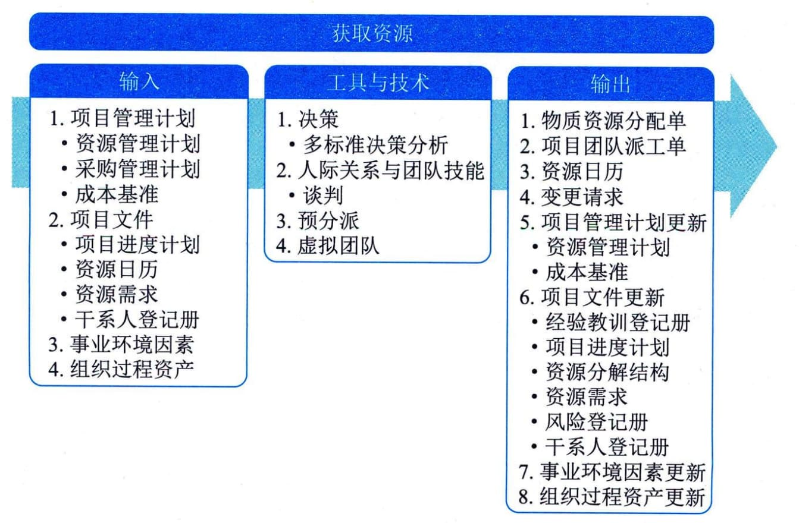

## 12.4 获取资源
获取资源是获取项目所需的团队资源、设施、设备、材料、用品和其他资源的过程。本过程的主要作用是，概述和指导资源的选择，并将其分配给相应的活动。本过程应根据需要在整个项目期间定期开展。图12-11描述本过程的输入、工具与技术和输出。

图12-11 获取资源过程的输入、工具与技术和输出
获取资源过程旨在以正确的方式在正确的时间获取适合的人力资源和实物资源。项目所需资源可能来自项目执行组织的内部或外部。内部资源由职能经理或资源经理负责获取（分配），外部资源则是通过采购过程获得。在矩阵型组织结构下，项目经理需要向各职能部门调配人员。项目经理可能因组织的集体劳资协议而不得不使用某些人员，也可能因组织中的相关规定而必须或不能使用某些人员。在这些情况下，项目经理就没有获取人力资源的直接控制权，因此会面临更大的挑战。项目经理或项目团队应该进行有效谈判，并影响那些能为项目提供所需团队和实物资源的人员。
本过程还需要对所获取的资源进行分配，并形成相应的资源分配文件，包括物质资源分配单和项目团队派工单。项目团队派工单可以是写明团队成员的岗位信息的成员名单，也可以是已经插入成员姓名的项目计划。对于设备、设施和人员，还需要确定究竟什么时候可用于本项目，编制出相应的资源日历。
对所获得的团队成员，必须仔细分析他们的性格、态度、能力、胜任力和可用性等，并基于分析结果进行工作分配，确定该采用什么样的领导风格和手段去启发、激励和影响他们。
获取资源过程的主要输入为项目管理计划和项目文件；主要工具与技术包括决策、人际关系与团队技能、预分派、虚拟团队；主要输出为物质资源分配单、项目团队派工单和资源日历。
