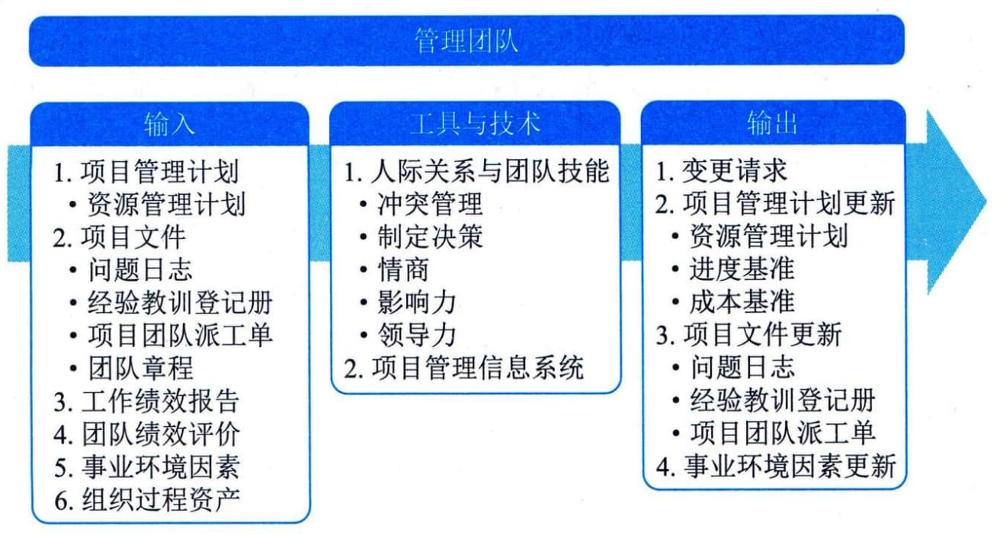

## 12.6 管理团队
管理团队是跟踪团队成员工作表现、提供反馈、解决问题并管理团队变更，以优化项目绩效的过程。本过程的主要作用是，影响团队行为、管理冲突以及解决问题。本过程需要在整个项目期间开展。图12-13描述本过程的输入、工具与技术和输出。

图12-13 管理团队过程的输入、工具与技术和输出
管理团队需要借助多方面的管理和领导力技能，来促进团队协作，整合团队成员的工作，从而创建高效团队。进行团队管理，需要综合运用各种技能，特别是沟通、冲突管理、谈判和领导技能。项目经理应留意团队成员是否有意愿和有能力完成工作，然后相应地调整管理和领导力方式。
管理团队的主要工作包括：
 - · 在管理团队的过程中，分析冲突背景、原因和阶段，采用适当方法解决冲突。
 - · 考核团队绩效并向成员反馈考核结果。
 - ·持续评估工作职责的落实情况，分析团队绩效的改进情况，考核培训、教练和辅导的效果。

 - ·持续评估团队成员的技能并提出改进建议，持续评估妨碍团队的困难和障碍的排除情况，持续评估与成员的工作协议的落实情况。
 - · 发现、分析和解决成员之间的误解，发现和纠正违反基本规则的言行。
 - · 对于虚拟团队，则还要持续评估虚拟团队成员参与的有效性。
管理团队过程的主要输入为项目管理计划、项目文件、工作绩效报告、团队绩效评价，主要工具与技术包括人际关系与团队技能、项目管理信息系统。
