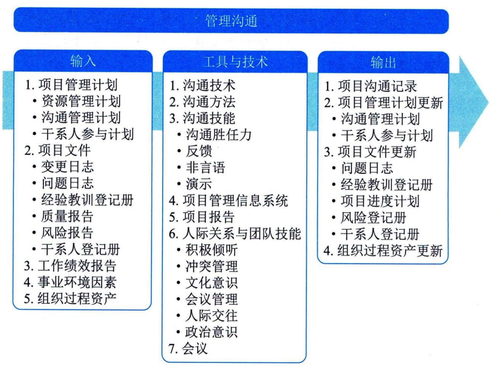

## 12.7 管理沟通
管理沟通是确保项目信息及时且恰当地收集、生成、发布、存储、检索、管理、监督和最终处置的过程。本过程的主要作用是，促成项目团队与干系人之间的有效率且有效果的沟通。图12-14描述本过程的输入、工具与技术和输出。
管理沟通的主要工作是根据项目管理计划中的沟通管理计划有效率且有效果地开展沟通，得到项目沟通记录。有效率的沟通是指只给项目干系人提供他们所需要的信息，但是不提供多余的信息。有效果的沟通是指在正确的时间把正确的信息发送给正确的人，以便信息起到正确的作用。项目管理计划中的资源管理计划，有利于为协调和管理资源而开展有效的沟通；干系人参与计划则有利于为引导干系人合理参与项目而开展沟通。

图12-14 管理沟通过程的输入、工具与技术和输出
管理沟通过程中应将工作绩效报告发送给项目干系人，也应该在管理沟通过程中把各种项目文件发送给项目干系人，如质量报告、风险报告。有些项目文件，如变更日志和问题日志，即便不需要或不应该完整地发给项目干系人，也应该以合理的方式把其中的部分内容传递给项目干系人。
管理沟通过程会涉及与开展有效沟通有关的所有方面，包括使用适当的技术、方法和技巧。此外，它还应允许沟通活动具有灵活性，允许对方法和技术进行调整，以满足干系人及项目不断变化的需求。本过程不局限于发布相关信息，它还设法确保信息以适当的格式正确生成和送达目标受众。本过程也为干系人提供机会，允许他们参与提供更多信息、澄清和讨论。有效的沟通管理需要借助的技术主要包括：发送方-接收方模型、媒介选择、写作风格、会议管理、演示、引导和积极倾听等。
 - （1）发送方-接收方模型：运用反馈循环，为互动和参与提供机会，并清除妨碍有效沟通的障碍。
 - （2）媒介选择：为满足特定的项目需求而使用合理的沟通方法。例如，何时进行书面沟通或口头沟通，何时准备非正式备忘录或正式报告，何时使用推式或拉式沟通，以及该选择何种沟通技术。
 - （3）写作风格：选择适当的语态、句子结构，以及使用适当的词汇。
 - （4）会议管理：准备议程，邀请重要参会者并确保他们出席；处理会议现场发生的冲突，或因对会议纪要和后续行动跟进不力而导致的冲突，或因不当人员与会而导致的冲突。
 - （5）演示：了解肢体语言和视觉辅助设计的作用。
 - （6）引导：达成共识、克服障碍（如小组缺乏活力），及维持小组成员兴趣和热情。
 - （7）积极倾听：积极倾听包括告知已收到、澄清与确认信息、理解，以及消除妨碍理解的障碍。管理沟通过程的主要输入为项目管理计划、项目文件和工作绩效报告，主要工具与技术包括沟通技术、沟通方法、沟通技能、项目管理信息系统、项目报告、人际关系与团队技能和会议，主要输出为项目沟通记录。
