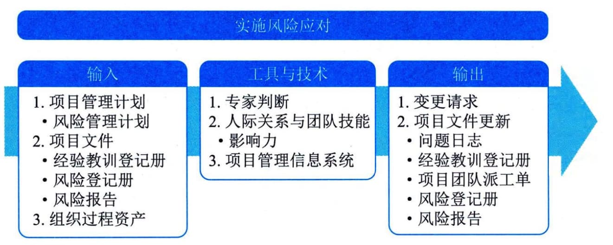

## 12.8 实施风险应对
实施风险应对是执行商定的风险应对计划的过程。本过程的主要作用是，确保按计划执行商定的风险应对措施，来管理整体项目风险、最小化单个项目威胁，以及最大化单个项目机会。本过程需要在整个项目期间开展。图12-15描述本过程的输入、工具与技术和输出。

图1245实施风险应对过程的输入、工具与技术和输出
项目风险管理的一个常见问题就是只发现不执行，即项目团队努力识别和分析风险并制定应对措施，然后把经商定的应对措施记录在风险登记册和风险报告中，但是不采取实际行动去管理风险。适当关注实施风险应对的过程，能够确保已商定的风险应对措施得到实际执行。
只有风险责任人努力去实施商定的应对措施，项目的整体风险和单个威胁及机会才能得到主动管理。
项目经理作为整体项目风险的责任人，必须根据规划风险应对过程的结果，组织所需的资源，采取已商定的应对策略和措施处理整体项目风险，使整体项目风险保持在合理水平。
实施风险应对过程的主要输入为项目管理计划和项目文件。
