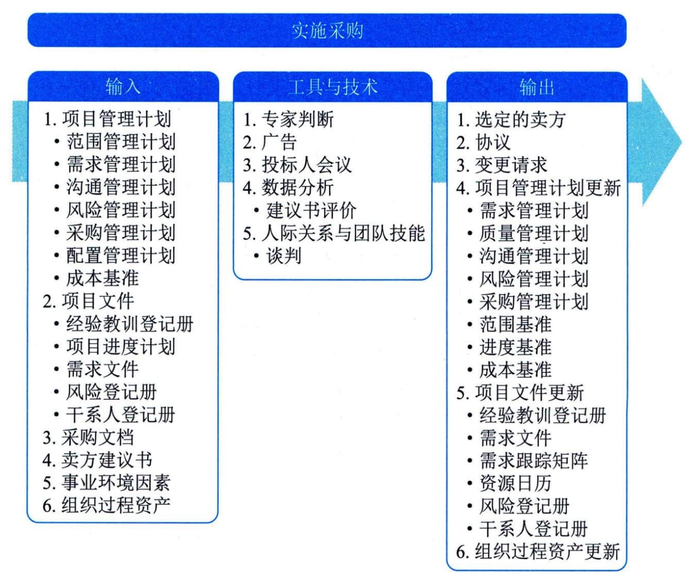

## 12.9 实施采购
实施采购是获取卖方应答、选择卖方并授予合同的过程。本过程的主要作用是，选定合格卖方并签署关于货物或服务交付的法律协议。本过程的最后成果是签订的协议，包括正式合同。本过程应根据需要在整个项目期间定期开展。图12-16描述本过程的输入、工具与技术和输出。
本过程是按采购管理计划和采购策略中规定的采购方法，来开展实际的采购，签订采购合同。采购形式一般有：
 - · 直接采购：直接邀请某一家厂商报价或提交建议书，没有竞争性。
 - · 邀请招标：邀请一些厂家报价或提交建议书，具有有限竞争性。
 - · 竞争招标：公开发布招标广告，以便潜在卖方报价或提交建议书，具有很大的竞争性。

图12-16 实施采购过程的输入、工具与技术和输出
以招投标方式进行的采购，实施采购过程包括招标、投标、评标和授标四个环节。
 - （1）招标。买方发出招标文件，邀请潜在卖方要约。竞争招标，应该在公共媒体上发布。邀请招标，应该在有限范围内发布。直接采购，则只需要向特定厂家发出采购消息。
 - （2）投标。潜在卖方购买招标文件之后，根据招标文件编制投标文件。在编制投标文件的过程中，潜在卖方会对招标文件有各种疑问。招标方应该通过投标人会议，给他们提问的机会，并回答他们的问题。在投标人会议期间，招标方也可以带潜在卖方考察项目现场。
 - （3）评标。招标方收到投标文件后，就要按既定的评标程序和标准开展评标工作。评标工作通常由专门的评标委员会进行。常用的评标方法包括：
 - ·加权打分法：用具有不同权重的各评标标准，对各投标文件进行打分，然后加权汇总，得到各潜在卖方的排名顺序。选择得分最高的潜在卖方中标。

 - ·筛选系统：通过多轮过滤，逐步淘汰达不到既定标准的投标商，直到剩下一家。用于淘汰的标准逐轮提高。最后剩下的那家，就是中标者。

 - ·独立估算：把潜在卖方的报价与买方事先编制的独立成本估算进行比较，选择与标底最接近的报价中标。
 - （4）授标。在确定中标者之前，需要与潜在卖方进行谈判。谈判的目的是要与潜在卖方加深了解，得到公平、合理的价格，为以后可能的合同关系奠定良好基础。基于评标委员会的推荐，招标方的高级管理层正式批准某投标方中标，与其订立合同。
实施采购过程的主要输入为项目管理计划、项目文件、采购文档和卖方建议书。主要输出为选定的卖方和协议。
