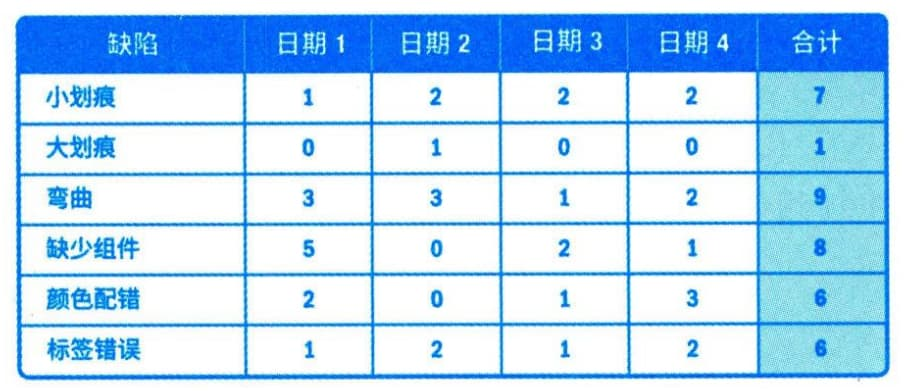

### 13.1.2 主要工具与技术
#### **1．数据收集**
适用于控制质量过程的数据收集技术包括核对单、核查表、统计抽样和问卷调查等。
 - （1）核对单。核对单有助于以结构化方式管理控制质量活动。
 - （2）核查表。核查表又称计数表，用于合理排列各种事项，以便有效地收集关于潜在质量问题的有用数据。在开展检查以识别缺陷时，用核查表收集属性数据就特别方便，例如关于缺陷数量或后果的数据，如图13-3所示。

图13-3 核查表
 - （3）统计抽样。统计抽样是指从目标总体中选取部分样本用于检查（如从75张工程图纸中随机抽取10张）。样本用于测量控制和确认质量。抽样的频率和规模应在规划质量管理过程中确定。
 - （4）问卷调查。问卷调查可用于在部署产品或服务之后收集关于客户满意度的数据。在问卷调查中识别的缺陷相关成本可被视为COQ模型中的外部失败成本，给组织带来的影响会超出成本本身。
#### **2．数据分析**
适用于控制质量过程的数据分析技术包括：绩效核查和根本原因分析（RCA）。
 - （1）绩效审查。绩效审查针对实际结果，测量、比较和分析规划质量管理过程中定义的质量测量指标。
 - （2）根本原因分析。根本原因分析用于识别缺陷成因。
#### **3．检查**
检查是指检验工作产品，以确定是否符合书面标准。检查的结果通常包括相关的测量数据，可在任何层面上进行，可以检查单个活动的成果，也可以检查项目的最终产品。检查也可称为审查、同行审查、审计或巡检等，而在某些应用领域，这些术语的含义比较狭窄和具体。检查也可用于确认缺陷补救。
#### **4．测试／产品评估**
测试是一种有组织的、结构化的调查，旨在根据项目需求提供有关被测产品或服务质量的客观信息。测试的目的是找出产品或服务中存在的错误、缺陷、漏洞或其他不合规问题。用于评估各项需求的测试的类型、数量和程度是项目质量计划的一部分，具体取决于项目的性质、时间、预算或其他制约因素。测试可以贯穿于整个项目，可以在项目的不同组成部分完成时进行，也可以在项目结束（即交付最终可交付成果）时进行。早期测试有助于识别不合规问题，帮助减少修补不合规组件的成本。
不同应用领域需要不同测试。例如，软件测试可能包括单元测试、集成测试、黑盒测试、白盒测试、接口测试、回归测试、a测试等；硬件开发中，测试可能包括环境应力筛选、老化测试、系统测试等。
#### **5．数据表现**
适用于控制质量过程的数据表现技术包括因果图、控制图、直方图和散点图等。
 - （1）因果图。因果图用于识别质量缺陷和错误可能造成的结果，详见本书12.3.2节。
 - （2）控制图。控制图用于确定一个过程是否稳定，或者是否具有可预测的绩效。规格上限和下限是根据要求制定的，反映了可允许的最大值和最小值。上下控制界限不同于规格界限。控制界限根据标准的统计原则，通过标准的统计计算确定，代表一个稳定过程的自然波动范围。项目经理和干系人可基于计算出的控制界限，识别须采取纠正措施的检查点，以预防不在控制界限内的绩效。控制图可用于监测各种类型的输出变量。虽然控制图最常用来跟踪批量生产中的重复性活动，但也可用来监测成本与进度偏差、产量、范围变更频率或其他管理工作成果，以便帮助确定项目管理过程是否受控。
 - （3）直方图。直方图可按来源或组成部分展示缺陷数量，详见本书12.3.2节。
 - （4）散点图。散点图可在一个轴上展示计划的绩效，在另一个轴上展示实际绩效，详见本书12.3.2节。
#### **6．会议**
审查已批准的变更请求、回顾／经验教训等会议可作为控制质量过程的一部分。
 - （1）审查已批准的变更请求：对所有已批准的变更请求进行审查，以核实它们是否已按批准的方式实施，确认是否已完成局部变更，以及是否已执行、测试、完成和证实所有部分。（2）回顾／经验教训：项目团队举行的会议，旨在讨论下述内容。
 - · 项目／阶段的成功要素。
 - · 待改进之处。
 - · 当前项目和未来项目可增加的内容。
 - · 可增加到组织过程资产中的内容等。
