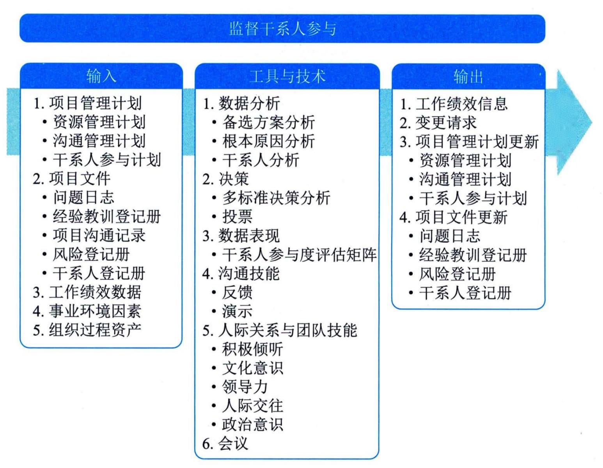

## 13.10 监督干系人参与
监督干系人参与是监督项目干系人关系，并通过修订参与策略和计划来引导干系人合理参与项目的过程。本过程的主要作用是，随着项目进展和环境变化，维持或提升干系人参与活动的效率和效果。本过程需要在整个项目期间开展。图13-14描述本过程的输入、工具与技术和输出。

图13-14 监督干系人参与过程的输入、工具与技术和输出
监督干系人参与过程的主要输入为项目管理计划、项目文件和工作绩效数据，主要工具与技术包括数据分析、决策、数据表现、沟通技能、人际关系与团队技能、会议，主要输出为工作绩效信息。
