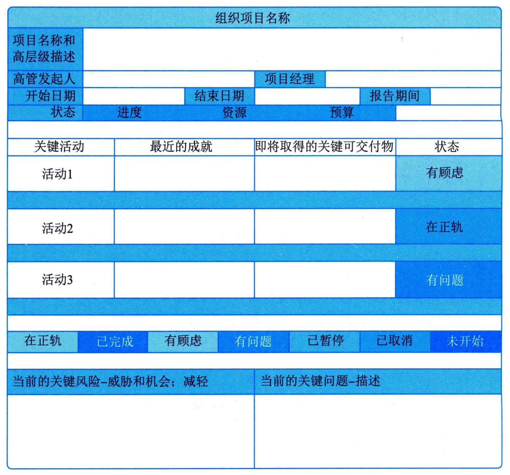
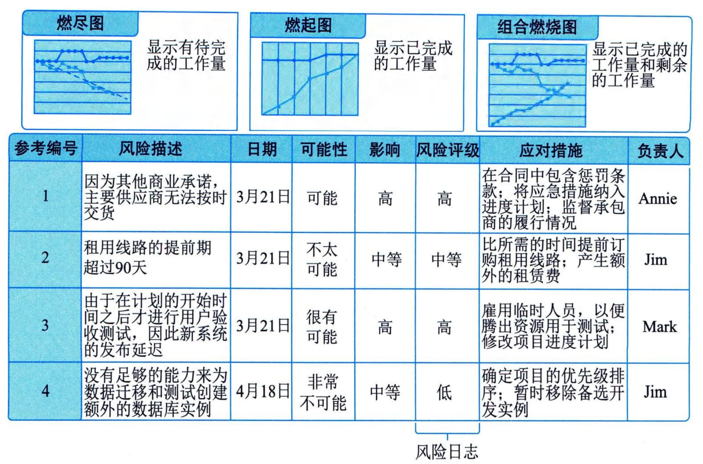
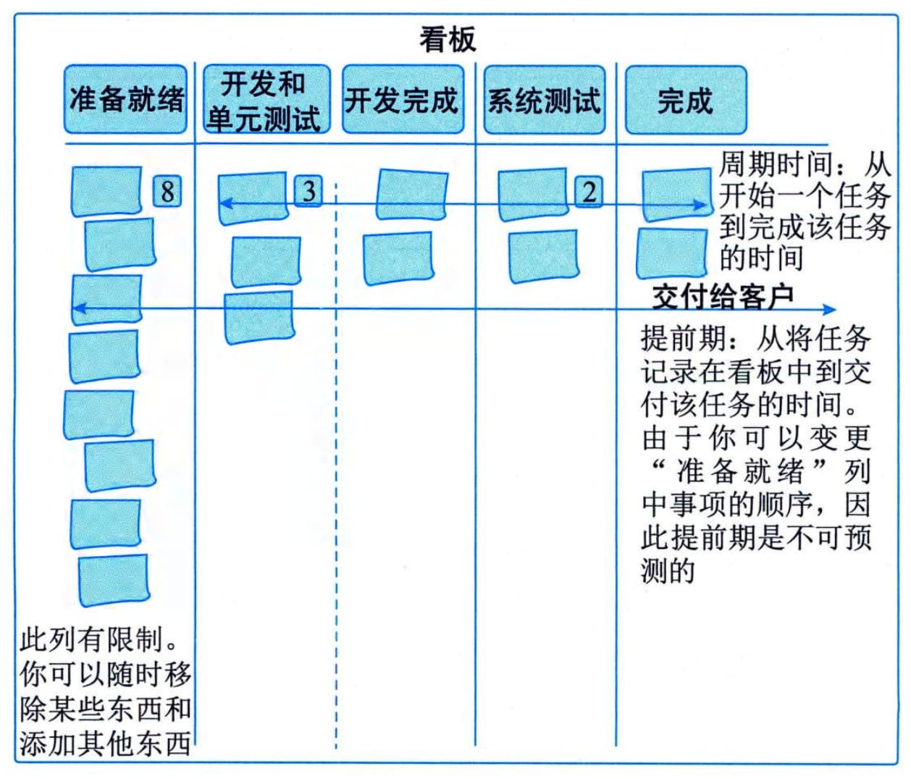
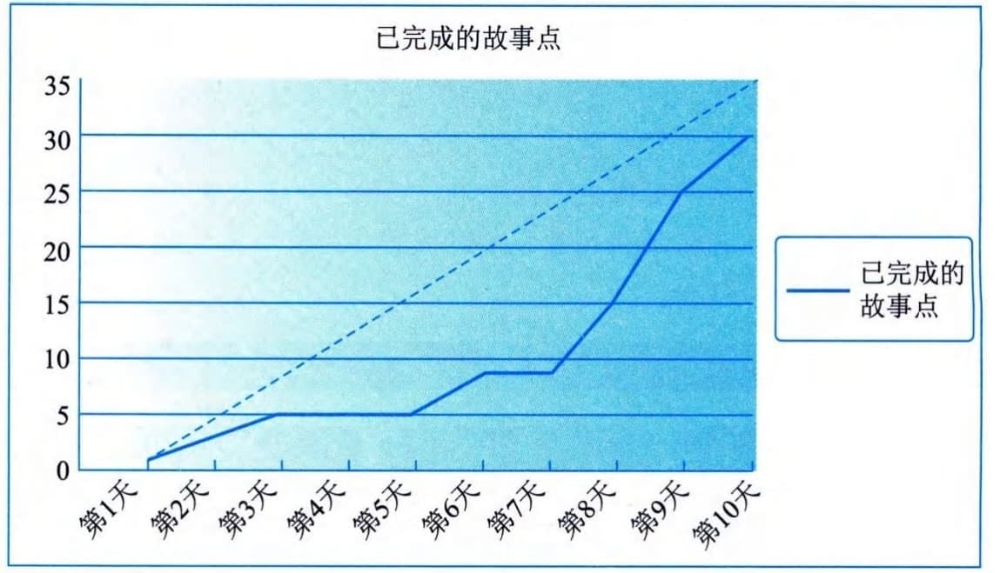
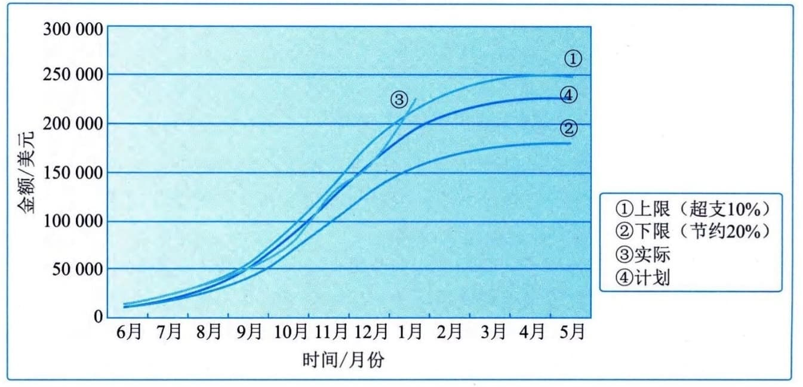

### 13.11.3 主要输出
工作绩效信息可以用实体或电子形式加以合并、记录和分发。基于工作绩效信息，以实体或电子形式编制形成工作绩效报告，以制定决策、采取行动或引起关注。根据项目沟通管理计划，通过沟通过程向项目干系人发送工作绩效报告。
工作绩效数据、工作绩效信息和工作绩效报告之间的主要区别，如表13-1所示。
**表13-1 工作绩效数据、工作绩效信息和工作绩效报告的区别**
+---------+----------+-----------------------+-------------------------+
| 比较项  | 工作     | 工作绩效信息          | 工作绩效报告            |
|         | 绩效数据 |                       |                         |
+=========+==========+=======================+=========================+
| 产生于  | 指导与   | 确认范围              | 监控项目工作过程        |
|         | 管理项目 | 、控制范围、控制进度  |                         |
|         | 工作过程 | 、控制成本、控制质量  |                         |
|         |          | 、监督沟通、控制资源  |                         |
|         |          | 、监督风险、控制采购  |                         |
|         |          | 、监督干系人参与过程  |                         |
+---------+----------+-----------------------+-------------------------+
| 产      | 项       | 间隔一定时间          | 间隔时间                |
| 生时间  | 目过程中 |                       | 较长，定期或特殊需要时  |
|         | 随时产生 |                       |                         |
+---------+----------+-----------------------+-------------------------+
| 主      | 记录     | 反映项目执            | 整个项目                |
| 要用途  | 项目执行 | 行和计划之间的偏差，  | 层面，更深入或更综合的  |
|         |          |                       | 项目执行与项目计划的对  |
|         | 情况     | 支持变更决定          | 比，支持变更或其他行动  |
+---------+----------+-----------------------+-------------------------+
| 回答    | 是什么   | 为什么（why）         | 如何解决和预防（how and |
| 的问题  | （what） |                       | how will）              |
+---------+----------+-----------------------+-------------------------+
| 使用者  | 项目团队 | 项目团队              | 项                      |
|         |          |                       | 目团队、发起人、高级管  |
|         |          |                       | 理者、客户及其他干系人  |
+---------+----------+-----------------------+-------------------------+
| 示例    | 截至当前 | 截至当                | 截至当前，进度偏差为-   |
|         | 完成了20 | 前，与计划相比，进度  | 2个月，超出控制临界值。 |
|         | 个模块的 | 落后2个月，主要原因是 | 应加强人员培训，提高技  |
|         | 研发工作 | 项目所需人员能力不足  | 能，防止进度的继续偏差  |
+---------+----------+-----------------------+-------------------------+
工作绩效报告的内容一般包括状态报告和进展报告。工作绩效报告可以包含挣值图表和信息、趋势线和预测、储备燃尽图、缺陷直方图、合同绩效信息和风险情况概述。工作绩效报告可以表示为引起关注、制定决策和采取行动的仪表盘、大型可见图表、任务板、燃烧图等形式。
#### **1．仪表盘**
仪表盘是以电子方式收集信息并生成描述状态的图表，允许对数据进行深入分析，用于提供高层级的概要信息，对于超出既定临界值的任何度量指标，辅助使用文本进行解释，如图13-16所示。

图13-16 仪表盘示例
仪表盘包括信号灯图（也称为RAG图，其中RAG是红、黄、绿的缩写）、横道图、饼状图和控制图。
#### **2．大型可见图表**
大型可见图表（BVC）也称为信息发射源，是一种可见的实物展示工具，可向组织内成员提供度量信息和结果，支持及时的知识共享。BVC不局限在进度工具或报告工具中发布信息，更多时候会在人们很容易看到的地方发布信息，BVC应该易于更新且经常更新。一般而言，BVC不是电子生成的，而是手动维护的，因此通常是"低科技高触感"。图13-17显示了与已完成工作、剩余工作和风险相关的BVC。

图13-17 信息发射源示例
#### **3．任务板**
任务板通过直观看板方式，显示已准备就绪并可以开始（待办）的工作、正在进行和已完成的工作，是对计划工作的可视化表示，可以帮助项目成员随时了解各项任务的状态，可以用不同颜色的便利贴代表不同类型的工作，如图13-18所示。

#### **4．燃烧图**
燃烧图（包括燃起图或燃尽图）用于显示项目团队的速度，此"速度"可度量项目的生产率。燃起图可以对照计划，跟踪已完成的工作量，如图13-19所示；燃尽图可以显示剩余工作（比如采用适应型方法的项目中的故事点）的数量或已减少的风险的数量。

图13-19 **燃起图示例**
图13-20是预算临界值设置的例子，超出计划支出率$+ 10\%$的曲线为①，-20％的曲线为②，③代表实际支出。图中显示在1月份，支出超过$了 + 10\%$的公差上限，将触发诊断计划。

图13-20 计划支出率和实际支出率
项目团队不应等到突破临界值才采取行动，如果可以通过趋势或新信息进行预测，则项目团队能主动提前解决偏差。诊断计划是在超过临界值或预测时采取的一组行动，诊断计划不需要注重形式，它可以像召集干系人开会讨论问题一样简单，诊断计划的重要性在于讨论问题并针对需要做的事情制订计划，然后持续跟进，确保计划得到实施并确定计划是否有效。
