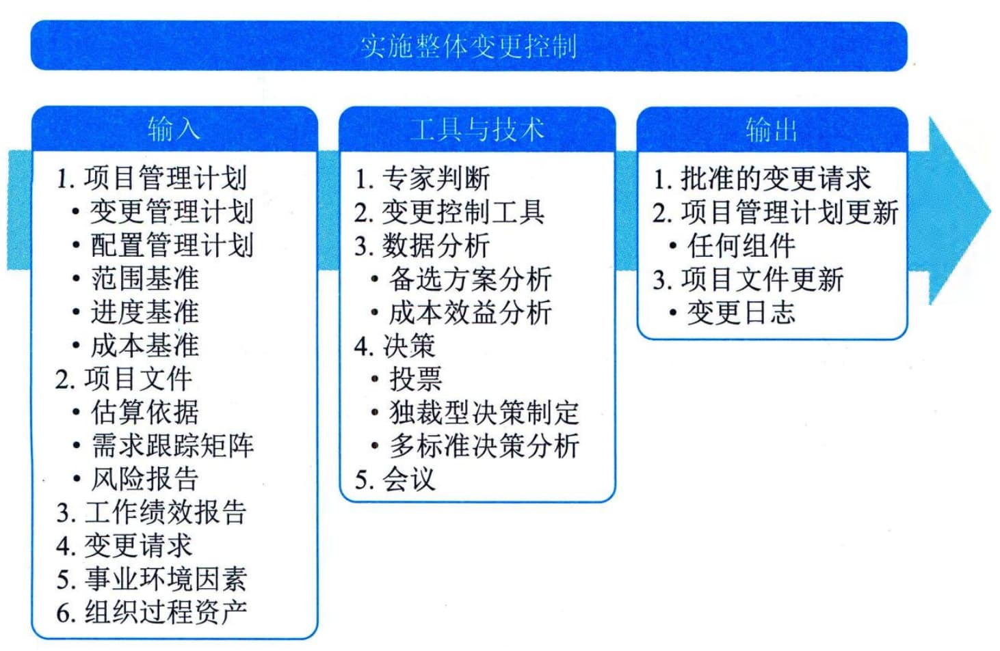

## 13.12 实施整体变更控制
实施整体变更控制是指审查所有变更请求，批准变更，管理对可交付成果、组织过程资产、项目文件和项目管理计划的变更，并对变更处理结果进行沟通的过程。本过程审查对项目文件、可交付成果或项目管理计划的所有变更请求，并决定对变更请求的处置方案。本过程的主要作用是，确保对项目中已记录在案的变更做综合评审。如果不考虑变更对整体项目目标或计划的影响就开展变更，往往会加剧整体项目风险。本过程需要在整个项目期间开展。图13-21描述了本过程的输入、工具与技术和输出。

图13-21 实施整体变更控制过程的输入、工具与技术和输出
实施整体变更控制过程贯穿项目始终，项目经理对此承担最终责任。变更请求可能影响项目范围、产品范围以及任一项目管理计划组件或任一项目文件。在整个项目生命周期的任何时间，参与项目的任何干系人都可以提出变更请求。
在基准确定之前，变更无须正式受控并实施整体变更控制过程。一旦确定了项目基准，就必须通过实施整体变更控制过程来处理变更请求。尽管变更可以口头提出，但所有变更请求都必须以书面形式记录，并纳入变更管理和（或）配置管理系统中。在批准变更之前，可能需要了解变更对进度的影响和对成本的影响。在变更请求可能影响任一项目基准的情况下，都需要开展正式的整体变更控制过程。每项记录在案的变更请求都必须由一位责任人批准、推迟或否决，这个责任人通常是项目发起人或项目经理。应该在项目管理计划或组织程序中指定这位责任人，必要时，应该由CCB来开展实施整体变更控制过程。变更请求得到批准后，可能需要新编（或修订）成本估算、活动排序、进度日期、资源需求和（或）风险应对方案分析，这些变更可能会对项目管理计划和其他项目文件进行调整。
为了便于开展变更管理，可以使用一些手动或信息化的工具。配置控制和变更控制的关注点不同：配置控制重点关注可交付成果及各个过程的技术规范，而变更控制则重点关注识别、记录、批准或否决对项目文件、可交付成果或基准的变更。
变更控制工具的选择应基于项目干系人的需要，并充分考虑组织和环境的情况和制约因素。变更控制工具需要支持的配置管理活动包括：识别配置项、记录并报告配置项状态、进行配置项核实与审计等。
 - （1）识别配置项：识别与选择配置项，为定义与核实产品配置、标记产品和文件、管理变更和明确责任提供基础。
 - （2）记录并报告配置项状态：对各个配置项的信息进行记录和报告。
 - （3）进行配置项核实与审计：通过配置核实与审计，确保项目的配置项组成的正确性，以及相应的变更都被登记、评估、批准、跟踪和正确实施，确保配置文件所规定的功能要求都已实现。
变更控制工具还需要支持的变更管理活动包括：识别变更、记录变更、做出变更决定和跟踪变更等。
 - （1）识别变更：识别并选择过程或项目文件的变更项。
 - （2）记录变更：将变更记录为合适的变更请求。
 - （3）做出变更决定：审查变更，批准、否决、推迟对项目文件、可交付成果或基准的变更或做出其他决定。
 - （4）跟踪变更：确认变更被登记、评估、批准、跟踪并向干系人传达最终结果。
也可以使用变更控制工具管理变更请求和后续的决策，同时还需要及时沟通，帮助CCB的成员履行职责，并向干系人传达变更相关的决定。
实施整体变更控制过程的主要输入为项目管理计划、项目文件、工作绩效报告和变更请求，主要输出为批准的变更请求。
