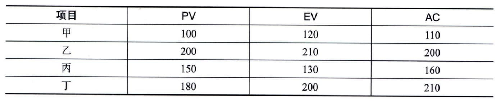

## 13.13 本章练习
#### **1．选择题**
\(1\) 过程将工作绩效信息作为输入。
A.监控项目 B.确认范围 C.控制范围 D.控制进度
**参考答案：A**
 - （2）为确保项目工作的未来绩效符合项目管理计划，而进行的有目的的活动属于

A.缺陷补救 B.纠正措施 C.修复措施 D.预防措施
**参考答案：D**
 - （3）关于实施项目整体变更控制过程的描述，不正确的是 。
A.尽管可以口头提出，但所有变更请求都必须以书面形式记录
B.在基准确定之前，变更也应正式受控，实施整体变更控制过程
C.实施整体变更控制过程贯穿项目始终，项目经理对此承担最终责任
D.项目的任何干系人都可以提出变更请求
**参考答案：B**
 - （4）控制范围过程的主要作用是 。
A.描述产品、服务或成果的边界和验收标准
B.通过确认每个可交付成果来提高最终产品获得验收的可能性
C.在整个项目期间保持对范围基准的维护
D.使验收过程具有客观性
**参考答案：C**
 - （5）四个项目甲、乙、丙、丁，当前各项目进度数据如表所示，则最有可能在按时完工的同时并能更好地控制成本的项目是
。
A.甲 B.乙 C.丙 D.丁
参考答案：A
 - （6） 不属于控制质量过程的数据表现技术。
A.思维导图 B.控制图 C.流程图 D.散点图
**参考答案：A**
 - （7） 检查项目绩效随时间的变化情况，可用于确定绩效是在改善还是在恶化。
A.备选方案分析 B.成本效益分析 C.绩效审查 D.趋势分析
**参考答案：D**
 - （8）关于风险审计的描述，不正确的是 。
A.风险审计可用于评估风险管理过程的有效性
B.项目经理要确保按项目风险管理计划所规定的频率实施风险审计
C.应召开专门的风险审计会议进行风险审计
D.在实施审计前，要明确定义审计的格式和目标
**参考答案：C**
 - （9）可能影响控制沟通过程的组织过程资产不包括 。
A.以往项目的经验教训知识库
B.组织对沟通的要求
C.制作、交换、储存和检索信息的标准化指南
D.组织治理框架
**参考答案：D**(10) 包含用于管理采购过程的完整支持性记录。
A.采购文档 B.采购合同 C.协议 D.采购管理计划
**参考答案：**A
2．思考题
 - （1）监控过程组包含哪些项目管理过程。
**参考答案：**略
 - （2）当项目发生变更时，请简述变更控制的过程。
**参考答案：**略
