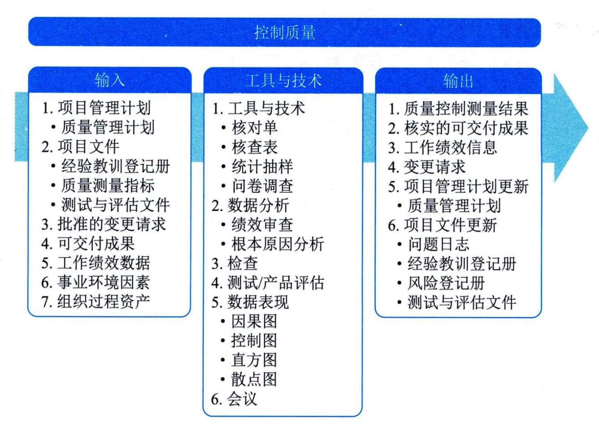

## 13.1 控制质量

图13-2 控制质量过程的输入、工具与技术和输出
本过程通过测量所有步骤、属性和变量，来核实与规划阶段所描述规范的一致性和合规性。在整个项目期间应执行质量控制，用可靠的数据来证明项目已经达到发起人和（或）客户的验收标准。
控制质量的努力程度和执行程度可能会因所在行业和项目管理风格而不同。例如，与其他行业相比，制药、医疗、运输和核能产业可能拥有更加严格的质量控制程序，为满足标准付出的工作也更多；在敏捷或适应型项目中，控制质量活动可能由所有团队成员在整个项目生命周期中执行；在瀑布或预测型项目中，控制质量活动由特定团队成员在特定时间点或者项目或阶段快结束时执行。
控制质量过程的主要输入为项目管理计划、项目文件、批准的变更请求、可交付成果和工作绩效数据，主要工具与技术包括数据收集、数据分析、检查、测试／产品评估、数据表现和会议，主要输出为质量控制测量结果、核实的可交付成果和工作绩效信息。
