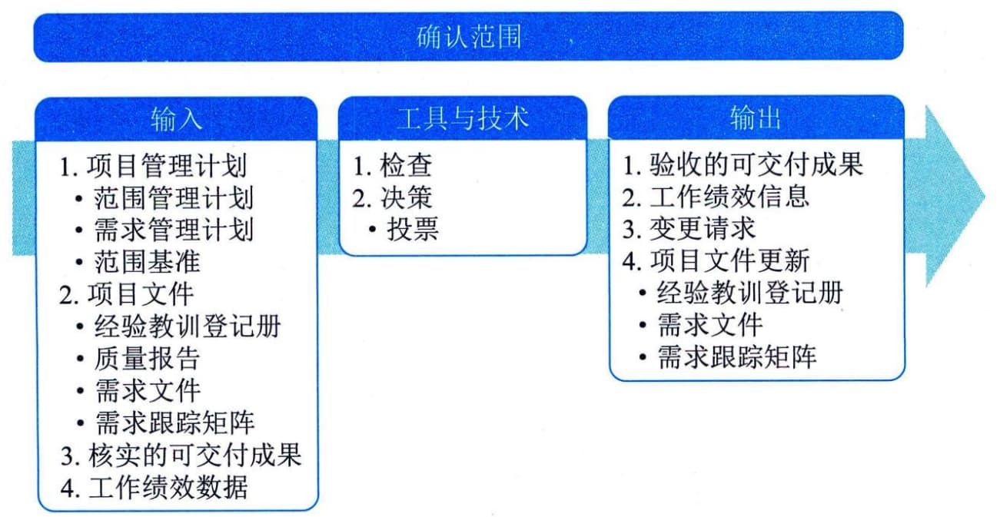

## 13.2 确认范围
确认范围是正式验收已完成的项目可交付成果的过程。本过程的主要作用是，使验收过程具有客观性；同时通过确认每个可交付成果来提高最终产品、服务或成果获得验收的可能性。本过程应根据需要在整个项目期间定期开展。图13-4描述本过程的输入、工具与技术和输出。

图**13-4**确认范围过程的输入、工具与技术和输出
由主要干系人，尤其是客户或发起人审查从控制质量过程输出的核实的可交付成果，确认这些可交付成果已经圆满完成并通过正式验收。确认范围过程依据从项目范围管理知识领域的相应过程获得的输出（如需求文件或范围基准），以及从其他知识领域的执行过程获得的工作绩效数据，对可交付成果的确认和最终验收。
确认范围过程的主要输入为项目管理计划、项目文件、核实的可交付成果和工作绩效数据，主要输出为验收的可交付成果和工作绩效信息。
