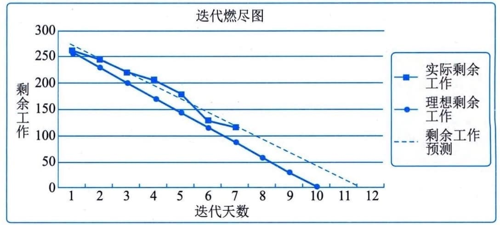

### 13.4.2 主要工具与技术
#### **1．数据分析**
可用作控制进度过程的数据分析技术主要包括：挣值分析、迭代燃尽图、绩效审查、趋势分析、偏差分析和假设情景分析等。
 - （1）挣值分析。进度绩效测量指标（如进度偏差（SV）和进度绩效指数（SPI））用于评价偏离初始进度基准的程度。
 - （2）迭代燃尽图。这类图用于追踪迭代未完项中尚待完成的工作。它分析与理想燃尽图的
偏差。可使用预测趋势线来预测迭代结束时可能出现的偏差，以及在迭代期间应采取的合理行动。燃尽图中先用对角线表示理想的燃尽情况，再每天画出实际剩余工作，最后基于剩余工作计算出趋势线以预测完成情况，如图13-7所示。

图13-7 迭代燃尽图
 - （3）绩效审查。绩效审查是指根据进度基准，测量、对比和分析进度绩效，如实际开始和完成日期、已完成百分比，以及当前工作的剩余持续时间。
 - （4）趋势分析。趋势分析检查项目绩效随时间的变化情况，以确定绩效是在改善还是在恶化。图形分析技术有助于理解截至目前的绩效，并与未来的绩效目标（表示为完工日期）进行对比。
 - （5）偏差分析。偏差分析关注实际开始和完成日期与计划的偏离，实际持续时间与计划的差异，以及浮动时间的偏差。它包括确定偏离进度基准的原因与程度，评估这些偏差对未来工作的影响，以及确定是否需要采取纠正或预防措施。
 - （6）假设情景分析。假设情景分析基于项目风险管理过程的输出，对各种不同的情景进行评估，促使进度模型符合项目管理计划和批准的基准。
#### **2．关键路径法**
检查关键路径的进展情况有助于确定项目进度状态。关键路径上的偏差将对项目的结束日期产生直接影响。评估次关键路径上的活动的进展情况，有助于识别进度风险。
#### **3．资源优化**
资源优化技术是在同时考虑资源可用性和项目时间的情况下，对活动和活动所需资源进行的进度规划。
#### **4．提前量和滞后量**
在网络分析中调整提前量与滞后量，设法使进度滞后的项目活动赶上计划。
#### **5．进度压缩**
采用进度压缩技术使进度落后的项目活动赶上计划，可以对剩余工作使用快速跟进或赶工方法。
