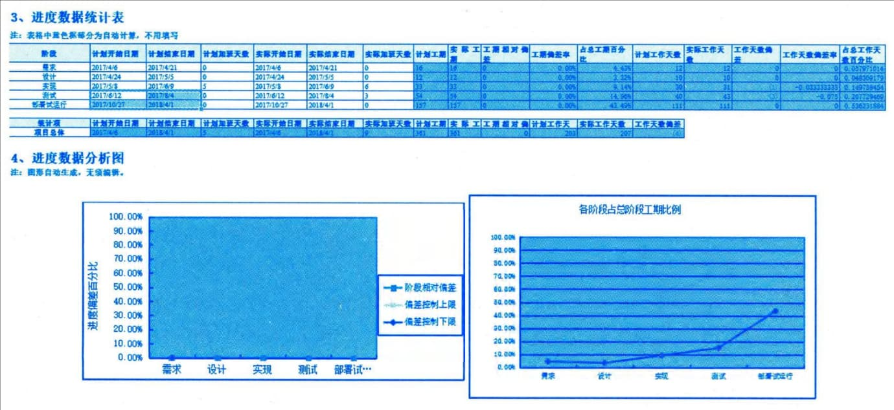

### 13.4.3 主要输出
#### **1．工作绩效信息**
工作绩效信息包括与进度基准相比较的项目工作执行情况。可以在工作包层级和控制账户层级，计算开始和完成日期的偏差以及持续时间的偏差。使用挣值分析的项目，进度偏差（SV）和进度绩效指数（SPI）将记录在工作绩效报告中。
某项目进度工作绩效信息示例如图13-8所示。

图13-8 进度工作绩效信息示例
#### **2．进度预测**
进度预测指根据已有的信息和知识，对项目未来的情况和事件进行的估算或预计。随着项目执行，应该基于工作绩效信息，更新和重新发布进度预测，这些信息取决于纠正或预防措施所期望的未来绩效，可能包括挣值绩效指数，以及可能在未来对项目造成影响的进度储备信息。
