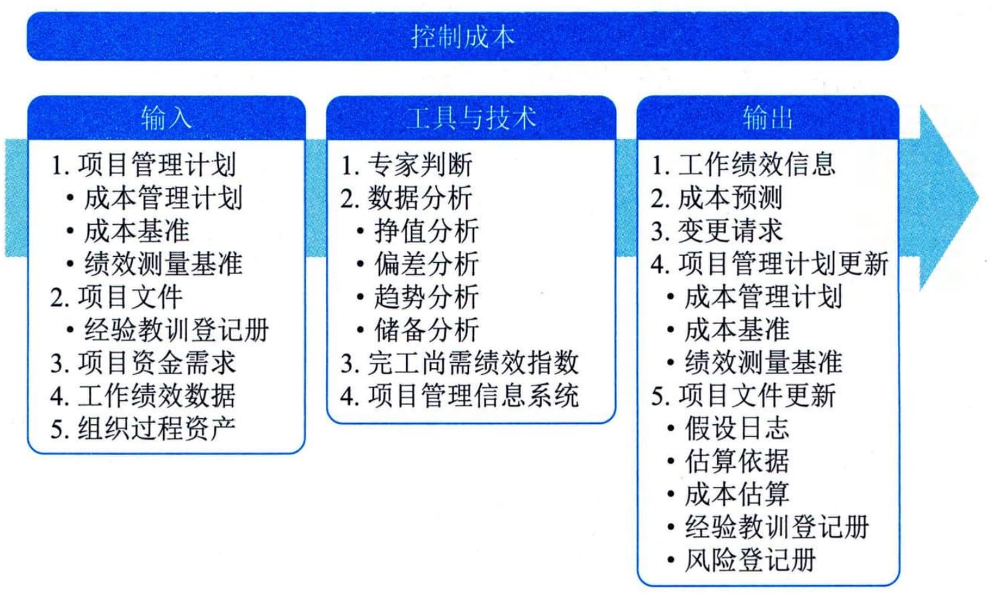

## 13.5 控制成本
控制成本是监督项目状态，以更新项目成本和管理成本基准变更的过程。本过程的主要作用是，在整个项目期间保持对成本基准的维护。本过程需要在整个项目期间开展。图13-9描述本过程的输入、工具与技术和输出。
要更新预算，就需要了解截至目前的实际成本。只有经过实施整体变更控制过程的批准，才可以增加预算。只监督资金的支出，而不考虑由这些支出所完成的工作的价值，对项目没有什么意义，最多算是跟踪资金流。因此，在成本控制中，应重点分析项目资金支出与相应完成的工作之间的关系。有效成本控制的关键在于管理经批准的成本基准。项目成本控制的目标包括：
 - · 对造成成本基准变更的因素施加影响；
 - · 确保所有变更请求都得到及时处理；
 - · 当变更实际发生时，管理这些变更；

图13-9 控制成本过程的输入、工具与技术和输出
 - ·确保成本支出不超过批准的资金限额，既不超出按时段、按WBS组件、按活动分配的限额，也不超出项目总限额；
 - · 监督成本绩效，找出并分析与成本基准间的偏差；
 - · 对照资金支出，监督工作绩效；
 - · 防止在成本或资源使用报告中出现未经批准的变更；
 - · 向干系人报告所有经批准的变更及其相关成本；
 - · 设法把预期的成本超支控制在可接受的范围内等。
控制成本过程的主要输入为项目管理计划、项目文件、项目资金需求和工作绩效数据，主要工具与技术包括挣值分析、偏差分析、趋势分析、储备分析、完工尚需绩效指数、项目管理信息系统，主要输出为工作绩效信息和成本预测。
