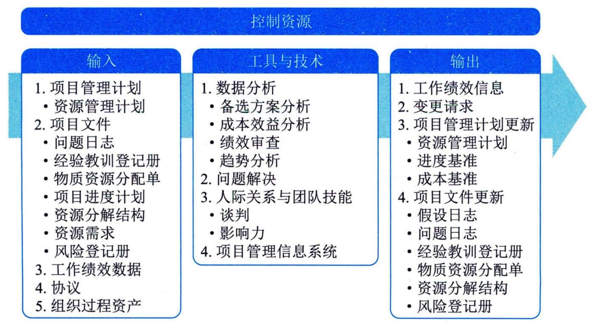

### 13.6 控制资源
控制资源是确保按计划为项目分配实物资源，以及根据资源使用计划监督资源实际使用情况，并采取必要纠正措施的过程。本过程的主要作用是，确保所分配的资源适时适地可用于项目，且在不再需要时被释放。本过程需要在整个项目期间开展。图13-10描述了本过程的输入、工具与技术和输出。

图**13-10**控制资源过程的输入、工具与技术和输出
应在所有项目阶段和整个项目生命周期期间持续开展控制资源过程，且适时、适地和适量地分配和释放资源，使项目能够持续进行。控制资源过程重点关注实物资源，例如设备、材料、设施和基础设施。本节讨论的控制资源技术是项目中最常用的，在特定项目或应用领域中，还可采用许多其他控制资源技术。
更新资源分配时，需要了解已使用的资源和还需要获取的资源。为此应审查至今为止的资源使用情况。控制资源过程关注：
 - · 监督资源支出；
 - · 及时识别和处理资源缺乏／剩余情况；
 - · 确保根据计划和项目需求使用并释放资源；
 - · 出现资源相关问题时通知相应干系人；
 - · 影响可以导致资源使用变更的因素；
 - · 在变更实际发生时对其进行管理等。
进度基准或成本基准的任何变更，都必须经过实施整体变更控制过程的审批。
控制资源过程的主要输入为项目管理计划、项目文件、工作绩效数据和协议。
**主要输入**
#### **1．项目管理计划**
可用于控制资源的项目管理计划组件是资源管理计划，资源管理计划为如何使用、控制和最终释放实物资源提供指南。
#### **2．项目文件**
可作为控制资源过程输入的项目文件主要包括：问题日志、经验教训登记册、物质资源分配单、项目进度计划、资源分解结构、资源需求和风险登记册等。
 - （1）问题日志。问题日志用于识别有关缺乏资源、原材料供应延迟或低等级原材料等问题。
 - （2）经验教训登记册。在项目早期获得的经验教训可以运用到后期阶段，以改进实物资源控制。
 - （3）物质资源分配单。物质资源分配单描述了资源的预期使用情况以及资源的详细信息，例如类型、数量、地点以及属于组织内部资源还是外购资源。
 - （4）项目进度计划。项目进度计划展示了项目在何时何地需要哪些资源。
 - （5）资源分解结构。资源分解结构为项目过程中需要替换或重新获取资源的情况提供了参考。
 - （6）资源需求。资源需求识别了项目所需的材料、设备、用品和其他资源。
 - （7）风险登记册。风险登记册识别了可能会影响设备、材料或用品的单个风险。
#### **3．工作绩效数据**
工作绩效数据包含有关项目状态的数据，例如已使用的资源的数量和类型。
#### **4．协议**
在项目中签署的协议是获取组织外部资源的依据，应在需要新的和未规划的资源时，或在当前资源出现问题时，在协议里定义相关程序。
