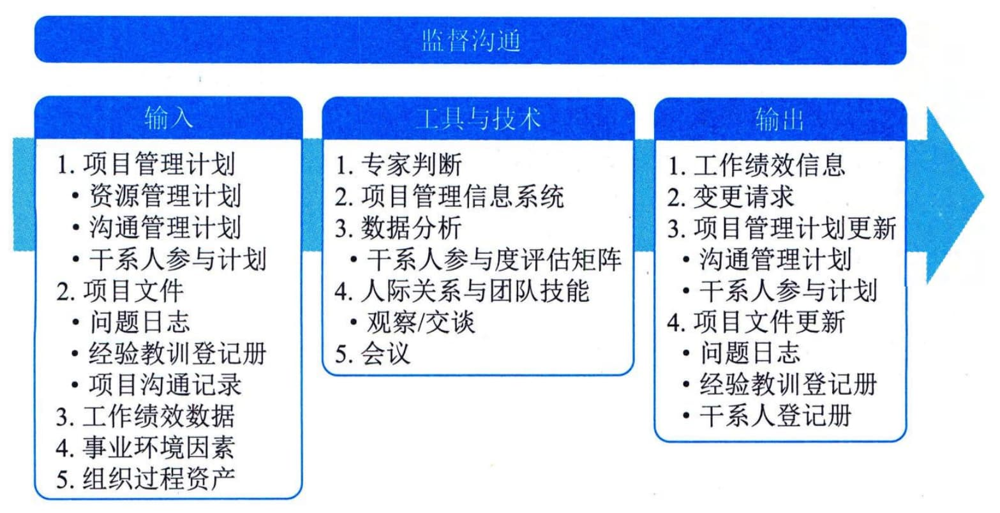

### 13.7 监督沟通
监督沟通是确保满足项目及其干系人的信息需求的过程。本过程的主要作用是，按沟通管理计划和干系人参与计划的要求优化信息传递流程。本过程需要在整个项目期间开展。图13-11描述本过程的输入、工具与技术和输出。

图13-11 监督沟通过程的输入、工具与技术和输出
通过监督沟通过程，来确定规划的沟通方法和沟通活动对项目可交付成果与预计结果的支持力度。项目沟通的影响和结果应该接受正式的评估和监督，以确保在正确的时间，通过正确的渠道，将正确的内容（发送方和接收方对其理解一致）传递给正确的受众。
监督沟通过程可能需要采取各种方法，例如，开展客户满意度调查、整理经验教训、开展团队观察、审查问题日志或评估变更。
监督沟通过程可能触发规划沟通管理、管理沟通过程的迭代，以便修改沟通计划并开展额外的沟通活动，来提升沟通的效果。这种迭代体现了项目沟通管理各过程的持续性。问题、关键绩效指标、风险或冲突，都可能立即触发重新迭代开展这些过程。
监督沟通过程的主要输入为项目管理计划、项目文件和工作绩效数据。
**主要输入**
#### **1．项目管理计划**
监督沟通过程使用的项目管理计划组件主要包括：资源管理计划、沟通管理计划、干系人参与计划等。
 - （1）资源管理计划。通过描述角色和职责，以及项目组织结构图，资源管理计划可用于理解实际的项目组织及其任何变更。
 - （2）沟通管理计划。沟通管理计划是关于及时收集、生成和发布信息的现行计划，它确定了沟通过程中的团队成员、干系人和有关工作。
 - （3）干系人参与计划。干系人参与计划确定了计划用以引导干系人参与的沟通策略。
#### **2．项目文件**
可作为监督沟通过程输入的项目文件主要包括：问题日志、经验教训登记册和项目沟通记录等。
 - （1）问题日志。问题日志提供项目的历史信息、干系人参与问题的记录，以及它们如何得以解决。
 - （2）经验教训登记册。项目早期的经验教训可用于项目后期阶段，以改进沟通效果。
 - （3）项目沟通记录。项目沟通记录提供已开展的沟通的信息。
#### **3．工作绩效数据**
工作绩效数据包含关于已开展的沟通类型和数量的数据。
