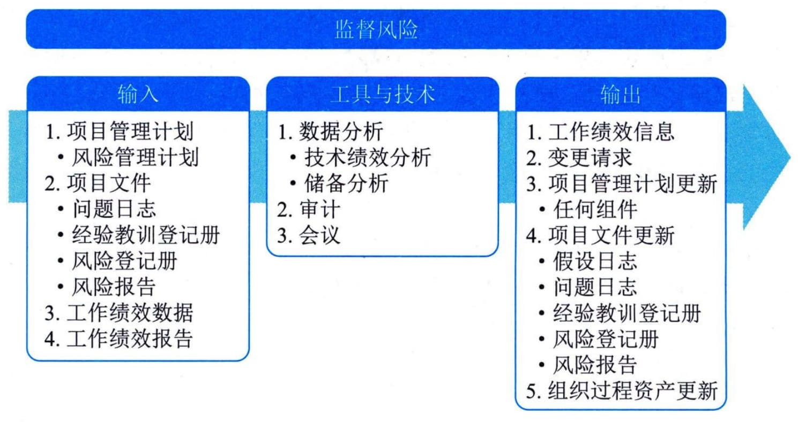

## 13.8 监督风险
监督风险是在整个项目期间，监督商定的风险应对计划的实施、跟踪已识别风险、识别和分析新风险，以及评估风险管理有效性的过程。本过程的主要作用是，使项目决策都基于关于整体项目风险和单个项目风险的当前信息。本过程需要在整个项目期间开展。图13-12描述本过程的输入、工具与技术和输出。

图13-12 监督风险过程的输入、工具与技术和输出
为了确保项目团队和关键干系人了解当前的风险级别，应该通过监督风险过程对项目工作进行持续监督，并持续关注新出现、正变化和已过时的单个项目风险。
监督风险过程采用项目执行期间生成的绩效信息，以确定：
 - · 实施的风险应对是否有效；
 - · 整体项目风险级别是否已改变；
 - · 已识别单个项目风险的状态是否已改变；
 - · 是否出现新的单个项目风险；·风险管理方法是否依然适用；
 - · 项目假设条件是否仍然成立；
 - · 风险管理政策和程序是否已得到遵守；
 - · 成本或进度应急储备是否需要修改；
 - · 项目策略是否仍然有效等。
监督风险过程的主要输入为项目管理计划、项目文件、工作绩效数据和工作绩效报告，主要工具与技术包括数据分析、审计和会议，主要输出为工作绩效信息。
