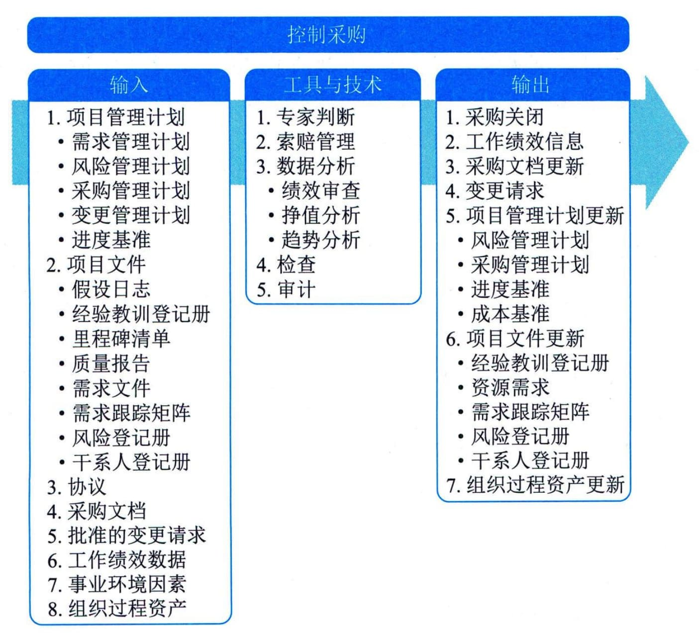

## 13.9 控制采购
控制采购是管理采购关系、监督合同绩效、实施必要的变更和纠偏，以及关闭合同的过程。本过程的主要作用是，确保买卖双方履行法律协议，满足项目需求。本过程应根据需要在整个项目期间开展。图13-13描述本过程的输入、工具与技术和输出。
买方和卖方都出于相似的目的来管理采购合同，每方都必须确保双方履行合同义务，确保各自的合法权利得到保护。合同关系的法律性质，要求项目管理团队必须了解在控制采购期间所采取的任何行动的法律后果。对于有多个供应商的较大项目，合同管理的一个重要方面就是管理各个供应商之间的沟通。鉴于其法律意义，很多组织都将合同管理视为独立于项目的一种组织职能。虽然采购管理员可以是项目团队成员，但通常还向另一部门的合同管理经理报告。

图13-13 控制采购过程的输入、工具与技术和输出
在控制采购过程中，需要把适当的项目管理过程应用于合同关系，并且需要整合这些过程的输出，以用于对项目的整合管理。如果涉及多个卖方，以及多种产品、服务或成果，往往需要在多个层级上开展这种整合。
合同管理活动可能包括以下5个方面：
 - （1）收集数据和管理项目记录，包括维护对实体和财务绩效的详细记录，以及建立可测量的采购绩效指标；
 - （2）完善采购计划和进度计划；
 - （3）建立与采购相关的项目数据的收集、分析和报告机制，并为组织编制定期报告；
 - （4）监督采购环境，以便引导或调整实施；
 - （5）向卖方付款。
控制采购的质量，包括采购审计的独立性和可信度，是采购系统可靠性的关键决定因素。组织的道德规范、内部法律顾问和外部法律咨询，包括持续的反腐计划，都有助于实现适当的采购控制。
在控制采购过程中，需要开展财务管理工作，包括监督向卖方付款。这是要确保合同中的支付条款得到遵循，确保按合同规定，把付款与卖方的工作进展联系起来。需要重点关注的一点是，确保向卖方的付款与卖方实际已经完成的工作量之间有密切的关系。如果合同规定了基于项目输出及可交付成果来付款，而不是基于项目输入（如工时），那么就可以更有效地开展采购控制。
在合同收尾前，若双方达成共识，可以根据协议中的变更控制条款，随时对协议进行修改。通常要书面记录对协议的修改。控制采购过程的主要输入为项目管理计划、项目文件、协议、采购文档和工作绩效数据，主要工具与技术包括专家判断、索赔管理、数据分析、检查和审计，主要输出为采购关闭和工作绩效信息。
