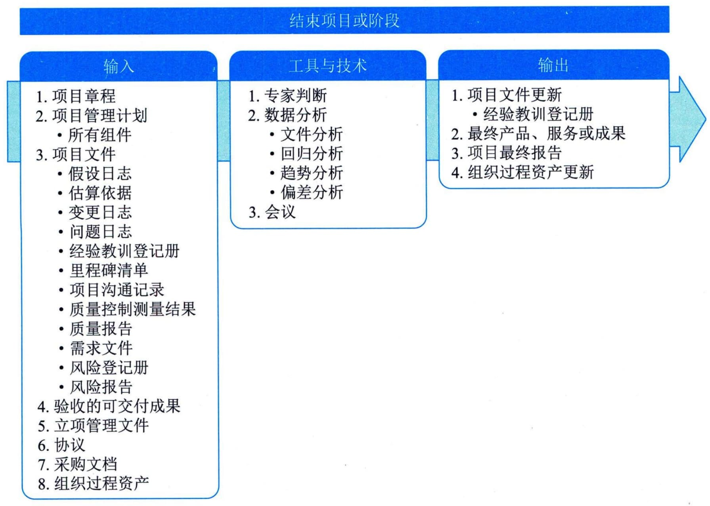

## 14.1 结束项目或阶段
结束项目或阶段是终结项目、阶段或合同的所有活动的过程。本过程的主要作用是，存档项目或阶段信息，完成计划的工作，释放组织资源以展开新的工作。本过程仅开展一次或仅在项目的预定义点开展。图14-2描述了本过程的输入、工具与技术和输出。

图14-2 结束项目或阶段过程的输入、工具与技术和输出
在结束项目时，项目经理需要回顾项目管理计划，确保所有项目工作都已完成以及项目目标均已实现。项目或阶段行政收尾所需的必要活动包括如下内容。
 - （1）为达到阶段或项目的完工或退出标准所必须的行动和活动，例如：
 - · 确保所有文件和可交付成果都已是最新版本，且所有问题都已得到解决；
 - · 确认可交付成果已交付给客户并已获得客户的正式验收；
 - · 确保所有成本都已记入项目成本账；
 - · 关闭项目账户；
 - · 重新分配人员；·处理多余的项目材料；
 - · 重新分配项目设施、设备和其他资源；
 - · 根据组织政策编制详尽的最终项目报告。
 - （2）为关闭项目合同协议或项目阶段合同协议所必须开展的活动，例如：
 - · 确认卖方的工作已通过正式验收；
 - · 最终处置未决索赔；
 - · 更新记录以反映最后的结果；
 - · 存档相关信息供未来使用。
 - （3）完成下列工作所必须开展的活动：
 - · 收集项目或阶段记录；
 - · 审计项目成败；
 - · 管理知识分享和传递；
 - · 总结经验教训；
 - · 存档项目信息以供组织未来使用。
 - （4）为向下一个阶段，或者向生产和（或）运营部门移交项目的产品、服务或成果所必须开展的行动和活动。
 - （5）收集关于改进或更新组织政策和程序的建议，并将它们发送给相应的组织部门。
 - （6）测量干系人的满意程度。
如果项目在完工前就提前终止，结束项目或阶段过程还需要制定程序，来调查和记录提前终止的原因。为了实现上述目的，项目经理应该引导所有合适干系人参与本过程。
结束项目和阶段过程的主要输入为项目章程、项目管理计划、项目文件、验收的可交付成果、协议和采购文档，主要输出为最终产品、服务或成果和项目最终报告。
