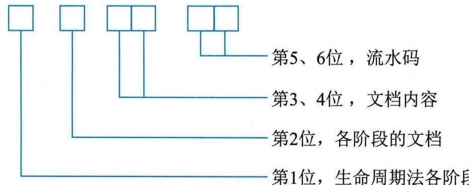

### 15.1.2 信息（文档）管理规则和方法
#### **1．信息（文档）编制规范**
信息（文档）的规范化管理主要体现在文档书写规范、图表编号规则、文档目录编写标准和文档管理制度等几个方面。
文档书写规范。管理信息系统的文档资料涉及文本、图形和表格等多种类型，无论是哪种类型的文档都应该遵循统一的书写规范，包括符号的使用、图标的含义、程序中注释行的使用、注明文档书写人及书写日期等。例如，在程序的开始要用统一的格式包含程序名称、程序功能、调用和被调用的程序、程序设计人等信息。
图表编号规则。在管理信息系统的开发过程中会用到很多的图表，对这些图表进行有规则的编号，可以方便查找图表。图表的编号一般采用分类结构。根据生命周期法的5个阶段，可以给出如图15-1所示的分类编号规则。根据该规则，通过图表编号就可以判断该图表出自系统开发周期的哪一个阶段，属于哪一个文档，文档中的哪一部分内容及第几张图表。

图15-1 图表编号规则
文档目录编写标准。为了存档及未来使用的方便，应该编写文档目录。管理信息系统的文档目录中应包含文档编号、文档名称、格式或载体、份数、每份页数或件数、存储地点、存档时间、保管人等。文档编号一般为分类结构，可以采用同图表编号类似的编号规则。文档名称要书写完整规范。格式或载体指的是原始单据或报表、磁盘文件、磁盘文件打印件、大型图表、重要文件原件、光盘存档等。
文档管理制度。为了更好地进行信息系统文档的管理，应该建立相应的文档管理制度。文档的管理制度须根据组织实体的具体情况而定，主要包括建立文档的相关规范、文档借阅记录的登记制度、文档使用权限控制规则等。建立文档的相关规范是指文档书写规范、图表编号规则和文档目录编写标准等。文档的借阅应该进行详细的记录，并且需要考虑借阅人是否有使用权限。
#### **2．信息（文档）定级保护**
应根据侵害可能影响对象和影响程度，对信息系统项目的信息（文档）进行分析并定级，按相应的定级保护策略进行管理。
 - （1）根据项目干系人和项目价值目标的识别，影响对象主要包括：
 - · 个人、法人和其他组织的合法权益和经济利益；
 - · 社会秩序、公共利益；
 - · 国家安全。
 - （2）对影响对象的侵害影响程度，归结为：
 - · 无影响；
 - · 造成一般损害；
 - · 造成严重损害；
 - · 造成特别严重损害。
基于以上定级方法，组织可以将项目信息（文档），结合自身业务的特点来定义分级标准，并建立相应的分级管理策略。针对文件的编制、审批、存储、分发、使用、变更、销毁等方面，在文档管理制度中提出相应的管理要求。特别要注意的是，在项目应用时，应结合客户要求和合同要求，建立项目信息（文档）管理策略。文档中有密级要求的，应注意保密和权限管理。项目干系人签字确认后的文档要与相关联的电子文档一一对应，这些电子文档还应设置为只读。项目人员须谨慎地处理项目信息资产，以防擅自披露（如在网络上传共享、传递给其他客户）、丢失或被盗。依照分配的职责或项目干系人授权范围，在需要知情的基础上只使用可得到的信息。
#### **3．信息（文档）配置管理**
信息（文档）配置管理是通过技术或者行政的手段对项目管理对象和信息系统的信息进行管理的一系列活动，这些信息不仅包括具体配置项信息，还包括这些配置项之间的相互关系。配置管理包含配置库的建立和配置管理数据库（C[onfig]{.underline}uration
Management
Databases，CMDB）准确性的维护，以支持信息系统项目的正常运行。在信息系统项目中，配置管理可用于问题分析、变更影响度分析、异常分析等，因此，配置项与真实情况的匹配度和详细度非常重要。
在组织实施信息系统项目过程中，常常会遇到变更的发生。变更一般有主动变更和被动变更两种。主动变更是主动发起的变更，常用于提高项目收益，包括降低成本、改进过程以及提高项目的便捷性和有效性等；被动变更常用于范围变化、异常、错误和适应不断变化的环境等，如随需求的增加，相应需要增加系统的功能或投资等。变更管理是对变更从提出、审议、批准、实施到完成的整个过程的管理。
