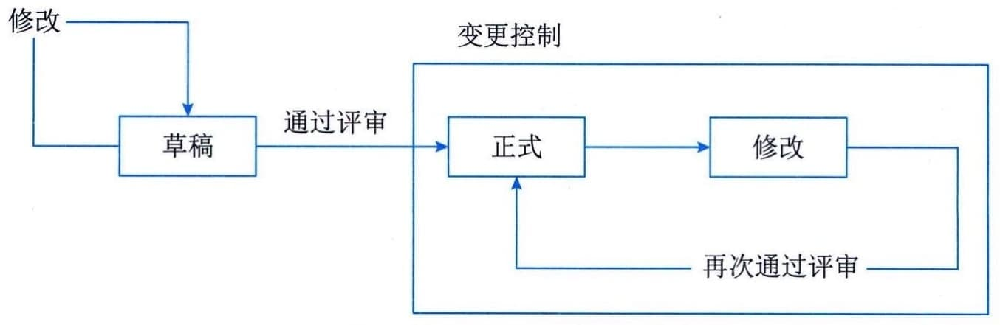

### 15.2.1 基本概念
1．配置项（Configuration Item，CI）
《信息技术 软件工程术语》（GB／T
11457）对配置项的定义为："为配置管理设计的硬件、软件或两者的集合，它在配置管理过程中作为一单个实体来对待"。配置项是信息系统组件或与其有关的项目，包括软件、硬件和各种文档，如变更请求、服务、服务器、环境、设备、网络设施、台式机、移动设备、应用系统、协议和电信服务等。
比较典型的配置项包括项目计划书、技术解决方案、需求文档、设计文档、源代码、可执行代码、测试用例、运行软件所需的各种数据、设备型号及其关键部件等，它们经评审和检查通过后进入配置管理。所有配置项都应按照相关规定统一编号，并以一定的目录结构保存在CMDB中。例如在信息系统的开发项目中须加以控制的配置项可以分为基线配置项和非基线配置项两类，基线配置项可能包括所有的设计文档和源程序等；非基线配置项可能包括项目的各类计划和报告等。所有配置项的操作权限应由配置管理员严格管理，基本原则是：基线配置项向开发人员开放读取的权限；非基线配置项向项目经理、CCB及相关人员开放。
#### **2．配置项状态**
配置项的状态需要根据配置项的不同类型和管理需求进行分别定义，如基于配置项建设过程阶段视角，可将状态分为"草稿""正式"和"修改"三种。配置项刚建立时，其状态为"草稿"。配置项通过评审后，其状态变为"正式"。此后若更改配置项，则其状态变为"修改"。当配置项修改完毕并重新通过评审时，其状态又变为"正式"。
配置项状态变化如图15-2所示。

图15-2 配置项状态变化
#### **3．配置项版本号**
配置项的版本号规则与配置项的状态定义相关。例如：①处于"草稿"状态的配置项的版本号格式为0．YZ，YZ的数字范围为01～99；随着草稿的修正，YZ的取值应递增。YZ的初值和增幅由用户自己把握。②处于"正式"状态的配置项的版本号格式为X.Y，X为主版本号，取值范围为1～9；Y为次版本号，取值范围为0～9。配置项第一次成为"正式"文件时，版本号为1.0。如果配置项升级幅度比较小，可以将变动部分制作成配置项的附件，附件版本依次为1.0,1.1，·····当附件的变动积累到一定程度时，配置项的Y值可适量增加，Y值增加到一定程度时，X值将适量增加。当配置项升级幅度比较大时，才允许直接增大X值。③处于"修改"状态的配置项的版本号格式为X.YZ。配置项正在修改时，一般只增大Z值，X.Y值保持不变。当配置项修改完毕，状态成为"正式"时，将Z值设置为0，增加X．Y值。参见上述规则②。
#### **4．配置项版本管理**
配置项的版本管理作用于多个配置管理活动中，如配置标识、配置控制和配置审计、发·与某个配置项有关的所有变更请求；
 - · 配置项变更轨迹；
特定的设备和软件；
 - · 计划升级、替换或弃用的配置项；
 - · 与配置项有关的变更和问题；
 - · 来自于特定时期特定供应商的配置项；
 - · 受问题影响的所有配置项。
配置管理数据库管理所有配置项及其关系，以及与这些配置项有关的事件、问题、已知错误、变更和发布及相关的员工、供应商和业务部门信息；保存多种服务的详细信息及这些服务与IT组件之间的关系；保存配置项的财务信息，如供应商、购买费用和购买日期等。
#### **7．配置库**
针对信息系统开发类型的项目，我们常使用配置库（Configuration
Library）存放配置项并记录与配置项相关的所有信息，它是配置管理的有力工具。利用库中的信息可回答许多配置管理的问题，例如：
 - · 哪些用户已提取了某个特定的系统版本；
 - · 运行一个给定的系统版本需要什么硬件和系统软件；
 - · 一个系统到目前已生成了多少个版本，何时生成的；
 - · 如果某一特定的构件变更了，会影响到系统的哪些版本；
 - · 一个特定的版本曾提出过哪几个变更请求；
 - · 一个特定的版本有多少已报告的错误。
使用配置库可以帮助配置管理员把信息系统开发过程的各种工作产品，包括半成品或阶段产品和最终产品管理得井井有条，使其不致管乱、管混、管丢。配置库可以分开发库、受控库和产品库3种类型。
 - ·开发库：也称为动态库、程序员库或工作库，用于保存开发人员当前正在开发的配置实体，如新模块、文档、数据元素或进行修改的已有元素。动态库中的配置项被置于版本管理之下。动态库是开发人员的个人工作区，由开发人员自行控制。库中的信息可能有较为频繁的修改，只要开发库的使用者认为有必要，无须对其进行配置控制，因为这通常不会影响到项目的其他部分。

 - ·受控库：也称为主库，包含当前的基线加上对基线的变更。受控库中的配置项被置于完全的配置管理之下。在信息系统开发的某个阶段工作结束时，将当前的工作产品存入受控库。

 - ·产品库：也称为静态库、发行库、软件仓库，包含已发布使用的各种基线的存档，被置于完全的配置管理之下。在开发的信息系统产品完成系统测试之后，作为最终产品存入产品库内，等待交付用户或现场安装。
配置库的建库模式有两种：按配置项类型建库和按开发任务建库。
 - · 按配置项的类型分类建库：适用于通用软件的开发组织。在这样的组织内，产品的继承性较强，工具比较统一，对并行开发有一定的需求。使用这样的库结构有利于对配置项
> 的统一管理和控制，同时也能提高编译和发布的效率。但由于这样的库结构并不是面向各个开发团队的开发任务的，所以可能会造成开发人员的工作目录结构过于复杂，带来一些不必要的麻烦。

 - ·按开发任务建立相应的配置库：适用于专业软件的开发组织。在这样的组织内，使用的开发工具种类繁多，开发模式以线性发展为主，所以就没有必要把配置项严格地分类存储，人为增加目录的复杂性。对于研发性的软件组织来说，采用这种设置策略比较灵活。
