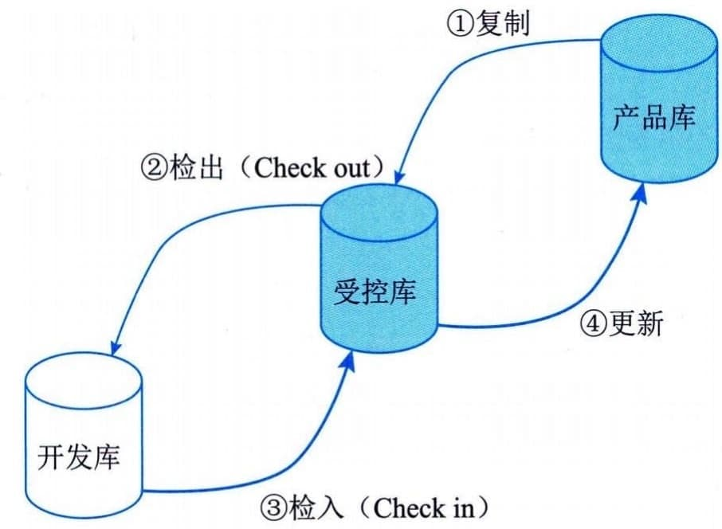

### 15.2.4 管理活动
配置管理的日常管理活动主要包括：制订配置管理计划、配置项识别、配置项控制、配置状态报告、配置审计、配置管理回顾与改进等。
#### **1．制订配置管理计划**
配置管理计划是对如何开展项目配置管理工作的规划，是配置管理过程的基础，应该形成文件并在整个项目生命周期内处于受控状态。CCB负责审批该计划。配置管理计划的主要内容包括：
 - · 配置管理的目标和范围；
 - ·配置管理活动主要包括配置项识别、配置项控制、配置状态报告、配置审计、配置管理回顾及改进等；
 - · 配置管理角色和责任安排；
 - · 实施这些活动的规范和流程，如配置项命名规则；
 - · 实施这些活动的进度安排，如日程安排和程序；
 - · 与其他管理之间（如变更管理等）的接口控制；
 - · 负责实施这些活动的人员或团队，以及他们和其他团队之间的关系；
 - ·配置管理信息系统的规划包括配置数据的存放地点、配置项运行的受控环境、与其他服务管理系统的联系和接口、构建和安装等支持工具；
 - · 配置管理的日常事务包括许可证控制、配置项的存档等；
 - · 计划的配置基准线、重大发布、里程碑，以及针对以后每个期间的工作量计划和资源计划。
#### **2．配置项识别**
配置项识别是针对所有信息系统组件的关键配置，以及各配置项间的关系和配置文档等结构进行识别的过程。它包括为配置项分配标识和版本号等。
配置项识别是配置管理员的职能。配置项识别的基本步骤如下：
 - （1）识别需要受控的配置项；
 - （2）为每个配置项指定唯一的标识号；
 - （3）定义每个配置项的重要特征；
 - （4）确定每个配置项的所有者及其责任；
 - （5）确定配置项进入配置管理的时间和条件；
 - （6）建立和控制基线；
 - （7）维护文档和组件的修订与产品版本之间的关系。
每个配置项可以通过自身的字符、拷贝号／序列号和版本号等标识唯一识别。注意：拷贝号／序列号和版本号等详细信息应记录在配置库或配置管理数据库中，但不一定作为标识的一部分。版本号用于识别出哪些变化的版本属于同一配置项。同一配置项的不同版本可以在同一时刻共存。
#### **3．配置项控制**
配置控制即配置项和基线的变更控制，包括变更申请、变更评估、通告评估结果、变更实施、变更验证与确认、变更的发布基于配置库的变更控制等任务。
 - （1）变更申请。变更申请主要就是陈述：要做什么变更，为什么要变更，以及打算怎么变更。相关人员（如项目经理）填写变更申请表，说明要变更的内容、变更的原因、受变更影响的关联配置项和有关基线、变更实施方案、工作量和变更实施人等，并提交给CCB。
 - （2）变更评估。CCB负责组织对变更申请进行评估并确定：
 - · 变更对项目的影响；
 - · 变更的内容是否必要；
 - · 变更的范围是否考虑周全；
 - · 变更的实施方案是否可行；
 - · 变更工作量估计是否合理。
CCB决定是否接受变更，并将决定通知相关人员。
 - （3）通告评估结果。CCB把关于每个变更申请的批准、否决或推迟的决定通知受此处置意见影响的每个干系人。如果变更申请得到批准，应该及时把变更批准信息和变更实施方案通知那些正在使用受影响的配置项和基线的干系人。如果变更申请被否决，应通知有关干系人放弃该变更申请。
 - （4）变更实施。项目经理组织修改相关的配置项，并在相应的文档、程序代码或配置管理数据中记录变更信息。
 - （5）变更验证与确认。项目经理指定人员对变更后的配置项进行测试或验证。项目经理应将变更与验证的结果提交CCB，由其确认变更是否已经按要求完成。
 - （6）变更的发布。配置管理员将变更后的配置项纳入基线。配置管理员将变更内容和结果通知相关人员，并做好记录。
 - （7）基于配置库的变更控制。在信息系统开发项目中，一处出现了变更，经常会连锁引起多处变更，会涉及参与开发工作的许多人员。例如，测试引发了需求的修改，那么很可能要涉及需求规格说明、概要设计、详细设计和代码等相关文档，甚至会使测试计划随之变更。
如果是多个开发人员对信息系统的同一部件做修改，情况会更加复杂。例如，在软件测试时发现了两个故障。项目经理最初以为两个故障是无关的，就分别指定甲和乙去解决这两个故障。但碰巧，引起这两个故障的错误代码都在同一个软件部件中。甲和乙各自对故障定位后，先后从库中取出该部件，各自做了修改，又先后送回库中。结果，甲放入库中的版本只有甲的修改，乙放入库中的版本只有乙的修改，没有一个版本同时解决了两个故障。
基于配置库的变更控制可以完美地解决上述问题，如图15-3所示。

图15-3 基于配置库的变更控制
现以某软件产品升级为例，其过程简述为：
 - （1）将待升级的基线（假设版本号为V2.1）从产品库中取出，放入受控库。
 - （2）程序员将欲修改的代码段从受控库中检出（Check
out），放入自己的开发库中进行修改。代码被检出后即被"锁定"，以保证同一段代码只能同时被一个程序员修改，如果甲正在对其修改，乙就无法将其检出。
 - （3）程序员将开发库中修改好的代码段检入（Check
in）受控库。代码检入后，代码的"锁定"被解除，其他程序员就可以检出该段代码了。
 - （4）软件产品的升级修改工作全部完成后，将受控库中的新基线存入产品库中（软件产品的版本号更新为V2.2，旧的V2.1版并不删除，继续在产品库中保存）。
#### **4．配置状态报告**
配置状态报告也称配置状态统计，其任务是有效地记录和报告管理配置所需要的信息，目的是及时、准确地给出配置项的当前状况，供相关人员了解，以加强配置管理工作。在信息系统项目中，配置项在不停地演化着。配置状态报告就是要在某个特定的时刻观察当时的配置状态，也就是要对动态演化着的配置项取个瞬时的"照片"，以利于在状态报告信息分析的基础上，更好地进行控制。配置状态报告主要包含下述内容。
 - ·每个受控配置项的标识和状态。一旦配置项被置于配置控制下，就应该记录和保存它的每个后继进展的版本和状态。
 - · 每个变更申请的状态和已批准的修改的实施状态。
 - · 每个基线的当前和过去版本的状态以及各版本的比较。
 - · 其他配置管理过程活动的记录等。
#### **5．配置审计**
配置审计也称配置审核或配置评价，包括功能配置审计和物理配置审计，分别用以验证当前配置项的一致性和完整性。配置审计的实施是为了确保项目配置管理的有效性，体现了配置管理的最根本要求：不允许出现任何混乱现象。例如：
 - · 防止向用户提交不适合的产品，如交付了用户手册的不正确版本；
 - · 发现不完善的实现，如开发出不符合初始规格说明或未按变更请求实施变更；
 - · 找出各配置项间不匹配或不相容的现象；
 - · 确认配置项已在所要求的质量控制审核之后纳入基线并入库保存；
 - · 确认记录和文档保持可追溯性等。
1）功能配置审计
功能配置审计是审计配置项的一致性（配置项的实际功效是否与其需求一致），具体验证主要包括：
 - · 配置项的开发已圆满完成；
 - · 配置项已达到配置标识中规定的性能和功能特征；
 - · 配置项的操作和支持文档已完成并且符合要求等。
2）物理配置审计
物理配置审计是指审计配置项的完整性（配置项的物理存在是否与预期一致），具体验证主要包括：
 - · 要交付的配置项是否存在；
 - · 配置项中是否包含了所有必需的项目等。
一般来说，配置审计应当定期进行，应当进行配置审计的场景包括：
 - · 实施新的配置库或配置管理数据库之后；
 - · 对信息系统实施重大变更前后；
 - · 在一项软件发布和安装被导入实际运作环境之前；
 - · 灾难恢复之后或事件恢复正常之后；
 - · 发现未经授权的配置项后；
 - · 任何其他必要的时候等。
部分常规配置审计工作可由审计软件完成，如比较两台计算机的配置情况，分析工作站并报告它当前的状况。但要注意的是，审计软件即使发现不一致的情况，也不允许自动更新配置库或配置管理数据库，必须由有关负责人调查后再进行更新。
#### **6．配置管理回顾与改进**
配置管理回顾与改进是指定期回顾配置管理活动的实施情况，目的是发现在配置管理执行过程中有无问题，找到改进点，优化配置管理过程。配置管理回顾与改进活动包括：
 - ·对本次配置管理回顾进行准备，设定日期和主题，通知相关人等参加会议。根据配置管理绩效衡量指标，要求配置项责任人提供配置项统计信息；

 - ·召开配置管理回顾会议，在设定日期召开回顾会议，对配置管理报告进行汇报，听取各方意见，回顾上次过程改进计划执行情况；
 - · 根据会议结论，制订并提交服务改进计划；
 - · 根据过程改进计划，协调落实改进等。
