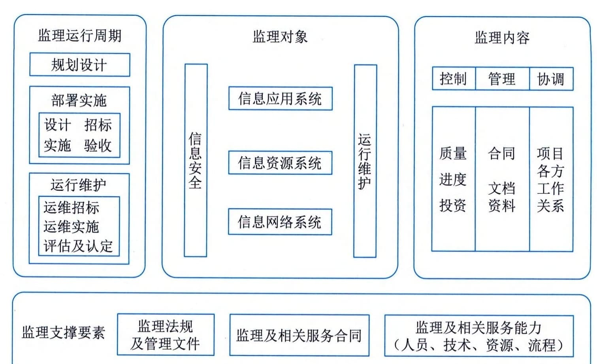

## 16.1 监理的意义和作用
众所周知，信息系统工程监理是吸取了建筑行业的建设监理的经验和思路，结合信息技术服务行业本身的特点发展而来的，是针对信息化建设独特的性质产生的新兴行业。信息系统工程监理系列标准规范的制定和大量专业技术人才的培养，对我国信息系统工程监理市场从无到有、从小到大、从弱到强的发展起到了规范和促进作用。同时，随着我国信息系统工程监理业务的不断扩展和规范，在信息技术服务中形成了信息系统工程监理的新市场，其服务质量和管理水平得以不断提高，所做的工作也得到行业认可，对提高我国信息化建设水平起到了极其重要的作用。
#### **1．监理的地位和作用**
信息系统监理通常直接面对业主单位和承建单位，在双方之间形成一种系统的工作关系，在保障工程质量、进度、投资控制和合同管理、信息管理，协调双方关系中处于重要的、不可替代的地位。
信息系统监理为项目业主单位提供信息系统工程相关的技术建议。作为信息系统工程监理，对信息系统工程相关的技术的理解和认知，是对其专业素养的必然要求。项目监理在项目的可行性研究、项目实施、项目交付过程中要全程参与，通过对技术方案评价、管理过程监督、交付成果检验等方法和手段，为项目承建单位提供技术建议和解决对策。
信息系统监理代表项目业主单位对项目的实施过程进行全程的跟踪和监督管理。现阶段对信息系统工程监理的服务需求主要有：有关国有投资项目建设管理的国家政策、法规的要求；有关业主单位工程建设的实际需求，包括合规性管理的实际要求、审计要求和管理办法要求等；业主单位在一定程度上受到工程技术特点、管理实践、经验和技能等限制，必须通过第三方监理服务协助承担有关监督、管理的责任等；或业主单位由于专业的原因，难以对项目建设过程进行有效的监督和管理，这时就会委托监理单位对项目承建单位的项目实施过程的标准性、规范性进行监督和管理，确保项目顺利交付。
信息系统监理保证项目交付成果的质量。信息系统工程监理要依据项目的质量目标和质量标准的要求，参照国家和行业标准，对项目的交付成果和项目的管理成果进行必要检验和审核，确保相关成果达到质量要求。
信息系统监理协调项目干系人间的关系，促进项目建设过程中的各类项目信息得到全面有效的共享、一致的理解和认同，保证项目质量目标的贯彻和落实。
信息系统工程监理涉及的部门和人员范围包括：监理及相关服务的资格认定和监督管理部门；从事监理及相关服务的单位和人员；信息系统工程的业主单位；信息系统工程的承建单位；信息系统运行维护服务的供方单位和需方单位；从事监理及相关服务的教育、培训和研究单位。
#### **2．监理的重要性与迫切性**
信息系统工程监理在工程建设过程中的重要性是不言而喻的，在信息系统工程项目中，其重要性就更为突出，主要原因有以下6个方面：
 - （1）随着信息化项目应用的普及，信息系统工程无论大小，一般都关系到国家、企业、单位的重要业务；
 - （2）随着信息技术的飞速发展，信息系统工程项目往往在还没有提出需求或需求还不明确时就付诸实施，因此在实施过程中需要不断修改；
 - （3）由于用户需求的不断变化以及其他内部或外部因素的影响，信息系统工程存在不能按预定进度执行的问题和风险；
 - （4）信息系统工程项目的投资相对比较大，如果管理不善会造成较大浪费；
 - （5）信息系统工程的实施过程存在隐蔽工程，可视性差，如过程监督缺失，容易产生工程隐患；
 - （6）信息系统工程项目存在"重建设，轻管理"的问题，尤其是项目内容从技术上或专业上比较复杂，业主单位缺乏足够的技术能力进行监管，需要懂专业的技术人员进行监督管理，并通过必要的信息化技术手段、方法和过程予以查验、审核，确认其技术指标是否实现。
#### **3．监理技术参考模型**
信息系统工程监理的技术参考模型由四部分组成，即监理支撑要素、监理运行周期、监理对象和监理内容，其相互关系如图16-1所示。参考模型表明，信息系统工程的监理及相关服务工作应建立在监理支撑要素的基础上，根据工程项目的需要，对监理运行周期的规划设计部分，提供相关信息技术咨询服务；在部署实施和运行维护部分，结合各项监理内容，对监理对象进行监督管理及提供相关信息技术服务。
监理支撑要素包括：监理法规及管理文件、监理及相关服务合同和监理及相关服务能力。其中监理服务能力要素由人员、技术、资源和流程四部分组成。

图16-1 信息系统工程监理及相关服务技术参考模型
 - （1）人员。人员主要包括总监理工程师、总监理工程师代表、监理工程师、监理员、外部技术协作体系、人力资源管理体系等。
 - （2）技术。技术主要包括监理工作体系、业务流程研究能力、监理技术规范、质量管理体系、监理大纲、监理规划、监理实施细则等。
 - （3）资源。资源包括监理机构、监理设施、监理知识库及监理案例库、检测分析工具及仪器设备、企业管理信息系统等。
 - （4）流程。流程包括项目管理体系、客户服务体系、监理及相关服务的制度和流程等。
监理活动最基础的内容被概括为"三控、两管、一协调"。
 - （1）三控。三控是指信息系统工程质量控制、信息系统工程进度控制和信息系统工程投资控制。
 - （2）两管。两管是指信息系统工程合同管理、信息系统工程信息管理。
 - （3）一协调。一协调是指在信息系统工程实施过程中协调有关单位及人员间的工作关系。
尽管在不同的教材、著作、文献中，还存在着"四控""五控"，甚至"七控"等提法，例如信息系统工程变更控制、信息系统工程安全管理等，但从其内容看，这些提法中都包含有国家标准中所提的"三控"，即质量、进度、投资控制。因此，本书采用国家标准中提出的最基础的"三控"，而其他提法中多出来的那些"控"和"管"则均有其在相关环境中存在的合理性，本书不再进一步讨论。
