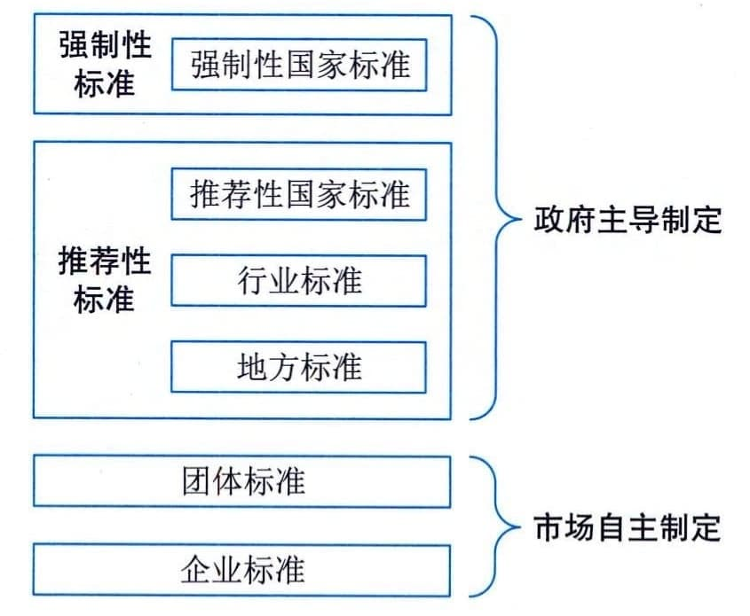

### 17.2.2 标准分级与标准分类
#### **1．标准的层级**
根据2017年修订发布的《中华人民共和国标准化法》将标准分为国家标准、行业标准、地方标准、团体标准和企业标准五个级别。各层级之间具有一定的依从关系和内在联系，形成覆盖全国且层次分明的标准体系。
 - （1）国家标准。对需要在全国范围内统一的技术要求，应当制定国家标准。国家标准由国务院标准化行政主管部门编制计划和组织草拟，并统一审批、编号和发布。
 - （2）行业标准。对没有推荐性国家标准、需要在全国某个行业范围内统一的技术要求，可以制定行业标准。行业标准由国务院有关行政主管部门制定。
 - （3）地方标准。为满足地方自然条件、风俗习惯等特殊技术要求，可以制定地方标准。地方标准由省、自治区、直辖市人民政府标准化行政主管部门制定；设区的市级人民政府标准化行政主管部门根据本行政区域的特殊需要，经所在地省、自治区、直辖市人民政府标准化行政主管部门批准，可以制定本行政区域的地方标准。地方标准由省、自治区、直辖市人民政府标准化行政主管部门报国务院标准化行政主管部门备案，由国务院标准化行政主管部门通报国务院有关行政主管部门。
 - （4）团体标准。团体标准是依法成立的社会团体为满足市场和创新需要，协调相关市场主体共同制定的标准。国务院标准化行政主管部门统一管理团体标准化工作。国务院有关行政主管部门分工管理本部门、本行业的团体标准化工作。县级以上地方人民政府标准化行政主管部门统一管理本行政区域内的团体标准化工作。县级以上地方人民政府有关行政主管部门分工管理本行政区域内本部门、本行业的团体标准化工作。（5）企业标准。企业标准是对企业范围内需要协调、统一的技术要求、管理要求和工作要求所制定的标准，是企业组织生产、经营活动的依据。企业可以根据需要自行制定企业标准，或者与其他企业联合制定企业标准。
#### **2．标准的类型**
根据《中华人民共和国标准化法》，国家标准分为强制性标准和推荐性标准。行业标准、地方标准是推荐性标准。强制性标准必须执行。国家鼓励采用推荐性标准。我国现行标准体系如图17-1所示。

图17-1 我国现行的标准体系
 - （1）强制性标准。对保障人身健康和生命财产安全、国家安全、生态环境安全以及满足经济社会管理基本需要的技术要求，应当制定强制性国家标准。国务院有关行政主管部门依据职责负责强制性国家标准的项目提出、组织起草、征求意见和技术审查。国务院标准化行政主管部门负责强制性国家标准的立项、编号和对外通报。国务院标准化行政主管部门应当对拟制定的强制性国家标准是否符合前款规定进行立项审查，对符合前款规定的予以立项。省、自治区、直辖市人民政府标准化行政主管部门可以向国务院标准化行政主管部门提出强制性国家标准的立项建议，由国务院标准化行政主管部门会同国务院有关行政主管部门决定。社会团体、企业事业组织以及公民可以向国务院标准化行政主管部门提出强制性国家标准的立项建议，国务院标准化行政主管部门认为需要立项的，会同国务院有关行政主管部门决定。强制性国家标准由国务院批准发布或者授权批准发布。法律、行政法规和国务院决定对强制性标准的制定另有规定的，从其规定。
 - （2）推荐性标准。对满足基础通用、与强制性国家标准配套、对各有关行业起引领作用等需要的技术要求，可以制定推荐性国家标准。推荐性国家标准由国务院标准化行政主管部门制定。
