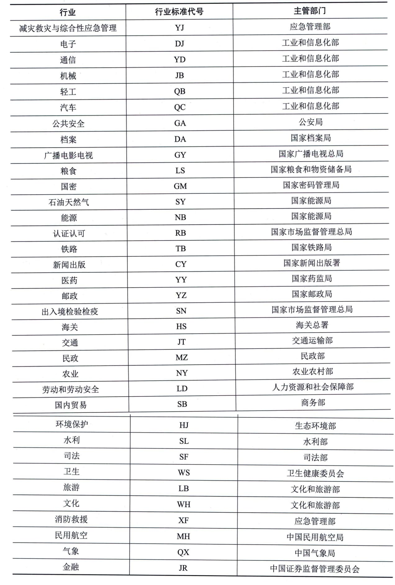

### 17.2.3 我国标准的编号及名称
#### **1．标准编号**
根据2022年发布的《国家标准管理办法》，国家标准的代号由大写汉语拼音字母构成。强制性国家标准的代号为"GB"，推荐性国家标准的代号为"GB／T"，国家标准样品的代号为"GSB"。指导性技术文件的代号为"GB／Z"。国家标准的编号由国家标准的代号、国家标准发布的顺序号和国家标准发布的年份号构成。国家标准样品的编号由国家标准样品的代号、分类目录号、发布顺序号、复制批次号和发布年份号构成。
行业标准的代号由国务院标准化行政主管部门规定。目前我国共有73个行业标准代号，其中，与信息技术行业相关的行业标准代号如表17-1所示。行业标准的编号由行业标准代号、标准顺序号及发布年号组成。
**表17-1
部分行业标准代号7-3**
地方标准的编号，由地方标准代号、顺序号和年代号三部分组成。省级地方标准代号，由汉语拼音字母"DB"加上其行政区划代码前两位数字组成。市级地方标准代号，由汉语拼音字母"DB"加上其行政区划代码前四位数字组成。
团体标准编号依次由团体标准代号"T"、社会团体代号、团体标准顺序号和年代号四部分组成。社会团体代号由社会团体自主拟定，可使用大写拉丁字母或大写拉丁字母与阿拉伯数字的组合。社会团体代号应当合法，不得与现有标准代号重复。
企业标准的编号由企业标准代号"Q"、企业代号、标准发布顺序号和标准发布年代号组成。
#### **2．标准名称**
标准名称是规范性的必备要素，是对文件所覆盖的主题的清晰、简明的描述，可直接反映标准化对象的范围和特征，关系到标准信息的传播效果。
国家标准GB／T 1.1《标准化工作导则
第1部分：标准化文件的结构和起草规则》对名称命名及表述原则进行了详细说明。名称的表述应使得某文件易于与其他文件相区分，不应涉及不必要的细节，任何必要的补充说明由范围给出。
标准名称由尽可能短的几种元素组成，其顺序由一般到特殊。所使用的元素应不多于以下三种。
 - （1）引导元素（可选元素）：表示文件所属的领域。如果省略引导元素会导致主体元素所表示的标准化对象不明确，那么文件名称中应有引导元素；如果主体元素（或者同补充元素一起）能确切地表示文件所涉及的标准化对象，那么文件名称中应省略引导元素。
 - （2）主体元素（必备元素）：表示上述领域内文件所涉及的标准化对象。
 - （3）补充元素（可选元素）：表示上述标准化对象的特殊方面，或者给出某文件与其他文件，或分为若干部分的文件的各部分之间的区分信息。如果文件只包含主体元素所表示的标准化对象的：·一个或两个方面，那么文件名称中应有补充元素，以便指出所涉及的具体方面。
 - ·两个以上但不是全部方面，那么在文件名称的补充元素中应由一般性的词语（例如技术要求、技术规范等）来概括这些方面，而不必一一列举。

 - ·所有必要的方面，并且是与该标准化对象相关的唯一现行文件，那么文件名称中应省略补充元素。
