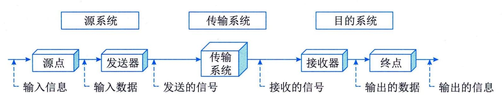
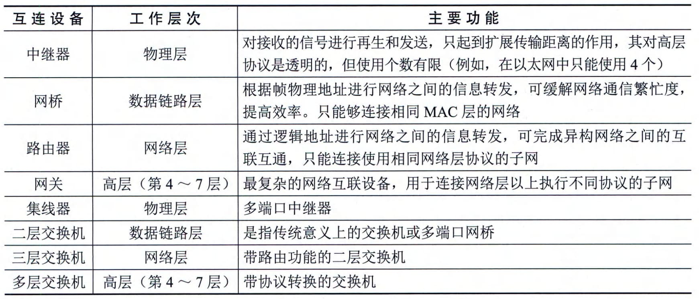
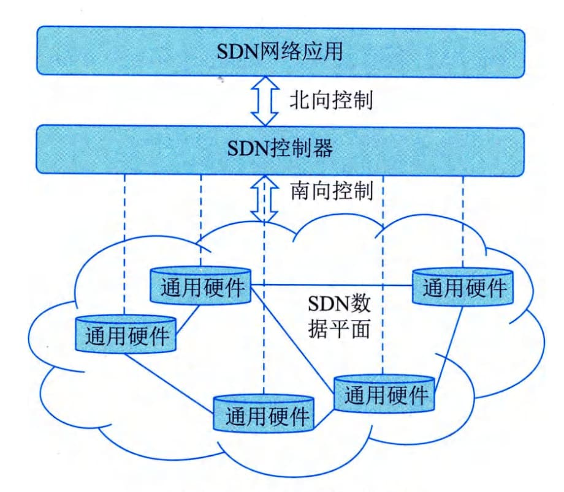

### 2.1.2 计算机网络
在计算机领域中，网络就是用物理链路将各个孤立的工作站或主机连接在一起，组成数据链路，从而达到资源共享和通信的目的。计算机网络将地理位置不同并具有独立功能的多个计算机系统通过通信设备和线路连接起来，结合网络软件（网络协议、信息交换方式及网络操作系统等）实现不同计算机资源之间的共享。
#### **1．通信基础**
通信是指人与人、人与自然之间通过某种行为或媒体进行的信息交流与传递。电（光）通信是指由一地向另一地进行信息的传输与交换的传递过程。通信的目的是传递消息（Message）中包含的信息（Information）。连续消息是指消息的状态随时间变化而连续变化，如话音等；离散消息指消息的状态是离散的，如符号、数据等。
1）通信系统和模型
一个通信系统包括三大部分：源系统（发送端或发送方）、传输系统（传输网络）和目的系统（接收端或接收方），如图2-1所示。

图2-1通信系统模型
#### **2）现代通信的关键技术**
从总体上看，通信技术实际上就是通信系统和通信网的相关技术。通信系统是指点对点通信所需的全部设施，而通信网是由许多通信系统组成的多点之间能相互通信的全部设施。而现代的关键通信技术有数字通信技术、信息传输技术、通信网络技术等。
 - ·数字通信技术：是用数字信号作为载体来传输消息，或用数字信号对载波进行数字调制后再传输的通信方式。它可传输电报、数字数据等数字信号，也可传输经过数字化处理的语音和图像等模拟信号。
 - ·信息传输技术：是主要用于管理和处理信息所采用的各种技术的总称，它主要是应用计算机科学和通信技术来设计、开发、安装和实施信息系统及应用软件；它也常被称为信息和通信技术。
 - ·通信网络技术：是指将各个孤立的设备进行物理连接，实现人与人、人与计算机、计算机与计算机之间进行信息交换的链路，从而达到资源共享和通信的目的。
#### **2．网络基础**
从网络的作用范围可将网络类别划分为个人局域网（Personal Area
Network，PAN）、局域网（Local Area Network，LAN）、城域网（Metropolitan
Area Network，MAN）、广域网（Wide Area Network,WAN)。
 - ·个人局域网（PAN）。个人局域网是指在个人工作的地方把属于个人的电子设备（如便携式电脑等）用无线技术连接起来的自组网络，因此也常称为无线个人局域网WPAN WirelessPAN）。从计算机网络的角度来看，PAN是一个局域网，其作用范围通常在10m左右。
 - ·局域网（LAN）。局域网通常指用微型计算机或工作站通过高速通信线路相连（速率通常在10Mb／s以上），其地理范围通常为1km左右。通常覆盖一个校园、一个单位、一栋建筑物等。
 - ·城域网（MAN）。城域网的作用范围可跨越几个街区甚至整个城市，其作用距离约为5\~50km。
 - ·广域网（WAN）。广域网使用节点交换机连接各主机，其节点交换机之间的连接链路一般是高速链路，具有较大的通信容量。广域网的作用范围通常为几十公里到几千公里，可跨越一个国家或一个洲进行长距离传输数据。
从网络的使用者角度可以将网络分为公用网（Public
Network）与专用网（Private Network）。
 - · 公用网。公用网指电信公司出资建造的面向大众提供服务的大型网络，也称为公众网。
 - · 专用网。专用网指某个部门为满足本单位的特殊业务工作所建造的网络，这种网络不向本单位以外的人提供服务，如电力、军队、铁路、银行等均有本系统的专用网。
#### **3．网络设备**
信息在网络中的传输主要有以太网技术和网络交换技术。网络交换是指通过一定的设备（如交换机等）将不同的信号或者信号形式转换为对方可识别的信号类型，从而达到通信目的的一种交换形式，常见的有数据交换、线路交换、报文交换和分组交换。在计算机网络中，按照交换层次的不同，网络交换可以分为物理层交换（如电话网）、链路层交换（二层交换-对MAC地址进行变更）、网络层交换（三层交换-对IP地址进行变更）、传输层交换（四层交换-对端口进行变更）（比较少见）和应用层交换。
在网络互连时，各节点一般不能简单地直接相连，而是需要通过一个中间设备来实现。按照OSI参考模型的分层原则，中间设备要实现不同网络之间的协议转换功能。根据它们工作的协议层的不同进行分类，网络互连设备有中继器（实现物理层协议转换，在电缆间转换二进制信号）、网桥（实现物理层和数据链路层协议转换）、路由器（实现网络层和以下各层协议转换）、网关（提供从最底层到传输层或以上各层的协议转换）和交换机等。在实际应用中，各厂商提供的设备都是多功能组合且向下兼容的，表2-1是对以上设备的一个总结。
**表2-1
网络互连设备**
随着无线技术运用的日益广泛，目前，市面上基于无线网络的产品非常多，主要有无线网卡、无线AP、无线网桥和无线路由器等。
#### **4．网络标准协议**
网络协议是为计算机网络中的数据交换构建的规则、标准或约定的集合。网络协议由三个要素组成，分别是语义、语法和时序。语义是解释控制信息每个部分的含义，它规定了需要发出何种控制信息，完成的动作以及做出什么样的响应；语法是用户数据与控制信息的结构与格式，以及数据出现的顺序；时序是对事件发生顺序的详细说明。人们形象地将这三个要素描述为：语义表示要做什么，语法表示要怎么做，时序表示做的顺序。
1\) **OSI**
国际标准化组织（ISO）和国际电报电话咨询委员会（CCITT）联合制定的开放系统互连参考模型（Open
System
Interconnect，OSI），其目的是为异构计算机互连提供一个共同的基础和标准框架，并为保持相关标准的一致性和兼容性提供共同的参考。OSI采用了分层的结构化技术，从下到上共分为七层。
 - · 物理层。物理层包括物理连网媒介，如电缆连线连接器。该层的协议产生并检测电压以便发送和接收携带数据的信号。物理层的具体标准有RS-232、V．35、RJ-45、FDDI。
 - ·数据链路层。数据链路层控制网络层与物理层之间的通信。它的主要功能是将从网络层接收到的数据分割成特定的可被物理层传输的帧。数据链路层常见的协议有IEEE802.3/2、HDLC、PPP、ATM。
 - ·网络层。网络层的主要功能是将网络地址（如IP地址）翻译成对应的物理地址（如网卡地址），并决定如何将数据从发送方路由到接收方。在TCP／IP协议中，网络层的具体协议有IP、ICMP、IGMP、IPX、ARP等。
 - ·传输层。传输层主要负责确保数据可靠、顺序、无错地从A点传输到B点。如提供建立、维护和拆除传送连接的功能；选择网络层提供最合适的服务；在系统之间提供可靠的、透明的数据传送，提供端到端的错误恢复和流量控制。在TCP／IP协议中，传输层的具体协议有TCP、UDP、SPX。
 - ·会话层。会话层负责在网络中的两节点之间建立和维持通信，以及提供交互会话的管理功能，如三种数据流方向的控制，即一路交互、两路交替和两路同时会话模式。常见的协议有RPC、SQL、NFS。
 - ·表示层。表示层如同应用程序和网络之间的翻译官，将数据按照网络能理解的方案进行格式化，这种格式化也因所使用网络的类型不同而不同。表示层管理数据的解密与加密、数据转换、格式化和文本压缩。表示层常见的协议有JPEG、ASCII、GIF、DES、MPEG。
 - ·应用层。应用层负责对软件提供接口以使程序能使用网络服务，如事务处理程序、文件传送协议和网络管理等。在TCP／IP协议中，常见的协议有HTTP、Telnet、FTP、SMTP。
2）IEEE 802协议族
IEEE
802规范定义了网卡如何访问传输介质（如光缆、双绞线和无线等），以及在传输介质上传输数据的方法，还定义了传输信息的网络设备之间连接的建立、维护和拆除的途径。遵循
IEEE
802标准的产品包括网卡、桥接器、路由器以及其他一些用来建立局域网络的组件。IEEE
802规范包括一系列标准的协议族，其中以太网规范IEEE
802.3是重要的局域网协议，内容包括：
 - ·  IEEE 802.3 标准以太网 10Mb/s 传输介质为细同轴电缆
 - ·  IEEE 802.3u 快速以太网 100Mb/s 双绞线
 - ·  IEEE 802.3z 千兆以太网 1000Mb/s 光纤或双绞线
3\) TCP/IP
TCP／IP协议是互联网协议的核心。在应用层中，TCP／IP协议定义了很多面向应用的协议，应用程序通过本层协议利用网络完成数据交互的任务，这些协议主要有：
 - · FTP （File Transfer
Protocol，文件传输协议）是网络上两台计算机传送文件的协议，其运行在TCP之上，是通过Internet将文件从一台计算机传输到另一台计算机的一种途径。FTP的传输模式包括Bin（二进制）和ASCII（文本文件）两种，除了文本文件之外，都应该使用二进制模式传输。
 - ·TFTP（Trivial File Transfer Protocol，简单文件传输协议）是用来在客户机与服务器之间进行简单文件传输的协议，提供不复杂、开销不大的文件传输服务。TFTP建立在UDP（User Datagram Protocol，用户数据报协议）之上，提供不可靠的数据流传输服务，不提供存取授权与认证机制，使用超时重传的方式来保证数据的到达。
 - · HTTP （Hypertext Transfer Protocol，超文本传输协议）是用于从WWW服务器传输超文本到本地浏览器的传送协议。它可以使浏览器更加高效，使网络的传输量减少。HTTP建立在TCP之上，它不仅保证计算机正确快速地传输超文本文档，还可以确定传输文档中的哪一部分以及哪部分内容首先显示等。
 - ·SMTP （Simple Mail Transfer Protocol，简单邮件传输协议）建立在TCP之上，是一种提供可靠且有效传输电子邮件的协议。SMTP是建立在FTP文件传输服务上的一种邮件服务，主要用于传输系统之间的邮件信息并提供与电子邮件有关的通知。
 - · DHCP （Dynamic Host ConfigurationProtocol，动态主机配置协议）建立在UDP之上，是基于客户机／服务器结构而设计的。所有的IP网络设定的数据都由DHCP服务器集中管理，并负责处理客户端的DHCP要求；而客户端则会使用从服务器分配下来的IP环境数据。DHCP分配的IP地址可以分为三种方式：固定分配、动态分配和自动分配。
 - ·Telnet（远程登录协议）是登录和仿真程序，其建立在TCP之上，它的基本功能是允许用户登录并进入远程计算机系统。以前，Telnet是一个将所有用户输入送到远程计算机进行处理的简单的终端程序。目前，它的一些较新的版本可以在本地执行更多的处理，可以提供更好的响应，并且减少了通过链路发送到远程计算机的信息数量。
 - ·DNS （Domain Name System，域名系统）在Internet上的域名与IP地址之间是一一对应的，域名虽然便于人们记忆，但机器之间只能相互识别IP地址，它们之间的转换工作称为域名解析，域名解析需要由专门的域名解析服务器来完成，DNS就是进行域名解析的服务器。DNS通过对用户友好的名称来查找计算机和服务。
 - · **SNMP** （Simple Network Management Protocol，简单网络管理协议）是为了解决Internet上的路由器管理问题而提出的，它可以在IP、IPX、AppleTalk和其他传输协议上使用。SNMP是指一系列网络管理规范的集合，包括协议本身、数据结构的定义和一些相关概念。目前，SNMP已成为网络管理领域中事实上的工业标准，并被广泛支持和应用，大多数网络管理系统和平台都是基于SNMP的。
4）TCP和UDP
在OSI的传输层有两个重要的传输协议，分别是TCP（Transmisson Control
Protocol，传输控制协议）和UDP（User Datagram
Protocol，用户数据报协议），这些协议负责提供流量控制、错误校验和排序服务。
 - ·TCP是整个TCP／IP协议族中最重要的协议之一，它在IP协议提供的不可靠数据服务的基础上，采用了重发技术，为应用程序提供了一个可靠的、面向连接的、全双工的数据传输服务。TCP协议一般用于传输数据量比较少且对可靠性要求高的场合。
 - · UDP是一种不可靠的、无连接的协议，它可以保证应用程序进程间的通信，与TCP相比，UDP是一种无连接的协议，它的错误检测功能要弱得多。可以这样说，TCP有助于提供可靠性，而UDP则有助于提高传输速率。UDP协议一般用于传输数据量大，对可靠性要求不是很高，但要求速度快的场合。
#### **5．软件定义网络**
软件定义网络（Software Defined
Network，SDN）是一种新型的网络创新架构，SDN是网络虚拟化的一种实现方式，它可通过软件编程的形式定义和控制网络，其将网络设备的控制面与数据面分离开来，从而实现了网络流量的灵活控制，使网络变得更加智能，为核心网络及应用的创新提供了良好的平台。SDN被认为是网络领域的一场革命，为新型互联网体系结构研究提供了新的实验途径，也极大地推动了下一代互联网的发展。
利用分层的思想，SDN将数据与控制相分离。在控制层，包括具有逻辑中心化和可编程的控制器，可掌握全局网络信息，方便运营商和科研人员管理、配置网络和部署新协议等。在数据层，包括哑交换机（与传统的二层交换机不同，专指用于转发数据的设备），仅提供简单的数据转发功能，可以快速处理匹配的数据包，适应流量日益增长的需求。两层之间采用开放的统一接口（如OpenFlow等）进行交互。控制器通过标准接口向交换机下发统一标准规则，交换机仅需按照这些规则执行相应的动作即可。SDN打破了传统网络设备的封闭性。此外，南北向和东西向的开放接口及可编程性，也使得网络管理变得更加简单、动态和灵活。
SDN的整体架构由下到上（由南到北）分为数据平面、控制平面和应用平面，如图2-2所示。其中，数据平面由交换机等网络通用硬件组成，各个网络设备之间通过不同规则形成的SDN数据通路连接；控制平面包含了逻辑上为中心的SDN控制器，它掌握着全局网络信息，负责各种转发规则的控制；应用平面包含着各种基于SDN的网络应用，用户无须关心底层细节就可以编程、部署新应用。

图2-2 SDN体系架构图
控制平面与数据平面之间通过SDN控制数据平面接口（Control-Data-Plane
Interface，CDPI）进行通信，它具有统一的通信标准，主要负责将控制器中的转发规则下发至转发设备，最主要应用的是OpenFlow协议。控制平面与应用平面之间通过SDN北向接口（NorthBound
Interface，NBI）进行通信，而NBI并非统一标准，它允许用户根据自身需求定制开发各种网络管理应用。
SDN中的接口具有开放性，以控制器为逻辑中心，南向接口负责与数据平面进行通信，北向接口负责与应用平面进行通信，东西向接口负责多控制器之间的通信。最主流的南向接口CDPI采用的是OpenFlow协议。OpenFlow最基本的特点是基于流（Flow）的概念来匹配转发规则，每一个交换机都维护一个流表（Flow
Table），依据流表中的转发规则进行转发，而流表的建立、维护和下发都是由控制器完成的。针对北向接口，应用程序通过北向接口编程来调用所需的各种网络资源，实现对网络的快速配置和部署。东西向接口使控制器具有可扩展性，为负载均衡和性能提升提供了技术保障。
#### **6．第五代移动通信技术**
第五代移动通信技术（5th Generation Mobile Communication
Technology，5G）是具有高速率、低时延等特点的新一代移动通信技术。
国际电信联盟（ITU）定义了5G的八大指标，与4G的对比如表2-2所示。
**表2-2 4G与5G主要指标对标**
+---+---------+---------+------+------+------+--------+-----+--------+
| 指 | 流量   | 连接数  | 时延 | 移动 | 能效 | 用户   | 频  | 峰值   |
| 标 | 密度／ | 密度／  | ／ms | 性／ | ／倍 | 体验速 | 道  | 速率／ |
|   |         |         |      |      |      |        | 效  |        |
| 名 | (Tb    | （万    |      | $$   |      | 率／（ |     | $$(G   |
| 称 | /s·k㎡) | ·k㎡） |      | (km  |      | b·s1)  | 率  | b \cdo |
|   |         |         |      | \cdo |      |        | ／  | t s^{- |
|   |         |         |      | t h^ |      |        | 倍  |  1})$$ |
|   |         |         |      | {- 1 |      |        |     |        |
|   |         |         |      | })$$ |      |        |     |        |
+===+=========+=========+======+======+======+========+=====+========+
| 4 | 0.1     | 10      | 空   | 350  | 1    | 10M    | 1   | 10     |
| G |         |         | 口10 |      |      |        |     |        |
+---+---------+---------+------+------+------+--------+-----+--------+
| 5 | 10      | 100     | 空   | 500  | 100  | 0      | 3   | 20     |
| G |         |         | 口1  |      |      | .1\~1G |     |        |
+---+---------+---------+------+------+------+--------+-----+--------+
5G国际技术标准重点满足灵活多样的物联网需要。在正交频分多址（Orthogonal
Frequency Division Multiple Access，OFDMA）和多入多出（Multiple Input
Multiple
Output，MIMO）基础技术上，5G为支持三大应用场景，采用了灵活的全新系统设计。在频段方面，与4G支持中低频不同，考虑到中低频资源有限，5G同时支持中低频和高频频段，其中中低频满足覆盖和容量需求，高频满足在热点区域提升容量的需求，5G针对中低频和高频设计了统一的技术方案，并支持百兆Hz的基础带宽。为了支持高速率传输和更优覆盖，5G采用LDPC（一种具有稀疏校验矩阵的分组纠错码）、Polar（一种基于信道极化理论的线性分组码）新型信道编码方案、性能更强的大规模天线技术等。为了支持低时延、高可靠，5G采用短帧、快速反馈、多层／多站数据重传等技术。
5G采用全新的服务化架构，支持灵活部署和差异化业务场景。5G采用全服务化设计和模块化网络功能，支持按需调用，实现功能重构；采用服务化描述，易于实现能力开放，有利于引入IT开发实力，发挥网络潜力。5G支持灵活部署，基于NFV／SDN技术实现硬件和软件解耦、控制和转发分离；采用通用数据中心的云化组网，网络功能部署灵活，资源调度高效；支持边缘计算，云计算平台下沉到网络边缘，支持基于应用的网关灵活选择和边缘分流。通过网络切片满足5G差异化需求，网络切片是指从一个网络中选取特定的特性和功能，定制出的一个逻辑上独立的网络，它使得运营商可以部署功能、特性服务各不相同的多个逻辑网络，分别为各自的目标用户服务，目前定义了3种网络切片类型，即增强移动宽带、低时延高可靠、大连接物联网。
国际电信联盟（ITU）定义了5G的三大类应用场景，即增强移动宽带（eMBB）、超高可靠低时延通信（u[RLLC]{.underline}）和海量机器类通信（mM[TC]{.underline}）。增强移动宽带主要面向移动互联网流量爆炸式增长，为移动互联网用户提供更加极致的应用体验；超高可靠低时延通信主要面向工业控制、远程医疗、自动驾驶等对时延和可靠性有极高要求的垂直行业应用需求；海量机器类通信主要面向智慧城市、智能家居、环境监测等以传感和数据采集为目标的应用需求。
