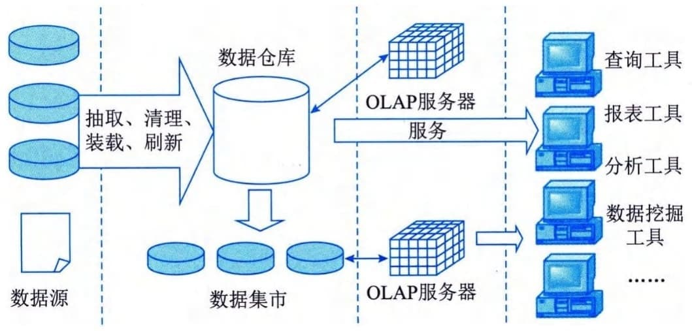

### 2.1.3 存储和数据库
存储是计算机系统的重要组成部分，一般以存储器的方式存在。存储器的主要用途是存放程序和数据，程序是计算机操作的依据，数据是计算机操作的对象。
数据库是数据的仓库，是长期存储在计算机内的有组织的、可共享的数据集合。它的存储空间很大，可以存放百万条、千万条、上亿条数据。但是数据库并不是随意地将数据进行存放，而是有一定的规则的，否则查询的效率会很低。
存储和内存技术对数据库操作产生了巨大影响。存储和数据库系统一直处于相同的发展曲线。随着时间的流逝，SQL（Structured
Query
Language，结构化查询语言）数据库已经从垂直可扩展的系统发展为NoSQL（Not
only
SQL，非关系型）数据库，后者是水平可扩展的分布式系统。同样，存储技术已经从垂直扩展的阵列发展到水平扩展的分布式存储系统。
#### **1．存储技术**
存储分类根据服务器类型分为封闭系统的存储和开放系统的存储。封闭系统主要指大型机等服务器。开放系统指基于包括麒麟、欧拉、UNIX、Linux等操作系统的服务器。开放系统的存储分为内置存储和外挂存储。外挂存储根据连接方式分为直连式存储（Direct
Attached Storage，DAS）和网络化存储（Fabric Attached
Storage，FAS）。网络化存储根据传输协议又分为网络接入存储（Network
Attached Storage，NAS）和存储区域网络（Storage Area Network，SAN)。
1）DAS（直连式存储）
DAS也可称为SAS（Server Attached
Storage，服务器附加存储）。DAS被定义为直接连接在各种服务器或客户端扩展接口下的数据存储设备，它依赖于服务器，其本身是硬件的堆叠，不带有任何存储操作系统。在这种方式中，存储设备是通过电缆（通常是SCSI接口电缆）直接到服务器的，I／O（输入／输入）请求直接发送到存储设备。
2）NAS（网络接入存储）
NAS也称为网络直联存储设备或网络磁盘阵列，是一种专业的网络文件存储及文件备份设备，它是基于LAN（局域网）的，按照TCP／IP协议进行通信，以文件的I／O方式进行数据传输。一个NAS里面包括核心处理器、文件服务管理工具以及一个或者多个硬盘驱动器，用于数据的存储。3）SAN（存储区域网络）
SAN是一种通过光纤集线器、光纤路由器、光纤交换机等连接设备将磁盘阵列、磁带等存储设备与相关服务器连接起来的高速专用子网。SAN由三个基本的组件构成：接口（如SCSI、光纤通道、ESCON等）、连接设备（交换设备、网关、路由器、集线器等）和通信控制协议（如IP和SCSI等）。这三个组件再加上附加的存储设备和独立的SAN服务器，就构成了一个SAN
系统。
SAN主要包含FC SAN和IP SAN两种，FC SAN的网络介质为光纤通道（Fibre
Channel），IP
SAN使用标准的以太网。采IPSAN可以将SAN为服务器提供的共享特性以及IP网络的易用性很好地结合在一起，并且为用户提供了类似服务器本地存储的较高性能体验。
DAS、NAS、SAN等存储模式之间的技术与应用对比如表2-3所示。
**表2-3 常用存储模式的技术与应用对比**
+----------------+-----------------+----------------+-----------------+
| 存储系统架构   | DAS             | NAS            | SAN             |
+================+=================+================+=================+
| 安装难易度     | 不一定          | 简单           | 困难            |
+----------------+-----------------+----------------+-----------------+
| 数据传输协议   | SCSI/FC/ATA     | TCP/IP         | FC              |
+----------------+-----------------+----------------+-----------------+
| 传输对象       | 数据块          | 文件           | 数据块          |
+----------------+-----------------+----------------+-----------------+
| 使用标         | 否              | 是（           | 否              |
| 准文件共享协议 |                 | NFS／CIFS···） |                 |
+----------------+-----------------+----------------+-----------------+
| 异种操         | 否              | 是             | 需要转换设备    |
| 作系统文件共享 |                 |                |                 |
+----------------+-----------------+----------------+-----------------+
| 集中式管理     | 不一定          | 是             | 需要管理工具    |
+----------------+-----------------+----------------+-----------------+
| 管理难易度     | 不一定          | 以网           | 不一            |
|                |                 | 络为基础，容易 | 定，但通常很难  |
+----------------+-----------------+----------------+-----------------+
| 提高服务器效率 | 否              | 是             | 是              |
+----------------+-----------------+----------------+-----------------+
| 灾难忍受度     | 低              | 高             | 高，专有方案    |
+----------------+-----------------+----------------+-----------------+
| 适合对象       | 中小组织服务器  | 中小组织       | 大型组织        |
|                |                 |                |                 |
|                | 捆              | SOHO族         | 数据中心        |
|                | 绑磁盘（JBOD）  |                |                 |
|                |                 | 组织部门       |                 |
+----------------+-----------------+----------------+-----------------+
| 应用环境       | 局域网          | 局域网         | 光纤            |
|                |                 |                | 通道存储区域网  |
|                | 文档共享程度低  | 文档共享程度高 |                 |
|                |                 |                | 网络环境复杂    |
|                | 独立操作平台    | 异质           |                 |
|                |                 | 格式存储需求高 | 文档共享程度高  |
|                | 服务器数量少    |                |                 |
|                |                 |                | 异              |
|                |                 |                | 质操作系统平台  |
|                |                 |                |                 |
|                |                 |                | 服务器数量多    |
+----------------+-----------------+----------------+-----------------+
| 业务模式       | 一般服务器      | Web服务器      | 大型资料库      |
|                |                 |                |                 |
|                |                 | 多媒体资料存储 | 数据库等        |
|                |                 |                |                 |
|                |                 | 文件资料共享   |                 |
+----------------+-----------------+----------------+-----------------+
| 档案格式复杂度 | 低              | 中             | 高              |
+----------------+-----------------+----------------+-----------------+
| 容量扩充能力   | 低              | 中             | 高              |
+----------------+-----------------+----------------+-----------------+
4）存储虚拟化
存储虚拟化（Storage
Virtualization）是"云存储"的核心技术之一，它把来自一个或多个网络的存储资源整合起来，向用户提供一个抽象的逻辑视图，用户可以通过这个视图中的统一逻辑接口来访问被整合的存储资源。
存储虚拟化使存储设备能够转换为逻辑数据存储。虚拟机作为一组文件存储在数据存储的目录中。数据存储是类似于文件系统的逻辑容器。它隐藏了每个存储设备的特性，形成一个统一的模型，为虚拟机提供磁盘。存储虚拟化技术帮助系统管理虚拟基础架构存储资源，提高资源利用率和灵活性，提高应用正常运行时间。
5）绿色存储
绿色存储（Green
Storage）技术是指从节能环保的角度出发，用来设计生产能效更佳的存储产品，降低数据存储设备的功耗，提高存储设备每瓦性能的技术。
绿色存储技术的核心是设计运行温度更低的处理器和更有效率的系统，生产更低能耗的存储系统或组件，降低产品所产生的电子碳化合物，其最终目的是提高所有网络存储设备的能源效率，用最少的存储容量来满足业务需求，从而消耗最低的能源。以绿色理念为指导的存储系统最终是存储容量、性能和能耗三者的平衡。
绿色存储技术涉及所有存储分享技术，包括磁盘和磁带系统、服务器连接、存储设备、网络架构及其他存储网络架构、文件服务和存储应用软件、重复数据删除、自动精简配置和基于磁带的备份技术等，可以提高存储利用率、降低建设成本和运行成本的存储技术，其目的是提高所有网络存储技术的能源效率。
#### **2．数据结构模型**
数据结构模型是数据库系统的核心。数据结构模型描述了在数据库中结构化和操纵数据的方法，模型的结构部分规定了数据如何被描述（例如树、表等）。模型的操纵部分规定了数据的添加、删除、显示、维护、打印、查找、选择、排序和更新等操作。
常见的数据结构模型有三种：层次模型、网状模型和关系模型。层次模型和网状模型又统称为格式化数据模型。
1）层次模型
层次模型是数据库系统最早使用的一种模型，它用"树"结构表示实体集之间的关联，其中实体集（用矩形框表示）为结点，而树中各结点之间的连线表示它们之间的关联。在层次模型中，每个结点表示一个记录类型，记录类型之间的联系用结点之间的连线（有向边）表示，这种联系是父子之间的一对多的联系，这就使得层次数据库系统只能处理一对多的实体联系。每个记录类型可包含若干个字段，这里记录类型描述的是实体，字段描述实体的属性。每个记录类型及其字段都必须命名。各个记录类型、同一记录类型中各个字段不能同名。每个记录类型可以定义一个排序字段，也称码字段，如果定义该排序字段的值是唯一的，则它能唯一地标识一个记录值。
一个层次模型在理论上可以包含任意有限个记录类型和字段，但任何实际的系统都会因为存储容量或实现复杂度而限制层次模型中包含的记录类型个数和字段个数。在层次模型中，同一双亲的子女结点称为兄弟结点，没有子女结点的结点称为叶结点。层次模型的一个基本的特点是任何一个给定的记录值只能按其层次路径查看，没有一个子女记录值能够脱离双亲记录值而独立存在。层次模型的主要优点包括：
 - · 层次模型的数据结构比较简单清晰；
 - · 层次数据库查询效率高，性能优于关系模型，不低于网状模型；
 - · 层次模型提供了良好的完整性支持。
层次模型的主要缺点包括：
 - · 现实世界中很多联系是非层次性的，不适合用层次模型表示结点之间的多对多联系；
 - ·如果一个结点具有多个双亲结点等，用层次模型表示这类联系就很笨拙，只能通过引入冗余数据或创建非自然的数据结构来解决；
 - · 对数据插入和删除操作的限制比较多，因此应用程序的编写比较复杂；
 - · 查询子女结点必须通过双亲结点；
 - · 由于结构严密，层次命令趋于程序化。
2）网状模型
现实世界中事物之间的联系更多的是非层次关系的，一个事物和另外的几个都有联系，用层次模型表示这种关系很不直观，网状模型克服了这一弊病，可以清晰地表示这种非层次关系。这种用有向图结构表示实体类型及实体间联系的数据结构模型称为网状模型。网状模型突破了层次模型不能表示非树状结构的限制，两个或两个以上的结点都可以有多个双亲结点，将有向树变成了有向图。
网状模型中以记录作为数据的存储单位。记录包含若干数据项。网状数据库的数据项可以是多值的和复合的数据。每个记录有一个唯一标识它的内部标识符，称为码（DatabaseKey，DBK），它在一个记录存入数据库时由数据库管理系统（DataBase
Management
System，DBMS）自动赋予。DBK可以看作记录的逻辑地址，可作记录的"替身"或用于寻找记录。网状数据库是导航式（Navigation）数据库，用户在操作数据库时不但说明要做什么，还要说明怎么做。例如在查找语句中不但要说明查找的对象，而且要规定存取路径。
网状模型的主要优点包括：
 - · 能够更为直接地描述现实客观世界，可表示实体间的多种复杂联系；
 - · 具有良好的性能，存取效率较高。
网状模型的主要缺点包括：
 - · 结构比较复杂，用户不容易使用；
 - · 数据独立性差，由于实体间的联系本质上是通过存取路径表示的，因此应用程序在访问数据时要指定存取路径。
3）关系模型
关系模型是在关系结构的数据库中用二维表格的形式表示实体以及实体之间的联系的模型。关系模型是以集合论中的关系概念为基础发展起来的。关系模型中无论是实体还是实体间的联系均由单一的结构类型关系来表示。
关系模型允许设计者通过数据库规范化的提炼，去建立一个信息一致性的模型。访问计划和其他实现与操作细节由DBMS引擎来处理，而不反映在逻辑模型中。关系模型的基本原理是信息原理，即所有信息都表示为关系中的数据值。所以，关系变量在设计时是相互无关联的；反而，设计者在多个关系变量中使用相同的域，如果一个属性依赖于另一个属性，则通过参照完整性来强制这种依赖性。
关系模型的主要优点包括：
 - ·数据结构单一。关系模型中，不管是实体还是实体之间的联系，都用关系来表示，而关系都对应一张二维数据表，数据结构简单、清晰。

 - ·关系规范化，并建立在严格的理论基础上。构成关系的基本规范要求关系中每个属性不可再分割，同时关系建立在具有坚实的理论基础的严格数学概念基础上。

 - ·概念简单，操作方便。关系模型最大的优点就是简单，用户容易理解和掌握，一个关系就是一张二维表格，用户只需用简单的查询语言就能对数据库进行操作。

> 关系模型的主要缺点包括：

 - ·存取路径对用户透明，查询效率往往不如格式化数据模型。

 - ·为提高性能，必须对用户查询请求进行优化，增加了开发数据库管理系统的难度。
#### **3．常用数据库类型**
数据库根据存储方式可以分为关系型数据库（SQL）和非关系型数据库（NoSQL）。
1）关系型数据库
网状数据库和层次数据库已经很好地解决了数据的集中和共享问题，但是在数据独立性和抽象级别上仍有很大欠缺。用户在对这两种数据库进行存取时，仍然需要明确数据的存储结构，指出存取路径。为解决这一问题，关系型数据库应运而生，它采用了关系模型作为数据的组织方式。
关系数据库是在一个给定的应用领域中，所有实体及实体之间联系的集合。关系型数据库支持事务的ACID原则，即原子性（Atomicity）、一致性（Consistency）、隔离性（Isolation）、持久性（Durability），这四种原则保证在事务过程当中数据的正确性。关系型数据库主要特征包括：
 - · 表中的行、列次序并不重要；
 - · 行（row）：表中的每一行又称为一条记录；
 - · 列（column）：表中的每一列，称为属性字段field域；
 - · 主键PK（primary key）：用于唯一确定一条记录的字段外键FK域；
 - · 领域（domain）：属性的取值范围，如，性别只能是"男"和"女"两个值。
2）非关系型数据库
非关系型数据库是分布式的、非关系型的、不保证遵循ACID原则的数据存储系统。NoSQL数据存储不需要固定的表结构，通常也不存在连接操作。在大数据存取上具备关系型数据库无法比拟的性能优势。非关系型数据库的主要特征包括：
 - · 非结构化的存储；
 - · 基于多维关系模型；
 - · 具有特定的使用场景。
常见的非关系数据库分为：
 - ·键值数据库。类似传统语言中使用的哈希表。可以通过key来添加、查询或者删除数据库，因为使用key主键访问，所以会获得很高的性能及扩展性。Key／Value模型对于信息系统来说，其优势在于简单、易部署、高并发。

 - ·列存储（Column-oriented）数据库。列存储数据库将数据存储在列族中，一个列族存储经常被一起查询，如人们经常会查询某个人的姓名和年龄，而不是薪资。这种情况下姓名和年龄会被放到一个列族中，薪资会被放到另一个列族中。这种数据库通常用来应对分布式存储海量数据。

 - ·面向文档（Document-Oriented）数据库。文档型数据库可以看作是键值数据库的升级版，允许之间嵌套键值。文档型数据库比键值数据库的查询效率更高。面向文档数据库会将数据以文档形式存储。

 - ·图形数据库。图形数据库允许人们将数据以图的方式存储。实体会被作为顶点，而实体之间的关系则会被作为边。比如有三个实体：SteveJobs、Apple和Next，则会有两个Founded by的边将Apple和Next连接到SteveJobs。
3）不同类型数据库的优缺点
关系型数据库和非关系型数据库的优缺点如表2-4所示。
**表2-4 常用数据库类型优缺点**
+-----------+-------+--------------------------------------------------+
| 数        | 特点  | 描述                                             |
| 据库类型  | 类型  |                                                  |
+===========+=======+==================================================+
| 关系      | 优点  | ·容                                              |
| 型数据库  |       | 易理解：二维表结构是非常贴近逻辑世界的一个概念， |
|           |       | 关系模型相对于网状、层次等其他模型来说更容易理解 |
|           |       |                                                  |
|           |       | ·使用                                            |
|           |       | 方便：通用的SQL语言使得操作关系型数据库非常方便  |
|           |       |                                                  |
|           |       | ·易于维                                          |
|           |       | 护：丰富的完整性（实体完整性、参照完整性和用户定 |
|           |       | 义的完整性）大大降低了数据冗余和数据不一致的概率 |
+-----------+-------+--------------------------------------------------+
|           | 缺点  | ·数据读写必须经                                  |
|           |       | 过SQL解析，大量数据、高并发下读写性能不足（对于  |
|           |       | 传统关系型数据库来说，硬盘I／O是一个很大的瓶颈） |
|           |       |                                                  |
|           |       | ·具有固定的表结构，因此扩展困难                  |
|           |       |                                                  |
|           |       | ·多表的关联查询导致性能欠佳                      |
+-----------+-------+--------------------------------------------------+
| 非关系    | 优点  | ·高并发：大数据下读写能力较                      |
| 型数据库  |       | 强（基于键值对的，可以想象成表中的主键和值的对应 |
|           |       | 关系，且不需要经过SQL层的解析，所以性能非常高）  |
|           |       |                                                  |
|           |       | ·基本支持分布式：易于扩展，可伸缩（因为基于键    |
|           |       | 值对，数据之间没有耦合性，所以非常容易水平扩展） |
|           |       |                                                  |
|           |       | ·简单：弱结构化存储                              |
+-----------+-------+--------------------------------------------------+
|           | 缺点  | ·事务支持较弱                                    |
|           |       |                                                  |
|           |       | ·通用性差                                        |
|           |       |                                                  |
|           |       | ·无完整约束，复杂业务场景支持较差                |
+-----------+-------+--------------------------------------------------+
#### **4．数据仓库**
传统的数据库技术在联机事务处理中获得了成功，但缺乏决策分析所需的大量历史数据信息，因为传统的数据库一般只保留当前或近期的数据信息。为了满足人们对预测、决策分析的需要，在传统数据库的基础上产生了能够满足预测、决策分析需要的数据环境-数据仓库。数据仓库相关的基础概念包括：
 - ·清洗／转换／加载（Extract／Transformation／Load，ETL）。用户从数据源中抽取出所需的数据，经过数据清洗、转换，最终按照预先定义好的数据仓库模型，将数据加载到数据仓库中去。

 - ·元数据。元数据是关于数据的数据，指在数据仓库建设过程中所产生的有关数据源定义、目标定义、转换规则等相关的关键数据。同时元数据还包含关于数据含义的商业信息。典型的元数据包括：数据仓库表的结构、数据仓库表的属性、数据仓库的源数据（记录系统）、从记录系统到数据仓库的映射、数据模型的规格说明、抽取日志和访问数据的公用例行程序等。

 - ·粒度。粒度指数据单位中保存数据的细化或综合程度的级别。细化程度越高，粒度级就越小；相反，细化程度越低，粒度级就越大。

 - ·分割。结构相同的数据被分成多个数据物理单元。任何给定的数据单元属于且仅属于一个分割。

 - ·数据集市。数据集市指小型的、面向部门或工作组级数据仓库。

 - ·操作数据存储（Operation DataStore，ODS）。能支持企业日常的、全局应用的数据集合，是不同于DB的一种新的数据环境，是DW扩展后得到的一个混合形式。

 - ·数据模型。逻辑数据结构包括由数据库管理系统为进行有效数据库处理提供的操作和约束。

 - ·人工关系。人工关系指在决策支持系统环境中用于表示参照完整性的一种设计技术。
数据仓库是一个面向主题的、集成的、非易失的且随时间变化的数据集合，用于支持管理决策。常见的数据仓库的体系结构如图2-3所示。

图2-3 数据仓库体系结构
1）数据源
数据源是数据仓库系统的基础，是整个系统的数据源泉。通常包括企业内部信息和外部信息。内部信息包括存放于关系型数据库管理系统中的各种业务处理数据和各类文档数据。外部信息包括各类法律法规、市场信息和竞争对手的信息等。
2）数据的存储与管理
数据的存储与管理是整个数据仓库系统的核心。数据仓库的真正关键是数据的存储和管理。数据仓库的组织管理方式决定了它有别于传统数据库，同时也决定了其对外部数据的表现形式。要决定采用什么产品和技术来建立数据仓库的核心，则需要从数据仓库的技术特点着手分析。针对现有各业务系统的数据进行抽取、清理并有效集成，按照主题进行组织。数据仓库按照数据的覆盖范围可以分为企业级数据仓库和部门级数据仓库（通常称为数据集市）。
3）联机分析处理（OnLine Analytical Processing，OLAP）服务器
OLAP服务器对分析需要的数据进行有效集成，按多维模型予以组织，以便进行多角度、多层次的分析，并发现趋势。其具体实现可以分为：基于关系数据库的OLAP（Relational
OLAP，ROLAP）、基于多维数据组织的OLAP（Multidimensional
OLAP，MOLAP）和基于混合数据组织的OLAP（Hybrid
OLAP，HOLAP）。ROLAP基本数据和聚合数据均存放在RDBMS之中；MOLAP基本数据和聚合数据均存放于多维数据库中；HOLAP基本数据存放于关系数据库管理系统（Relational
Database Management System，RDBMS）之中，聚合数据存放于多维数据库中。
4）前端工具
前端工具主要包括各种查询工具、报表工具、分析工具、数据挖掘工具以及各种基于数据仓库或数据集市的应用开发工具。其中数据分析工具主要针对OLAP服务器，报表工具、数据挖掘工具主要针对数据仓库。
