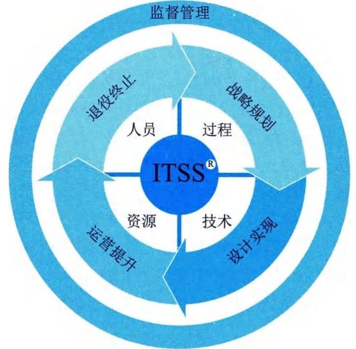

### 3.2.1 IT服务原理
ITSS给出了IT服务的基本原理，由能力要素、生存周期要素、管理要素组成，如图3-1所示。能力要素由人员（People）、过程（Process）、技术（Technology）和资源（Resource）组成，简称PPTR。IT服务生命周期由四个阶段组成，分别是战略规划（Strategy＆planning）、设计实现（Design＆implementation）、运营提升（Operation＆
promotion）、退役终止（Retirement
＆termination），简称为SDOR。为了保证每个生命周期阶段及其过程的实施，需要通过监督提供保障，通过管理提供支撑。

图3-1 ITSS基本原理
