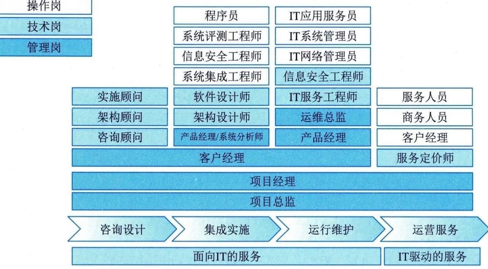
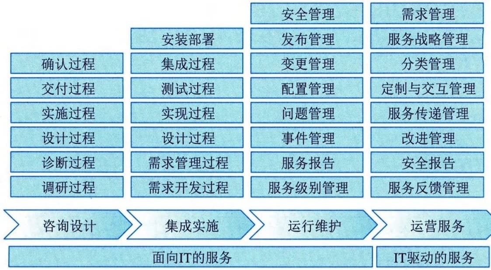
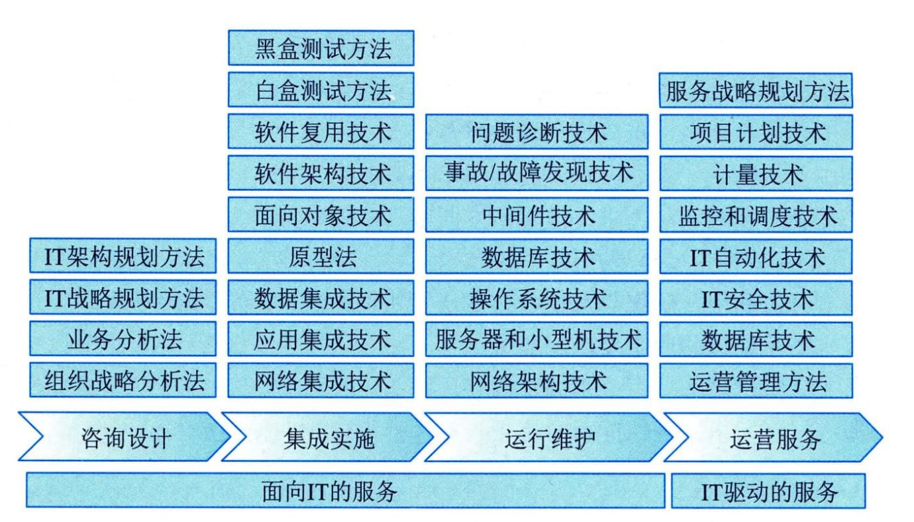
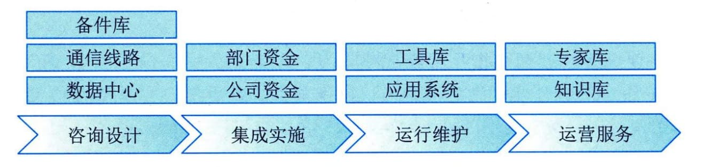

### 3.2.2 组成要素
ITSS定义了IT服务由人员、过程、技术和资源组成，并对这些服务的组成要素进行标准化。另外，就IT服务而言，通常情况下是由具备匹配的知识、技能和经验的人员，合理运用资源，并通过规定的过程向需方提供服务。
#### **1．人员**
人员是指IT服务生命周期中各类满足要求的人才的总称，ITSS规定了提供IT服务的各类人员应具备的知识、经验和技能要求，目的是指导IT服务提供商根据岗位职责和管理要求"正确选人"。
一般而言，针对咨询设计、集成实施、运行维护和运营等典型的IT服务，所需要的人员包括项目经理（如系统集成项目经理、服务项目经理）、系统分析师、架构设计师、系统集成工程师、信息安全工程师、系统评测工程师、服务工程师、服务定价师、客户经理和日常服务人员等，如图3-2所示。
图例：

图3-2 IT服务所需要的人员
目前，针对IT服务人员，使得服务供方常面临如下挑战：
 - · 人员知识、技能和经验评估难；
 - · 不同人员交付同一服务的质量不一致；
 - · 人才流动率高，很难建设稳定的服务团队；
 - · 人才招聘难，很难形成合理的人力资源池；
 - · 人员专业化的必要性；
 - · 有助于建立与服务发展相适应的人才队伍，保障服务工作的连续性和稳定性；
 - · 有助于改进和完善人才培养模式，提高人才培养质量；
 - · 有助于优化人力资源管理，提高管理效率和降低管理成本。
#### **2．过程**
过程是通过合理利用必要的资源，将输入转化为输出的一组相互关联和结构化的活动，是提高管理水平和确保服务质量的关键要素。ITSS根据咨询设计、集成实施、运行维护等各种类型的IT服务，规定了应建立的过程和各个过程应实现的关键绩效指标（KPI），确保供方能"正确做事"。通过按照ITSS要求建立简洁、高效和协调的过程，能有效地将人员、技术和资源要素连接起来，指导服务人员按规定的方式方法正确地做事。
过程作为IT服务的核心要素之一，有明确的目标，可重复和可度量。各类IT服务的典型过程如图3-3所示。

图3-3 各类IT服务的典型过程
对各类IT服务组织来说，过程要素所面临的挑战主要包括以下几个方面：
 - · 过程没有明确定义，完全按照操作人员的个人习惯执行；
 - · 过程定义不清晰，不具备按照过程管理思路执行的价值；
 - · 过程定义太复杂，执行效率严重下降甚至影响运营；
 - · 没有明确的过程目标，操作人员不清楚每一项活动应该做到什么；
 - · 对过程没有监督，不清楚过程的稳定性；
 - · 对过程没有考核，不能得到持续改进。
过程规范化的必要性主要包括以下几个方面：
 - · 确保过程可重复和可度量；
 - · 有效控制因未明确定义而引发的潜在风险；
 - · 通过对过程进行评价和度量，可持续提升过程的效率；
 - · 通过过程实现规范化管理，可持续提高服务质量；
 - · 通过规范化的过程管理，提高效率，减少人员和成本的投入。
#### **3．技术**
技术是指交付满足质量要求的IT服务应使用的技术或应具备的技术能力，以及提供IT服务所必须的分析方法、架构和步骤。技术要素确保IT服务供方能"高效做事"，是提高IT服务质量方面重点考虑的要素，主要通过自有核心技术的研发和非自有核心技术的学习借鉴，持续提升提供服务过程中发现问题和解决问题的能力。
在提供服务过程中，可能面临各种问题、风险以及新技术和前沿技术应用所提出的新要求，供方应根据需方要求或技术发展趋势，具备发现和解决问题、风险控制、技术储备以及研发、应用新技术和前沿技术的能力。针对咨询设计、集成实施、运行维护等IT服务，常用的技术如图3-4所示。

图3-4 IT服务常用的技术
对服务供需双方来说，技术要素所面临的挑战主要包括：
 - · 为满足组织的目标和需求，组织对IT技术的依赖程度越来越高；
 - · 激烈的市场竞争使得组织对技术的要求越来越高；
 - ·低成本、高效率的服务需求，对组织的技术研发和使用能力提出了更高的要求。技术体系化的必要性主要体现在以下几个方面：
 - · 提高服务质量，降低服务成本；
 - · 减少人员流失带来的损失；
 - · 及时应用和推广成熟技术；
 - · 做好新技术的研发和储备；
 - · 在提供服务中使用一致的技术标准。
#### **4．资源**
资源是指提供IT服务所依存和产生的有形及无形资产，如咨询服务供方为满足需方的需求，提供咨询服务所必须具备的知识、经验和工具等。资源要素确保供方能"保障做事"，主要由人员、过程和技术要素中被固化的成果和能力转化而成，同时又对人员、过程和技术要素提供有力的支撑和保障。
根据所提供的IT服务类型的不同，所需要的资源也不尽相同，但可以对其进行汇总。例如，咨询设计服务和IT运维服务所使用的资源包括知识库、工具库、专家库、备件库和服务台。常见的IT服务资源如图3-5所示。

图3-5常见的IT服务资源
对于各类服务组织来说，资源要素所面临的挑战主要包括：
 - · 忽略资源的价值，投入不够，导致资源不足；
 - · 对资源的使用不重视，重复投资现象严重；
 - · 缺乏利用资源的统一规划，资源的利用率不高；
 - · 资源的更新不及时，与需求、技术研发脱节。
资源系统化的必要性主要体现在以下几个方面：
 - · 统筹资源开发利用，确保与运营、技术研发协调一致；
 - · 确保提供满足质量和成本要求的服务；
 - · 明确各类资源管理的要点，提高资源使用率；
 - · 结合服务发展需求，确保能及时更新资源，提高资源的使用率和使用质量。
