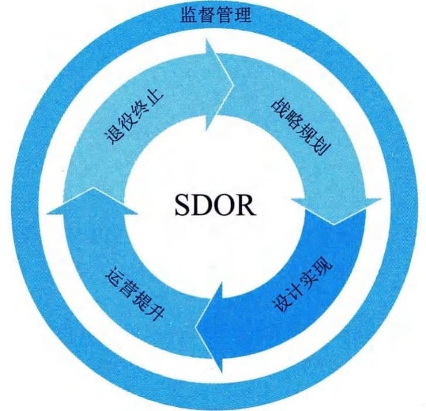

## 3.3 服务生命周期
IT服务生存周期是指IT服务从战略规划、设计实现、运营提升到退役终止的演变，如图3-6所示。IT服务生命周期的引入，改变了IT服务在不同阶段相互割裂、独立实施的局面。同时，通过连贯的逻辑体系，以战略规划为指引，设计实现为准绳，通过服务运营实现价值转化，直至服务的退役终止。同时伴随着监督管理的不断完善，将服务中的不同阶段的不同过程有机整合为一个井然有序、良性循环的整体，使服务质量得以不断改进和提升。

图3-6 ITSS定义的IT服务生命周期
 - （1）战略规划。战略规划是指从组织战略出发，以需求为中心，参照ITSS对IT服务进行战略规划，为IT服务的设计实现做好准备，以确保提供满足供需双方需求的IT服务。
 - （2）设计实现。设计实现是指依据战略规划，定义IT服务的体系结构、组成要素、要素特征以及要素之间的关联关系，建立管理体系、部署专用工具以及服务解决方案。
 - （3）运营提升。运营提升是指根据服务实现情况，采用过程方法实现业务运营与IT服务运营相融合，评审IT服务满足业务运营的情况以及自身缺陷，提出优化提升策略和方案，对IT
服务进行进一步的规划。
 - （4）退役终止。退役终止是指对趋近于退役期的IT服务进行残余价值分析，规划新的IT
服务部分或全部替换原有的IT服务，对没有可利用价值的IT服务停止使用。
IT服务的相关方在IT服务生命周期的各个阶段设定服务目标，在服务质量、运营效率和业务连续性方面不断改进和提升，并能够有效识别、选择和优化服务的有效性，提高绩效，为组织做出更优的决策提供指导。
