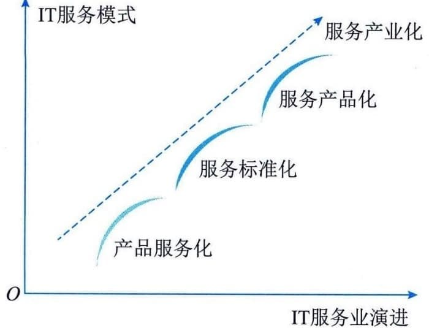

### 3.4.1 服务产业化
IT服务的产业化进程分为产品服务化、服务标准化和服务产品化三个阶段。
 - （1）产品服务化。软硬件服务化已成为IT产业发展的主要方向之一，特别是云计算、物联网、移动互联网等新模式、新技术的不断出现，改变了软硬件的营销、生产和交付模式。软件即服务、平台即服务、基础设施即服务等业态的出现，促使软硬件组织以产品为基础向服务转型。
 - （2）服务标准化。标准化是确保服务实现专业化、规模化的前提，也是规范服务的重要手段。在服务标准化的过程中，标准化的核心作用是确定服务的范围和内容，规范组成服务的各种要素，从而为服务的规模化生产和消费奠定基础。
 - （3）服务产品化。产品化是实现产业化的前提和基础，只有需方对服务产品达到一致认识的前提下，服务的规模化生产和消费才能成为可能。总的来说，产品服务化是前提，服务标准化是保障，服务产品化是趋势。三者之间的关系如图3-7所示。
#### **1．产品服务化**
在传统意义上，产品的含义是能够提供给市场，被人们使用和消费，并能满足人们某种需求的任何有形的物品；而服务在传统意义上则是指为他人做事，并使他人从中受益的一种有偿或无偿的活动，通常不以实物形式而以提供劳动的形式满足他人或组织的某种特殊需要。
图3-7 IT服务产业化
IT服务相关的产品包括硬件、软件等在不断发展，IT产品在技术、质量方面不断地改进提升，但产品的同质化状况也日益严重，市场竞争也更多地体现在为需方提供的服务上，通过为需方提供量身定制的个性化、差异化的服务，增加供方为需方带来的价值。在此背景下，产品的含义也逐步从单纯的有形产品扩展到基于产品的增值服务，有形产品本身只是作为传递服务的载体或者平台，这种趋势就是产品服务化。
产品服务化的特征主要包括以下几个方面：
 - · 产品服务化是以产品为主线，服务依附于产品而存在；
 - · 产品服务化在服务过程中，常对服务没有明确的考核；
 - · 产品与服务是不可分割的两部分，两者往往融合在一起。
产品服务化的价值可以分别从需方和供方角度来看。
 - （1）从需方的角度。产品的交付和使用是为了有效支撑需方业务运营，一般是通过供方为需方提供服务来实现的，包括以产品本身和增值服务方式提供的服务，从而实现产品的作用和价值的最大化。
 - （2）从供方的角度。新产品或新的解决方案，需要通过研发和应用的有效互动来持续改进，并在提供服务的过程中不断提升产品，在为需方创造价值的同时，实现供方的发展战略。
#### **2．服务标准化**
随着IT应用的快速成长，IT服务的供方和需方逐渐意识到服务标准化将成为服务的核心能力。服务标准化主要是基于服务生命周期的管理，针对服务过程、规范以及相关制度进行统一规定、统一度量标准，实现服务可复制交付。
服务标准化的特征主要包括以下几方面：
 - · 建立了标准的过程、实施规范以及相关制度；
 - · 具有明确的有形化产出物描述及相关模板；
 - · 实施服务的过程有记录，此记录可进行追溯且可审计；
 - · 建立完善的服务质量考核指标体系。
服务标准化的价值分别从供方和需方角度来看：
 - · 从供方的角度：服务标准化使服务规模化成为可能；
 - · 从需方的角度：在接受服务的过程中更有效地获得满足需求的服务。
#### **3．服务产品化**
随着组织对IT的依赖，IT服务需求不断增加，并从附属于硬件和软件的从属地位中逐渐独立出来，成为增长速度最快的领域。但是，由于服务的无形性、不可存储性等特殊性，如何衡量IT服务质量和成本、评价服务绩效已成为IT服务发展过程中的关键技术难题。因此，需要借鉴针对传统产品的方式，实现服务产品化，即将所提供的服务通过可衡量的质量要求、可视化的服务体系、清晰的服务定价机制和统一的服务标准来体现，形成具有特定属性的服务产品，并具有产品规范化、可视化、数字化特性。
服务产品化的特征主要包括：
 - · 服务产品化具有清晰的服务目录；
 - · 具有独立的价值、明确的功能和性能指标；
 - · 对具体的服务有相应的服务级别要求；
 - · 对服务有明确的考核指标；
 - · 对服务产品实施全生命周期管理。
服务产品化的价值可以分别从供方和需方角度来看。
 - （1）从服务需方角度。服务产品化之后，需方能够以产品组合的形式定制规范化服务，具有清晰的标准、预期的服务质量和服务收益。
 - （2）从服务供方的角度。将服务进行产品化，能够满足需方不同阶段的服务需求，以产品的方式对需方提供统一、规范的服务交付内容、交付过程及交付界面，有效地提升了服务的工作效率和服务级别协议的达成率，使需方得到统一、规范、专业的服务，获得更大的满意度。
