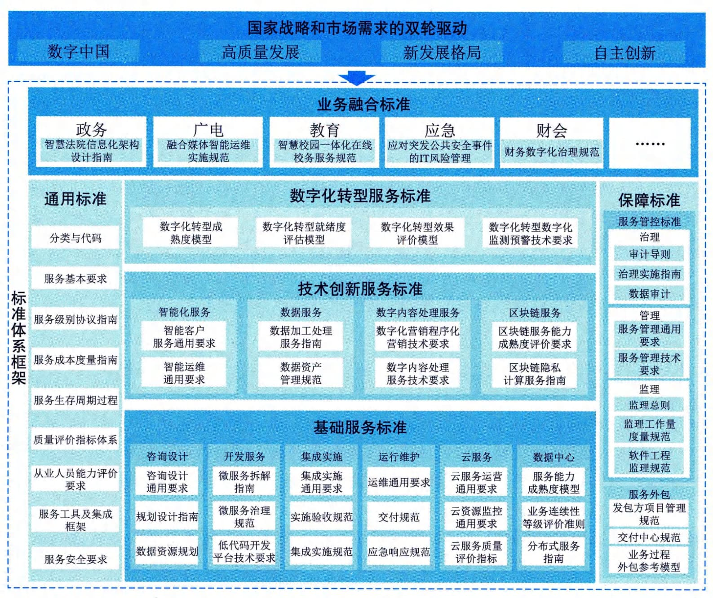

### 3.4.2 服务标准
ITSS在工业和信息化部、国家标准化管理委员会的指导下，在各方共同努力下，开创了政府指导、企业主体、应用牵引、国际同步、产学研用共同推进的标准化工作局面，破解了标准化工作重研制、轻应用、无反馈的难题，提出了以IT服务基本原理为核心、整体布局、分类分级、协调优化、持续改进的标准体系建设的新方法。ITSS在政策规划制定、产业转型升级、行业统计制度建设、企业服务能力提升、IT服务关键支撑工具和产品研发等方面发挥了重要作用。ITSS既是一套成体系和综合配套的标准库，又是IT服务的方法论，通过最佳实践的总结、标准化提炼等实现IT服务相关方的可信赖。
#### **1．建设目标**
经过多年的建设与发展，ITSS的建设目标主要聚焦在支撑国家战略、引导产业高质量发展、促进新技术应用创新、指导IT服务业务升级、确保标准化工作有序开展等方面。
 - （1）支撑国家战略。标准是国家竞争力的基本要素，是国际交往的技术语言和国际贸易的技术依据。ITSS体系的建设与发展，需要始终坚持以国家战略为纲领，更好支撑"数字化发展""建设数字中国""新发展格局""自主创新"等国家战略部署。
 - （2）引领产业高质量发展。ITSS体系的建设与发展，应致力于引领产业的高质量发展。信息技术服务业产业结构升级持续加快，智能化服务、数据服务、区块链服务等新产业形态蓬勃发展，ITSS体系建设应从标准化角度助力产业链贯通和产业生态打造，着力构建IT服务领域的新发展格局，引领和推动信息技术服务的高质量发展。
 - （3）促进新技术创新应用。ITSS体系的建设与发展，应从标准化的角度引领新技术融合创新。传统基础服务呈现智能化发展趋势，建立IT服务关键技术体系，开展相关标准研制工作，需要引领信息技术创新导向，促进新技术的在业务上的创新应用。
 - （4）指导IT服务业务升级。ITSS体系的建设与发展，应全面、客观反映IT服务的基础和转型升级进展，固化业界最佳实践和认知水平成果，分享IT服务标准化领域的研究成果和实践经验，为IT服务的转型升级和有序发展奠定坚实基础。
 - （5）确保标准化工作有序开展。ITSS体系应直观地规定标准体系中需要制定的标准及其彼此之间的关联关系，有效支持以上原则的实施，有效规避标准化目标不明确、方向不清晰等问题，指导和统筹协调相关部门标准体系构建工作，确保成体系、成系统地开展标准研制工作。
#### **2．价值定位**
ITSS对IT服务相关方来讲，将带来质量、成本、效能和风险等方面的潜在收益。
对IT服务需方的价值收益主要包括：提升服务质量、优化服务成本、强化服务效能、降低服务风险等。
 - （1）提升服务质量。通过量化和监控用户满意度，需方可以更好地控制和提升用户满意度，从而有助于全面提升服务质量。
 - （2）优化服务成本。不可预测的支出往往导致服务成本频繁变动，同时也意味着难以持续控制并降低服务成本，通过使用ITSS，将有助于量化服务成本，从而达到优化成本的目的。
 - （3）强化服务效能。通过ITSS实施标准化的服务，有助于更合理地分配和使用服务，让所获得的服务能够得到最充分、最合理的使用。
 - （4）降低服务风险。通过ITSS实施标准化的服务，也就意味着更稳定、更可靠的服务，降低业务中断风险，并可以有效避免被服务供方绑定。
对IT服务供方的价值收益主要包括：提升服务质量、优化服务成本、强化服务效能、降低服务风险等。
 - （1）提升服务质量。供需双方基于同一标准衡量服务质量，可使供方：
 - · 通过ITSS来提升服务质量；
 - · 提升的服务质量被需方认可，直接转换为经济效益。
 - （2）优化服务成本。ITSS使供方可以将多项服务成本从组织内成本转换成社会成本，比如初级服务工程师培养、客户IT教育等。这种转变一方面降低了供方的成本，另一方面为供方的工作快速发展提供了可能。
 - （3）强化服务效能。服务标准化是服务产品化的前提，服务产品化是服务产业化的前提。ITSS让供方实现服务的规模化成为可能。
 - （4）降低服务风险。通过依据ITSS引入监理、服务质量评价等第三方服务，可降低服务项目实施风险；部分服务成本从组织内转换到组织外，可降低组织运营风险。
#### **3．体系框架**
ITSS的内容即为依据其原理制定的一系列标准，是一套完整的IT服务标准体系。标准体系是一种由标准组成的系统，为了实现系统化的目标而必须具备一整套具有内在联系的、科学的有机整体。标准体系内部各标准按照一定的结构进行逻辑组合，而不是杂乱无章的堆积，它是一个概念系统，是由人为组织制定的标准形成的人工系统。标准体系结构是指标准系统内各标准内在有机联系的表现方式。形成标准体系的主要方式有层次和并列两种，层次是指一种方向性的等级顺序，彼此存在着制约关系和隶属关系；并列是指同一层次内各类或各标准之间存在的方式和秩序，ITSS标准体系通过并列方式列出各类和各项标准。
1）体系建立原则
ITSS标准体系的建立原则主要包括目标明确，整体性强，整个体系是有序的，并具有开放性、动态性特点等。
 - ·目标性。任何标准体系的建立有其明确的目标。建立ITSS体系的目标是按照科学的分类体系指导IT服务标准化工作成体系、成系统地开展，解决IT服务发展过程中的共性技术问题，从而降低服务和技术的研究、生产、使用或消费、维护乃至管理的成本和风险，使标准化工作发挥最佳效益。

 - ·整体性。现代标准化以标准的整体性为特征。构成标准体系的各标准并不是独立的要素，标准之间相互联系、相互作用、相互约束、相互补充，从而构成一个完整统一体。

 - ·有序性。标准体系是一个相当复杂的系统，包含为数众多的标准，体系内部各标准不是杂乱无章的堆积，整个标准体系的结构层次应该是有序的。标准体系结构应具备合理的标准层级、时间序列和数量比例。标准体系结构层次的有序性是由系统中各层次要素之间的依从关系决定的。上一层是对下一层的抽象（归纳），而下一层又是上一层的具体化。

 - ·开放性与动态性。标准是科学技术和生产水平的综合反映，科学技术不断发展，生产水平也不断提高，所以标准也要不断提高水平、拓宽领域、完善更新。这就决定了标准体系必须随着科学技术和生产力的发展而不断发展。{width="0.2916666666666667in"
> height="1.3055555555555556in"}
因此，标准体系既不是封闭的，也不是绝对静止的。任何标准体系总是处于某种环境之中，总是要同环境之间进行相互作用和交换信息，并且不断地调整或淘汰那些不适用的要素，及时补充新的要素，使标准体系处于不断改进的过程。
2\) ITSS 5.0
ITSS
5.0标准体系框架是在数字中国建设、产业高质量发展、新发展格局构建以及自主创新的国家战略和市场需求的双轮驱动下，以基础服务标准为底座，以通用标准和保障标准为支柱，以技术创新服务标准和数字化转型服务标准为引领，共同支撑业务融合的实现。ITSS
5.0的体系框架如图3-8所示

图3-8 ITSS 5.0体系框架图
ITSS 5.0的主要内容包括：
 - ·通用标准。通用标准是指适用于所有IT服务的共性标准，主要包括IT服务的业务分类和服务原理、服务质量评价方法、服务基本要求、服务从业人员能力要求、服务成本度量和服务安全等。

 - ·保障标准。保障标准是指对IT服务提出保障要求的标准，主要包括服务管控标准和外包标准。服务管控标准是指通过对IT服务的治理、管理和监理活动和要求，以确保IT服务管控的权责分明、经济有效和服务可控；服务外包标准则对组织通过外包形式获取服务所应采取的业务和管理措施提出要求。

 - ·基础服务标准。基础服务标准是指面向IT服务基础类服务的标准，包括咨询设计、开发服务、集成实施、运行维护、云服务、数据中心等标准。

 - ·技术创新服务标准。技术创新服务标准是指面向新技术加持下的新业态新模式的标准，包含智能化服务、数据服务、数字内容处理服务和区块链服务等标准。

 - ·数字化转型服务标准。数字化转型服务标准是支撑和服务组织数字化转型服务开展和创新融合业务发展的标准，包含数字化转型成熟度模型、就绪度评估、效果评估、中小企业指南、数字化监测预警等标准规范和要求。

 - ·业务融合标准。业务融合标准是指支撑IT服务与各行业融合的标准，包括面向政务、广电、教育、应急、财会等行业建立具有行业特点的信息技术服务相关的标准。
