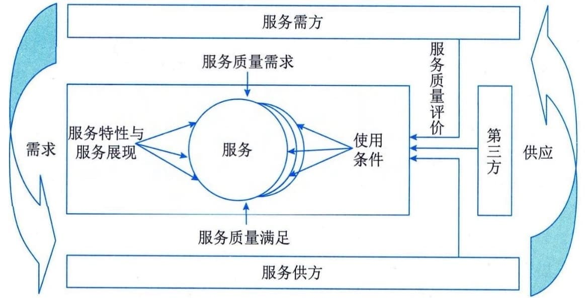

### 3.5.1 相关方模型
IT服务涉及服务的开发、提供和消费等环节，并涉及服务的需方、供方和第三方等服务相关方，在特定条件下的服务交互过程，如图3-9所示。服务需方负责提出服务质量需求，作为整个服务质量衡量或评价的基准，服务质量需求通常情况下是以供需双方签订的服务级别协议体现，服务需方有时也行使服务质量评价的职能；服务供方负责提供满足服务质量需求的服务，同时在提供服务过程中，有职责和义务配合服务需方和第三方开展质量监督和评价工作，以及开展内部质量监督和评价；第三方通常是受服务需方或服务供方的委托，以中立的视角参照服务质量需求，应用服务质量评价工具，对整个服务过程的服务质量进行客观评价。

图3-9 服务质量相关方模型
