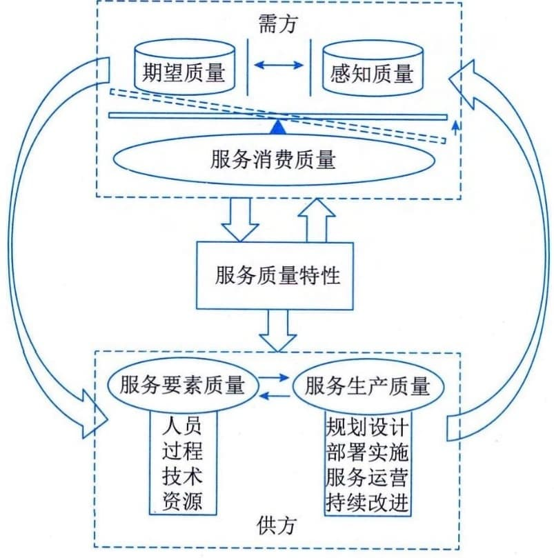

### 3.5.2 互动模型
服务的需方和供方之间是通过服务质量特性来进行互动的，如图3-10所示。在需方部分，期望质量也就是需方对供方服务所提出的服务质量要求，感知质量就是供方在提供服务过程中被需方感受到的服务质量。这二者都将通过服务质量特性的评价指标去量化体现。其中期望质量与感知质量的差异将影响到服务需方满意度，期望质量大于感知质量，服务需方不满意；期望质量小于或等于感知质量，服务需方满意。在供方部分，服务质量特性决定于服务供方的服务要素质量和服务生产质量应满足的服务质量要求。服务要素质量涉及人员、过程、技术、资源等方面。服务生产质量就是供方提供服务的过程，覆盖了服务的全生命期。服务要素质量支撑服务生产质量，服务生产质量依赖服务要素质量并通过服务质量特性的评价影响需方的感知质量。

图3-10 IT服务质量特性模型
