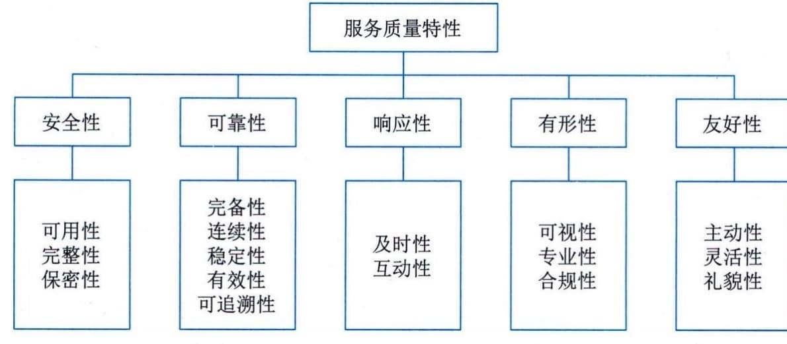

### 3.5.3 质量模型
《信息技术服务 质量评价指标体系》（GB／T
33850）定义了IT服务质量模型，如图3-11所示。质量模型用于定义服务质量的各项特性，分为5大类：安全性、可靠性、响应性、有形性和友好性。每个大类服务质量特性进一步细分为若干子特性。这些特性和子特性适用于定义各类IT
服务的评价指标。

图3-11 IT服务质量模型
 - （1）安全性。IT服务供方在服务过程中保障需方的信息安全的程度。子特性包括：
 - ·可用性。确保授权用户对信息的正常使用不应被异常拒绝，在必要时能及时地访问和使用的程度。

 - ·完整性。确保供方在服务提供过程中管理的需方信息不被非授权篡改、破坏和转移的程度。
 - · 保密性。确保供方在服务提供过程中不泄露信息给非授权的用户或实体的程度。
 - （2）可靠性。IT服务供方在规定条件下和规定时间内履行服务协议的程度。子特性包括：
 - · 完备性。供方所提供的服务是否具备了服务协议中承诺的所有功能的程度。
 - ·连续性。确保服务协议在任何情况下都能得到满足的程度，致力于将风险降低至合理水平以及在业务中断以后进行业务恢复两个方面。
 - · 稳定性。供方所提供的服务能够稳定地达到服务协议约定的要求的程度。
 - · 有效性。供方按照服务协议要求对服务请求进行解决的程度。
 - ·可追溯性。供方在服务过程中涉及的活动应具有原始的完整记录，实现有据可查的程度。
 - （3）响应性。IT服务供方按照服务协议要求及时受理需方服务请求的程度。子特性包括：
 - · 及时性。供方按照服务协议要求对服务请求响应快慢的程度。
 - · 互动性。供方通过建立适宜的互动沟通机制保障供需双方进行信息交换的程度。
 - （4）有形性。IT服务供方通过实体证据展现其服务的程度。这些实体证据通常包括人员形象、服务设施、服务流程、服务工具及服务交付物等。子特性包括：
 - · 可视性。供方向需方以可见的方式展现其服务的程度。·专业性。供方在服务过程中展现出的规范性、标准性和先进性的程度。
 - · 合规性。供方提供的IT服务遵循标准、约定或法规以及类似规定的程度。
 - （5）友好性。IT服务供方设身处地为需方着想和对需方给予特别关注的程度。子特性包括：
 - · 主动性。供方主动感知需方需求并积极采取措施保障服务提供的能力。
 - · 灵活性。供方应对需方需求变化的能力。
 - · 礼貌性。供方在服务提供过程中展现的服务语言、行为和态度规范化的能力。
