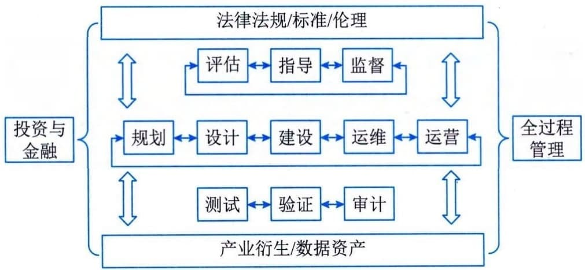

### 3.7.2 服务产品与组合
服务集成是对组织内、外部多领域服务产品（内容）的有机融合，该过程结合了组织内外部"产品服务化、服务产品化"的进程和成果，也是相关知识与能力重组、再造和创新的过程。
#### **1．服务供应业务域识别**
服务供应业务域的识别与软硬件系统集成的架构层次识别类似，重点不是对具体（服务）产品的识别以及价值与指标确认，而是采用系统工程的分阶段模式与信息系统全生命过程管理体系，对需要参与服务集成的业务类型或组织类型进行识别和分析。考虑到服务产品的个性化与"非标"（与信息系统标准化软硬件相比）特点，服务供应业务域的识别全面性与有效性及其逻辑关系搭建方法与模式，对服务集成项目与活动来说都至关重要，其影响服务项目组织的搭建及服务融合的有效性等，往往对不同的服务集成项目，采用不同的识别方法和特定的关系模式。
就该项目而言，其采用的服务供应业务域识别模式如图3-13所示。

图3-13 某市城市交通空间综合开发项目服务供应业务域识别模型
该模型以信息系统及其服务创新的全生命周期为基础，定义规划、设计、建设、运维和运营相关服务供应业务域；该项目涉及城市发展和居民利益与感受，按照治理基本方法，定义了评估、指导和监督服务供应业务域；同时该项目关联较多的创新和动态过程等，定义了测试、验证和审计服务供应业务域，并明确了验证涵盖了社会化参与的验证需求等；考虑到该项目的复杂性和融合创新性等，定义了全过程管理服务供应业务域；基于该项目涉及无人驾驶、低速无人快递等内容，在法律法规、标准的基础上，定义了伦理相关的服务供应业务域；又考虑到该项目涉及投融资、招商引资以及过程资金共管等情况，定义了投资与金融服务供应业务域；基于项目带动的数字经济发展需求等，定义了产业衍生、数字资产服务供应业务域。
#### **2．服务产品定义与组合**
服务产品是具备标准化输入输出接口、服务水平控制的一组服务活动、服务资源集合，是实施服务集成的基本单元，是进行服务编排、计划与调度的基础。服务产品与一般信息系统软硬件产品有所区别，其行业或产业标准化程度不高，往往是服务供方自行定义其内容、范围、模式、成果、接口等，这是由于服务固有的可变性及个性化等因素造成。服务产品的颗粒度及内容标准化程度，与服务集成的梳理实施关系紧密。服务产品定义和组合是服务集成项目进入实施阶段前的重要工作，并伴随整个服务集成全生命周期。针对该项目，确立的服务产品定义与组合如表3-3所示。
**表3-3 某市城市交通空间综合开发项目服务产品定义与组合示例**
  -------------------------------------------------------------------------------------------------------------------------------------------------------------------------------------------------------------
  业务域                 服务产品（组）   产品（组）概述                                                                             组合基本原则／要求
  ---------------------- ---------------- ------------------------------------------------------------------------------------------ --------------------------------------------------------------------------
  金融／投资             投资管理         对政府引导资金、建设资金等进行管理以及发展基金的筹措等                                     政府指定的平台公司全权实施
                         资金管理         对项目建设资金、运营基础资金进行第三方管理以及多方共管提供服务                             具备支持平台公司参与资金共管的银行机构
                         ······           ······                                                                                     ······
  法律法规、标准与伦理   法律法规         为集成项目的立项、招采、合同、人员等提供法律服务，为伦理或运营突破提供法律建议等           与地方政府一起，实现满足新型服务、智能社会伦理等相关政策与法规的创新融合
                         标准             为项目标准制定、发布和应用提供支撑，为项目标准拓展为社团、地方、行业、国家标准提供支撑等   能够与全过程管理和关键建设机构形成互动
                         伦理             持续跟踪项目的社会化运营，提供伦理审查支持、伦理验证与创新等支持                           能够综合开发利用社会科学技术等，并与法律法规及标准组织具备协同基础
                         ······           ······                                                                                     ······
  -------------------------------------------------------------------------------------------------------------------------------------------------------------------------------------------------------------
 - （续表）
  --------------------------------------------------------------------------------------------------------------------------------------------------------------------------------------------------------------------------------------------------------------
  业务域       服务产品（组）       产品（组）概述                                                                                                                   组合基本原则／要求                                                                       
  ------------ -------------------- -------------------------------------------------------------------------------------------------------------------------------- ---------------------------------------------------------------------------------------- --
  规划         顶层规划             从整体视角，对项目涉及的资金、技术、运营、经济发展、惠民等内容进行规划，对整体项目集成模式进行整体策划等                         与平台公司及全过程管理相关活动能够有效衔接和支撑                                         
               智慧停车专项规划     从城市发展、居民便捷出行等视角，对路侧停车、公共停车场的建设、运营和管理等进行整体规划                                           继承顶层规划的要求，并与整体规划形成互动与融合                                           
               ······               ······                                                                                                                           ······                                                                                   
  设计         工程设计             对车辆网、路侧停车的土木工程、弱电工程等进行专业化设计                                                                           能够充分理解车联网等新型技术与发展模式，并能够对既有基础环境进行测绘等                   
               信息系统设计         对停车管理、车联网管理与调度等信息系统进行设计                                                                                   能够与工程设计及各类规划服务进行有机融合                                                 
               运营管理设计         对项目关联和衍生的运营体系进行设计，包括车联网运营、停车运营等                                                                   能够与平台公司及社会化运营机构等进行有效衔接                                             
               ······               ······                                                                                                                           ······                                                                                   
  全过程管理   项目管理辅助及监理   为平台公司提供项目全生命周期辅助管理，包括技术创新、商业谈判、过程管理等，并通过监理活动确保项目策划到各项具体活动实施的一致性   能够充分理解项目涉及的目标、价值、意义和边界等，与平台公司及各类参与者形成良性互动融合   
               专家管理服务         聚合综合类、技术类、运营类、服务类的多元化专家资源，为项目各项活动提供专家服务                                                   与平台公司及项目管理辅助机构形成良性互动融合                                             
               ······               ······                                                                                                                           ······                                                                                   
                                                                                                                                                                     ······                                                                                   
  --------------------------------------------------------------------------------------------------------------------------------------------------------------------------------------------------------------------------------------------------------------
在该阶段的服务产品定义活动往往不能达到项目实施所需要的服务产品颗粒度，其主要作为服务选型与服务机构确立的基本来源，需要结合服务机构具体的服务产品进一步细化，形成服务详细产品清单（树），并伴随项目全生命周期，持续迭代更新。
#### **3．服务接口标准与控制**
服务接口的价值作用与信息系统相关软硬件接口类似，都是各类产品共享交换、融合集成的基础，但服务接口的内容范围与形式有其特定属性，按照信息技术服务标准（ITSS）基本原理定义的服务基本要素包括：人员、过程、技术和资源，服务接口也要至少涵盖这些内容，同时考虑到服务持续提升及可变融合，通常也会涵盖服务机构的服务能力管理相关内容。
就该项目而言，定义的接口类型主要包括咨询服务接口、专家服务接口、工程建设服务接口、信息系统开发服务接口等。咨询服务接口标准内容如表3-4所示。
**表3-4 某市城市交通空间综合开发项目咨询服务接口标准示例**
+---------+--------+--------------------------------------------------+
| 服      | 要素   | 接口内容及标准                                   |
| 务类型  |        |                                                  |
+=========+========+==================================================+
| 咨      | 人员   | 服务负责人：服务供方高级管理人员                 |
| 询服务  |        |                                                  |
|         |        | 服务商务负责人：服务供方营销人员或项目负责人     |
|         |        |                                                  |
|         |        | 服                                               |
|         |        | 务产品负责人：服务供方服务研发负责人或项目负责人 |
|         |        |                                                  |
|         |        | 服务日常管理人员：服务供方项目负责人             |
|         |        |                                                  |
|         |        | 服                                               |
|         |        | 务交付负责人：服务供方实施团队负责人或技术负责人 |
|         |        |                                                  |
|         |        | 服务研发负责人：服务供方研发负责人或技术负责人   |
|         |        |                                                  |
|         |        | 服                                               |
|         |        | 务质量负责人：服务供方质量体系负责人或交付负责人 |
|         |        |                                                  |
|         |        | 服务团队人员：服务人员、服务时间、技能覆盖等信息 |
+---------+--------+--------------------------------------------------+
|         | 过程   | 服务接入规范：包括服务入口、服务响应流程及指标等 |
|         |        |                                                  |
|         |        | 服务管理规范：包                                 |
|         |        | 括内外部服务级别管理、服务人员管理等流程与指标等 |
|         |        |                                                  |
|         |        | 服务交付规范：                                   |
|         |        | 包括例行操作、响应支持、评估优化等规范与指标等服 |
|         |        | 务行为规范：包括人员行为、安全治理等规范和指标等 |
|         |        |                                                  |
|         |        | 服务报告规范：包括                               |
|         |        | 报告计划、报告模板、报告存储等规范与指标等······ |
+---------+--------+--------------------------------------------------+
|         | 技术   | 服务研                                           |
|         |        | 发：服务研发体系、研发方向、研发方法等接口与规范 |
|         |        |                                                  |
|         |        | 服务验                                           |
|         |        | 证：服务测试环境、验证方法、参照标准等接口与规范 |
+---------+--------+--------------------------------------------------+
|         | 资源   | 服务管                                           |
|         |        | 理平台：服务编排信息接口、服务调度信息接口等规范 |
|         |        |                                                  |
|         |        | 服务运                                           |
|         |        | 营平台：服务计量信息接口、服务计费信息接口等规范 |
|         |        |                                                  |
|         |        | 服务知识库平台：知                               |
|         |        | 识库共享接口、知识重组与再造信息接口等规范······ |
+---------+--------+--------------------------------------------------+
|         | 能     | 服务战略与策划接口等规范                         |
|         | 力管理 |                                                  |
|         |        | 服务沟通与交互接口等规范                         |
|         |        |                                                  |
|         |        | 服务检查与改进接口等规范                         |
+---------+--------+--------------------------------------------------+
服务接口控制是服务集成的重要活动，是控制服务风险、提升服务质量、服务一体化融合的主要支点，对服务接口的控制重点关注服务弹性、敏捷性、可变性等内容。服务接口控制可以参照国家标准《信息技术服务
质量评价指标体系》（GB／T
33850）相关规定进行设计和部署，从安全性、可靠性、响应性、有形性和有效性等结果性指标，管理、调整和优化服务接口控制方法。
就该项目而言，其服务接口控制的内容主要包括：
 - · 服务供方能力管理及能力要素变更；
 - · 服务质量态势感知；
 - · 服务需求、服务产品组合、服务运营、服务成本变更；
 - · 服务研发、创新联动、模式变革等。
该项目建立了服务接口控制委员会和专门服务接口管理人员，负责服务接口有效性、一致性和变更控制等。
