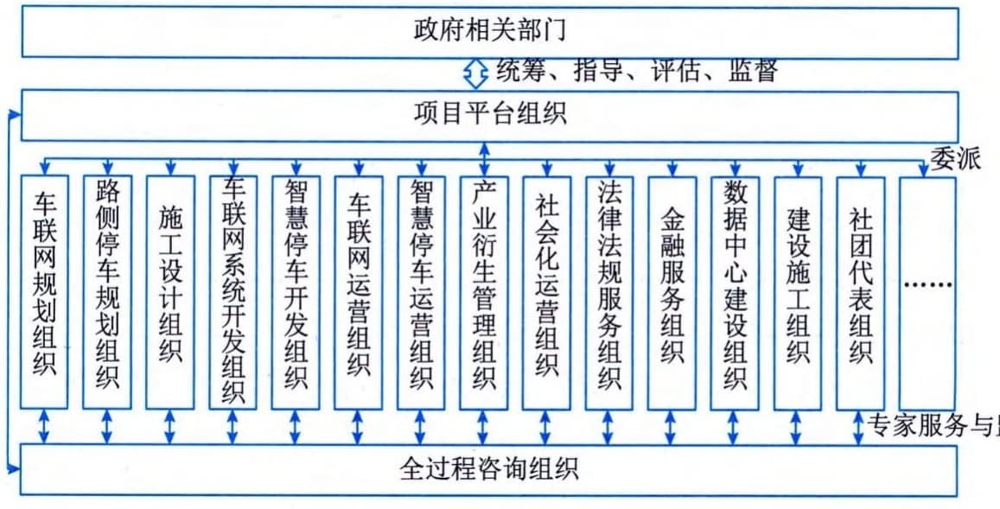
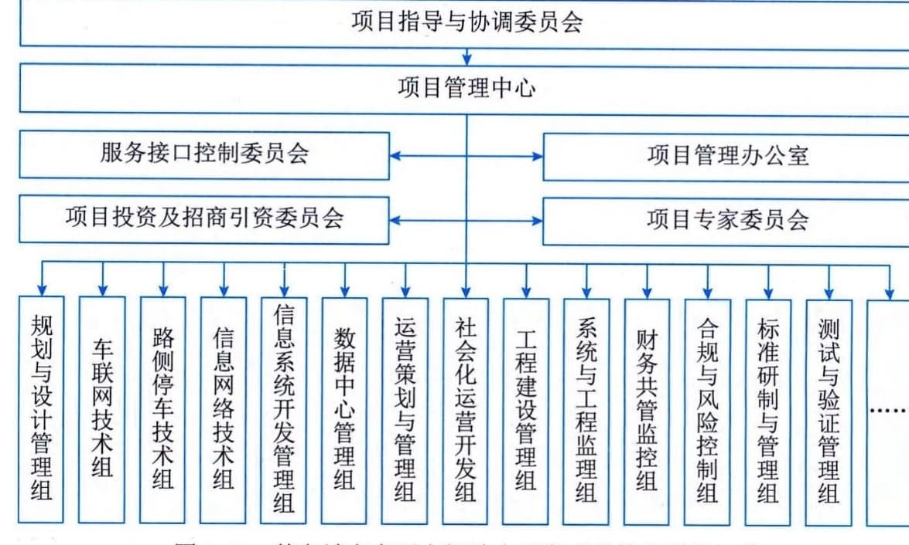
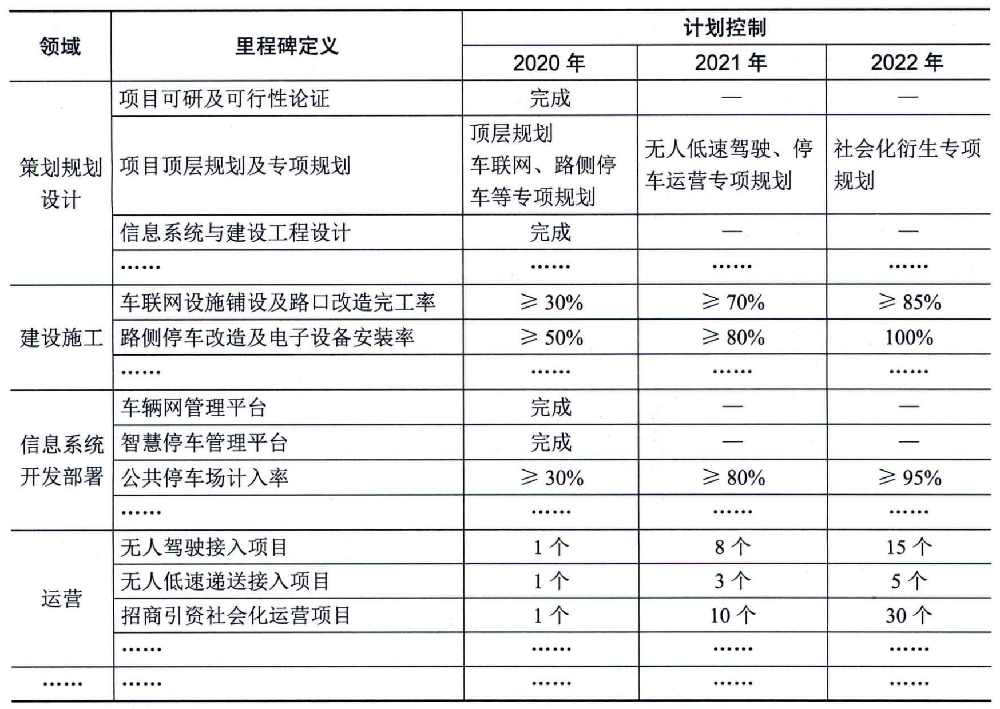

### 3.7.3 项目组织与里程碑计划
服务集成通常是跨服务供方组织的一项活动，这就对服务组织建设和进度控制提出了更高的要求，服务不可存储与不可分离等固有特性（服务供应与消费是同时进行的）又导致服务活动结果的不可逆，因此在服务项目组织设计和实施进度控制时，需要尽量强化服务实施前的设计和定义，充分考虑服务互补能力及进度控制手段。
#### **1．项目组织**
针对该项目的目标和特点，定义的项目组织体系如图3-14所示。

图3-14 某市城市交通空间综合开发项目组织体系
该项目由政府有关部门发起，并组建项目平台组织（公司），由平台组织聚合和委派各类服务组织参与项目的策划、建设和运营等活动。考虑到该项目服务集成的复杂性以及管控难度等，平台组织引入了全过程咨询组织，提供面向所有领域的专家咨询服务、项目代管及监理等活动。
政府相关组织的责任分工界面举例如表3-5所示。
**表3-5 某市城市交通空间综合开发项目政府相关组织分工界面**
+--------+-------------------------------------------------------------+
| 阶段   | 主要分工                                                    |
+========+=============================================================+
| 启动   | 明确城市交通空间综合开发的发展方向、目标和战略步骤等        |
|        |                                                             |
|        | 准备开发与引导资金并筹建平台组织（公司）                    |
|        |                                                             |
|        | 明确项目涉及的主管部门以及相关部门协同机制                  |
+--------+-------------------------------------------------------------+
| 建设   | 协调交通空间治理与管理有关部门                              |
|        |                                                             |
|        | 支撑法律法规、政策和标准的制定与修订，以及发布实施等        |
|        |                                                             |
|        | 评估、指导、监督项目各项工作的开展                          |
+--------+-------------------------------------------------------------+
| 运营   | 开展伦理审查及社会风险控制等                                |
|        |                                                             |
|        | 开展数字经济评估及招商引资对接等                            |
|        |                                                             |
|        | 协调解决居民反映的问题及居民满意度跟踪等                    |
+--------+-------------------------------------------------------------+
平台组织（公司）的责任分工界面举例如表3-6所示。
**表3-6 某市城市交通空间综合开发项目平台组织（公司）分工界面**
+--------+-------------------------------------------------------------+
| 阶段   | 主要分工                                                    |
+========+=============================================================+
| 启动   | 组织资源开展策划、社会调研、技术与服务选型等                |
|        |                                                             |
|        | 进一步深化业务需求，明确需求的关                            |
|        | 键点，定义需求控制机制与措施等开展项目顶层规划与专项规划等  |
+--------+-------------------------------------------------------------+
| 建设   | 协调指导                                                    |
|        | 深化设计，总体把控项目进度和项目质量，协调政府相关部门配合  |
|        | 依托内外部资源，成立专项业务转型升级、技术与工程建设工作组  |
|        |                                                             |
|        | 协调业务梳理，确定业务需求，确认并验证建设内容等            |
|        |                                                             |
|        | ······                                                      |
+--------+-------------------------------------------------------------+
| 运营   | 策划运营方向，明确运营的目标与价                            |
|        | 值导向等确认项目信息资产运营方案，协调组织项目运营各项资源  |
|        |                                                             |
|        | 评估、验证社会化运营方案，监督管理社会化运营活动            |
+--------+-------------------------------------------------------------+
信息系统、工程与技术承建组织的责任分工界面举例如表3-7所示。
**表3-7
某市城市交通空间综合开发项目信息系统、工程与技术承建组织分工界面**
+-------+--------------------------------------------------------------+
| 阶段  | 主要分工                                                     |
+=======+==============================================================+
| 启动  | 服务目录、服务水平管理、解决方案与技术方案准备               |
|       |                                                              |
|       | 根据项目的基本需求，定义服务相关的人员                       |
|       | 、流程、技术和资源等内容明确服务接口，配合调研，提供技术支持 |
|       |                                                              |
|       | ······                                                       |
+-------+--------------------------------------------------------------+
| 建设  | 开展与                                                       |
|       | 自身相关的项目详细需求调研分析，做好项目服务、技术方案设计和 |
|       | 功能模块设计做好服务接口管理，清晰定义相关的服务工作说明书等 |
|       |                                                              |
|       | 按照设计方案开展软件开发、系统部署、工                       |
|       | 程建设实施和服务交付等工作配合标准体系执行，配合专家技术论证 |
+-------+--------------------------------------------------------------+
| 运营  | 提供社会化运营服务或为社会化运营服务提供技术保障和           |
|       | 工作配合根据需求做好运营、应用、技术和信息资源管理的迭代升级 |
|       |                                                              |
|       | 持续深                                                       |
|       | 化运营所需的计量与记录能力，包括数据准确度、计量记录颗粒度等 |
+-------+--------------------------------------------------------------+
全过程咨询管理组织的责任分工界面举例如表3-8所示。
**表3-8 某市城市交通空间综合开发项目全过程咨询组织分工界面**
+--------+-------------------------------------------------------------+
| 阶段   | 主要分工                                                    |
+========+=============================================================+
| 启动   | 定义专家资源需                                              |
|        | 求，构建专家资源库，明确专家参与项目模式与方法等协助开展项  |
|        | 目策划和项目建设前期准备工作，参与项目顶层规划和专项规划等  |
|        |                                                             |
|        | 实施项目合作伙                                              |
|        | 伴比选、建设模式研究、需求调研、可行性分析、辅助项目招标等  |
|        |                                                             |
|        | ······                                                      |
+--------+-------------------------------------------------------------+
 - （续表）
+-------+-------------------------------------------------------------+---+
| 阶段  | 主要分工                                                    |   |
+=======+=============================================================+===+
| 建设  | 指导方案设计，做好设计方案成果质量把控和专家评审论证        |   |
|       |                                                             |   |
|       | 制定项目标准规范体                                          |   |
|       | 系，包括数据标准制定、系统标准制定、运营标准制定等开展项目  |   |
|       | 建设过程监理服务和评估评价工作，监督评估项目质量进度······  |   |
+-------+-------------------------------------------------------------+---+
| 运营  | 协助定义服务运营的计量单位及运营组合方案等                  |   |
|       |                                                             |   |
|       | 针对整体运营、信息资源运营等提供方案咨询等                  |   |
|       |                                                             |   |
|       | 对项目相关运营活动，提供能力成熟度及程度评价评估等          |   |
+-------+-------------------------------------------------------------+---+
该项目根据项目目标、业务需求以及组织体系的责任分工等内容，组建了项目管理中心作为项目管理的核心机构，该中心作为政府侧成立的项目指导与协同委员会的统筹、指导、评估和监督等，中心负责人由平台组织（公司）负责人担任，设置若干中心副主任，分别由资深专家代表、全过程咨询服务负责人、投资与招商引资负责人、关键技术负责人以及运营策划负责人等担任，组织架构如图3-15所示。

图3-15 某市城市交通空间综合开发项目管理组织架构
该组织架构下部分团队的主要定位说明如下：
 - ·项目指导与协调委员会：统筹、评估、指导和监督项目各项活动，并为项目提供政策制定和公共资源协调等。
 - ·项目管理中心：负责项目各项活动的策划、计划、实施和监控等工作，也是项目建设与运营的最高决策与协调机构，由多领域服务组织的负责人共同构成。
 - ·服务接口控制委员会：承担服务集成的协调、管理与控制，确保服务集成的有序、有机和融合，同时负责服务需求和服务交付变更控制等。·项目管理办公室：实施项目日常管理活动，包括章程制定、会议组织、活动监督、项目资源协调等。
 - ·项目投资与招商引资委员会：定义项目投资计划，实施投资管理，面向社会化运营和公共服务的招商引资等。
 - ·项目专家委员会：负责专家资源的需求识别、邀请，专家服务的使用与管理，专家知识资源的科技转化与导入等。
 - ·财务共管监控组：对纳入资金共管的资金使用和拨付使用进行条件验证，保障共管账户的资金安全等。
#### **2．项目里程碑计划**
该项目采用统一规划、分段实施的模式展开，针对面向城市基础设施与环境更新的工程部分，以及面向社会化运营部分，采用先试点、再推广的模式，项目关键里程碑定义和计划如表3-9所示。
**表3-9 某市城市交通空间综合开发项目里程碑计划示例**

