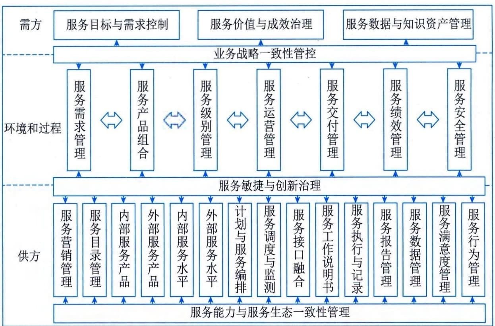

## 3.7 服务集成与实践
随着云计算、云原生、工业互联网等平台化业务模式的实践与发展，为满足社会、企业等具体业务场景或数字化转型需求，以信息系统平台为基础的多元服务融合集成，已成为信息系统集成发展的方向之一。服务集成是在传统意义上信息系统集成关注技术融合的基础上，更加强调数据融合共享条件下的"敏态"集成能力建设，是信息系统软硬件面向"稳态"集成后，面向各行业领域数字化转型和服务化发展的新型实践。服务集成以包含信息系统软件在内的"服务产品"为集成对象，以量化的服务水平管理为抓手，以跨组织、跨团队的服务动态融合为关注焦点，以服务交付管理为项目管理主要内容，以服务绩效和服务价值为集成成果评价关键点。
服务集成活动的基本方法，如图3-12所示。

图3-12 服务集成活动基本方法示意图
服务集成基于服务核心四要素：需方、供方、环境和过程，与单项服务活动相比，多元服务的集成更加关注通过业务战略一致性管控（服务集成价值与需方发展战略的深度融合）、服务敏捷与创新、服务能力与服务生态一致性建设，满足需方复杂需求（尤其是隐性需求）以及具备弹性的价值与成效要求等，这就需要供方通过服务数据共享交换、人才团队融合、计划和调度能力的强化等手段，确保内外部服务能力的一体化融合以及面向服务项目或场景的一致性行动等。服务集成涉及多个供方团队或组织，因此服务数据和知识资产的管理也成为服务集成的重要关注点。
