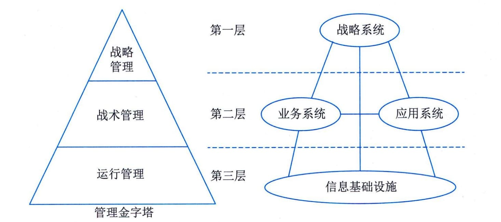

### 4.1.4 总体框架
框架是一个用于规划、开发、实施、管理和维持架构的概念性结构，框架对架构设计是至关重要的。框架是将组织业务内容的关注度进行了合理的分离，以角色为出发点从不同视角展示组织业务的内容。框架为架构设计提供了一张路线图，引导和帮助架构设计达到建设起一个先进、高效且适用架构的目标。
信息系统体系架构总体参考框架由四个部分组成，即战略系统、业务系统、应用系统和信息基础设施。这四个部分相互关联，并构成与管理金字塔相一致的层次，如图4-1所示。战略系统处在第一层，其功能与战略管理层次的功能相似，一方面向业务系统提出创新、重构与再造的要求，另一方面向应用系统提出集成的要求。业务系统和应用系统同在第二层，属于战术管理层，业务系统在业务处理流程的优化上对组织进行管理控制和业务控制，应用系统则为这种控制提供有效利用信息和数据实现的手段，并提高组织的运行效率。信息基础设施处在第三层，是组织实现信息化、数字化的基础部分，相当于运行管理层，它为应用系统和战略系统提供计算、传输、数据等支持。同时也为组织的业务系统实现重组提供一个有效的、灵活响应的技术与管理支持平台。

图4-1 信息系统体系架构的总体框架
#### **1．战略系统**
战略系统是指组织中与战略制定、高层决策有关的管理活动和计算机辅助系统。在信息系统架构（Information
System
Architecture，ISA）中战略系统由两个部分组成，其一是以信息技术为基础的高层决策支持系统，其二是组织的战略规划体系。在ISA中设立战略系统有两重含义：一是它表示信息系统对组织高层管理者的决策支持能力；二是它表示组织战略规划对信息系统建设的影响和要求。通常组织战略规划分成长期规划和短期规划两种，长期规划相对来说比较稳定，如调整产品结构等；短期规划一般是根据长期规划的目的而制订，相对来说，容易根据环境、组织运作情况而改变，如决定新产品的类型等。
#### **2．业务系统**
业务系统是指组织中完成一定业务功能的各部分（物质、能量、信息和人）组成的系统。组织中有许多业务系统，如生产系统、销售系统、采购系统、人事系统、会计系统等，每个业务系统由一些业务过程来完成该业务系统的功能，例如会计系统常包括应付账款、应收账款、开发票、审计等业务过程。业务过程可以分解成一系列逻辑上相互依赖的业务活动，业务活动的完成有先后次序，每个业务活动都有执行的角色，并处理相关数据。当组织调整发展战略为了更好地适应内外部发展环境（如部署使用信息系统）等的时候，往往会开展业务过程重组。业务过程重组是以业务流程为中心，打破组织的职能部门分工，对现有的业务过程进行改进或重新组织，以求在生产效率、成本、质量、交货期等方面取得明显改善，提高组织的竞争力。
业务系统在ISA中的作用是：对组织现有业务系统、业务过程和业务活动进行建模，并在组织战略的指导下，采用业务流程重组（Business
Process
Reengineering，BPR）的原理和方法进行业务过程优化重组，并对重组后的业务领域、业务过程和业务活动进行建模，从而确定出相对稳定的数据，以此相对稳定的数据为基础，进行组织应用系统的开发和信息基础设施的建设。
#### **3．应用系统**
应用系统即应用软件系统，指信息系统中的应用软件部分。对于组织信息系统中的应用软件（应用系统），一般按完成的功能可包含：事务处理系统（Transaction
Processing System，TPS）、管理信息系统（Management Information
System，MIS）、决策支持系统（Decision Support
System，DSS）、专家系统（Expert System，ES）、办公自动化系统（Office
Automation
System，OAS）、计算机辅助设计／计算机辅助工艺设计／计算机辅助制造、制造执行系统（Manufacturing
Execution
System，MES）等。对于其中的MIS又可按所处理的业务再细分为子系统：销售管理子系统、采购管理子系统、库存管理子系统、运输管理子系统、财务管理子系统、人事管理子系统等。
无论哪个层次上的应用系统，从架构的角度来看，都包含两个基本组成部分：内部功能实现部分和外部界面部分。这两个基本部分由更为具体的组成成分及组成成分之间的关系构成。界面部分是应用系统中相对变化较多的部分，主要由用户对界面形式要求的变化引起。在功能实现部分中，相对来说，处理的数据变化较小，而程序的算法和控制结构的变化较多，主要由用户对应用系统功能需求的变化和对界面形式要求的变化引起。
#### **4．信息基础设施**
组织信息基础设施是指根据组织当前业务和可预见的发展趋势及对信息采集、处理、存储和流通的要求，构筑由信息设备、通信网络、数据库、系统软件和支持性软件等组成的环境。这里可以将组织信息基础设施分成三部分：技术基础设施、信息资源设施和管理基础设施。（1）技术基础设施。技术基础设施由计算机设备、网络、系统软件、支持性软件、数据交换协议等组成。
 - （2）信息资源设施。信息资源设施由数据与信息本身、数据交换的形式与标准、信息处理方法等组成。
 - （3）管理基础设施。管理基础设施指组织中信息系统部门的组织架构、信息资源设施管理人员的分工、组织信息基础设施的管理方法与规章制度等。
技术基础设施由于技术的发展和组织系统需求的变化，在信息系统的设计、开发和维护中面临的变化因素较多，并且由于实现技术的多样性，完成同一功能有多种实现方式。信息资源设施在系统建设中的相对变化较小，无论组织完成何种功能，业务流程如何变化，都要对数据和信息进行处理，它们中的大部分不随业务改变而改变。管理基础设施相对变化较多，这是组织为了适应环境的变化和满足竞争的需要，尤其在我国向市场经济转型升级的阶段，经济政策的出台或改变、业务模式改革等，将在很大程度上造成组织规章制度、管理方法、人员分工以及组织架构的改变。
上面只是对信息基础设施中的三个基本组成部分的相对稳定与相对变化程度的总体说明，在技术基础设施、信息资源设施、管理基础设施中都有相对稳定的部分和相对易变的部分，不能一概而论。
